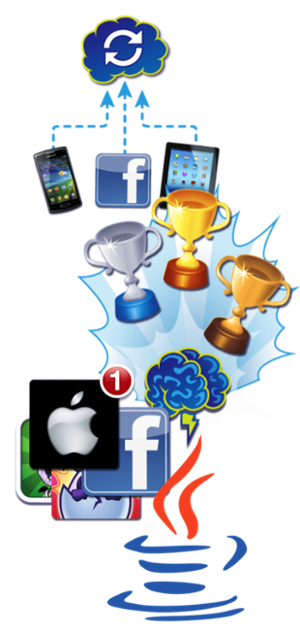

## Gameplay is not enough

Game companies can no longer focus _solely_ on designing fun - today’s studios are adapting the free-to-play business model and with it the increased focus on accessibility, monetization, conversion rates, social acquisition, and constant evolution.

With the new models and platforms of today, large developers are increasingly building and integrating cloud services into their games, to better tap into and maximize the Free-to-Play business model.

Given the essential nature of these systems, it is no wonder that many companies choose to implement their own back-end. In fact, as of August 2014, 49 of the top 50 Top Grossing iOS games were all utilizing custom backend solutions that cost millions of dollars to build.

Which is fine if you are a top tier developer who’s already had your big hit in the market. _But what if you’re not?_

## A better way

Over the years, we at brainCloud have built our fair share of these back-ends — for everything from online casinos and arena shooters, to top-tier mobile games like Simpsons: Tapped Out.

We know from experience that there is a ton of common features in all of these back-ends, and that every _custom_ solution ends up having game-specific logic and often _significant_ compromises in it’s implementation. (And, without exception, extreme gaps in their tools support).

We realized that there had to be a better way. A way to design a system that could be used out-of-the-box by a huge variety of game types, customized where necessary, and deployed in a rapid fashion to support the tight development schedules and budgets of today’s gaming market.

## Presenting brainCloud - a Backend for Gaming

And so, we’re pleased to present brainCloud - the result of three years of development, countless years of experience in the industry, and all our best thinking. We call it a “Backend in a Box” - and it’s so much more than the competing solutions out there.

We start with all the key gaming features you **need** —_multiplayer_, _matchmaking_, _cloud data_, _leaderboards_,_achievements_, _identity management_, _social integration_, _in-app purchase support_, _push notifications_ — we’ve got you covered.

Add the confidence of knowing that if there’s something that we don’t yet do - you can implement it yourself using our **Cloud Code** feature (server-based scripting in JavaScript).

To keep you productive, we provide **native libraries** for all the major platforms and game engines (Unity, Cocos2d-x, Unreal) - so you won’t mucking about making your own http/rest calls (unless you want to).

And we’ve paired those libraries up with the most **feature-rich tools** in the business - that support your entire team through the _design_, _development_, _testing+support_ and_product management_ cycles of your product.

And finally, the best for last - we’ve built upon this platform a set of advanced **Promotions** features that enable you to identify and target key segments of your player base and engaged them in individualized promotions - providing you the means to increase conversion, retention, and engagement - igniting your game’s monetization to new levels.

I look forward to taking a deeper dive into brainCloud with you in the coming weeks - stay tuned - and happy coding!

For more information [download our datasheet](http://hub.getbraincloud.com/backend-as-a-service), or better yet...

\[otw\_shortcode\_button href="https://portal.braincloudservers.com/signup" size="large" icon\_position="centre" shape="radius"\]Sign Up For Free\[/otw\_shortcode\_button\]
