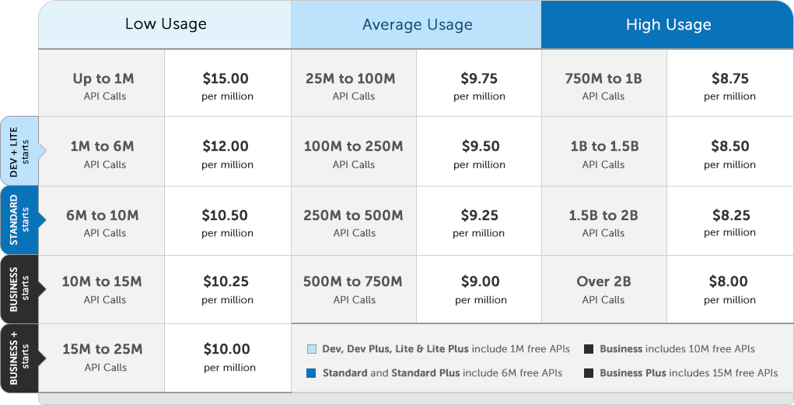

Information

_This article has been updated to include September 2020 tweaks to RTT pricing._

## The Plan plan

**brainCloud 4** is fast approaching - and it is bringing a slew of new capabilities to the platform, including the official release of **RTT** (Real-time events, Chat, Messaging, Online Matchmaking, Lobbies, Presence and more!) as well as brand-new **Hosting** capabilities (Relay Servers and Room Servers).

As these new capabilities bring additional costs to running our infrastructure - we will be introducing revised pricing plans in coordination with brainCloud 4.

The good news is that if you aren't using these features, nothing much changes -- in fact, we've _revised the API pricing tiers downward_, so **your overall costs should go down!**

For the folks taking advantage of these great new capabilities, we have added new **Plus** plans, and have worked hard to keep the pricing reasonable and in-line with the costs to provide the service.

We are also introducing new discounted **Lite** plans - perfect for apps with lower usage requirements.

## V4 Plans

When 4.0 launches, the new plan lineup will look like this:

- **Development (Free)** - access to all features, _except hosting_. Limited to 100 DAU, 1000 accounts. Includes 10 CCx.
- **Development Plus! ($5 /month)** - All features, **including hosting**. Limited to 200 DAU, 2000 accounts. Includes 20 CCx.
- **Lite ($15 /month)** - Core features. Includes 1M API.
- **Lite Plus ($25 /month)** - Core features + **RTT** + **Hosting**. Includes 1M API, 50 CCx.
- **Standard ($30 /month)** - Core features. Includes 6M API.
- **Standard Plus ($50 /month)** - Core features + **RTT** + **Hosting**. Includes 6M API, 100 CCx.
- **Business ($99 /month)** - Core + **Enterprise** features. Includes 10M API.
- **Business Plus ($199 /month)** - **All features**. Includes 15M API, 250 CCx.  
    We are confident that we have a plan to fit every app!

## API Usage

As we were putting together our new set of plans, we decided to simplify and standardize the API Usage Tier Pricing.

All V4 plans use the _same_ discounting tiers as they scale (it used to differ by plan). So no matter what plan you start with, as you get to 15M total API calls for the month, the cost per M drops to $10.00.

One side effect of this standardization is that the cost of additional usage for **Business Plan** customers now starts at $10.25 / M API, instead of $10.00 / M API from the old plan. To make up for this, we have bumped up the **Business Plan** to include **10M API** for free (instead of 9M) - so it is a net win.

We have also made our API Usage pricing tiers more aggressive. In the old plans, you needed to hit 300M+ API calls to get to $9.90 / M pricing. _In the new plans, we drop the price to $9.75 / M API at just 25M+ API calls._

**_We have accelerated the API discounting across the board, resulting in savings of 5-10% at high usage levels._**

## New Plus Plans

The new **Plus** plans make **RTT** and **Hosting** features available to apps at all usage levels.

Features available to Plus plans include:

- Async Match with RTT
- Chat
- Lobbies
- Online Matchmaking
- Presence
- Real-time Events
- Real-time Messaging
- Relay Server Hosting
- Room Server Hosting

And more!

We have worked hard to keep the incremental costs of the Plus plans low - so that as many developers as possible can integrate these great new features into their apps.

_Note - Plus plans are subject to RTT Usage and Hosting Usage costs. More details in the sections that follow._

## New Lite Plans

A frequent request has been for lower-cost, lower-usage plans.

We are pleased to present our new **Lite** and **Lite Plus** plans. These plans offer the _all the same features_ as their **Standard** plan equivalents, but at lower 1M API usage levels.

These plans, which start at just $15 and $25 /month respectively, are great for indie developers, the development of smaller experimental apps, and even for more ambitious apps in the long-tail phase of their product lifecycle.

## RTT Usage

brainCloud's RTT features require a nailed-up TCP or WebSocket connection for every client device. The costs to brainCloud are in **maintaining connections (CCx)** from our servers, and **delivering** the millions of real-time events to your users as they participate in chat, messaging, lobbies, etc.

To account for this utilization, we simply convert these resources to API counts.

Every RTT plan comes with a number of **Concurrent Connections** (**CCx**) that are **free** _per hour_. For example, the Standard Plus plan includes 100 CCx. That means that a peak of 100 Users can be _concurrently_ online without additional CCx usage fees. Assuming your average play session is 12 minutes, that might actually equate to 500 users per hour, or 12K users per day. And that's if RTT is enabled for the full time that users are in your app. _Optimize your app to only initialize RTT when you need it, and 100 CCx could equate to thousands of users per hour._

Above that, apps are charged at a rate of 10 API calls per CCx per hour. So - lets say your app was averaging double that - or 200 CCx. The additional costs would be 100 x 10 API/CCx x 24 hours x 30 days = 720,000 API counts. At ~ $10 / M API, that's about $7.20 in usage.

The other component of RTT Usage is **event delivery**. RTT is great for chat and lobby operations - where one operation may fan out to dozens (or thousands) of recipients. That's great functionality wise - but those deliveries can really add up!

The good news is that RTT is very efficient at delivering events - so we are charging at a bulk ratio of 100:1 - that is, your app is charged just **1 API count for each 100 events** delivered!

## Hosting Usage

brainCloud now supports hosting of _Relay Servers_ and custom _Room Servers_. This really opens up the sort of experiences that can be accommodated in a pure brainCloud environment.

The good news is that you aren't charged for API calls / messaging / etc to your hosted servers -- even if the server is one of our Relay Servers (using our new Relay Protocol).

That said, we do of course need to pass along the cloud costs of hosting the servers, and the data transfer usage associated with it, from the cloud provider.

For pricing, brainCloud is simply marking up the hosting costs by 15%, and adding 1.5 cents per hour for managing the servers.

To help keep costs low, brainCloud will automatically spin up / down servers as required. There are a complete set of parameters that can be customized to allow Teams to fine tune the best balance between server cost and performance.

## And those are the new plans!

Those are the billing changes for v 4.0.

We appreciate that brainCloud's adherence to elastic pricing can seem a bit complicated. It is certainly more complicated than traditional per-MAU pricing. But in the great majority of cases, it is also much better value.

Our overall goal when designing our pricing models is to ensure that the pricing you are charged reflects the costs that we incur in providing the service.

We feel this approach aligns our interests. The more server resources your apps consume, the higher our costs, and the higher the price to you. But the more efficiently you can build your app, the lower our costs, and the lower the pricing for you. It's win:win - and we are on the same side!

If you have any questions or feedback, please reach out to us via the Green Chat widget. We are always happy to hear from you!
