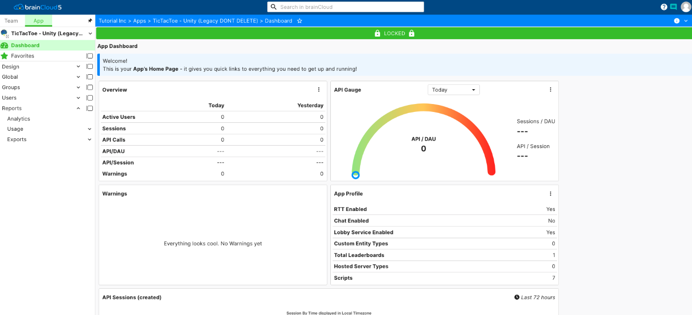

The brainCloud Design Portal is 4 powerful tools in one:

1. **Design Tool** – it’s a design tool that allows you to create, configure and define your applications.
2. **API Explorer** – it includes an expansive API Explorer that allows you to query your configured application dynamically without writing code!  Super handy for debugging and exploring the brainCloud API
3. **Monitoring Tool** – the monitoring features provide easy debugging of global and user data – and are also very useful in supporting your app once it goes live.
4. **Reporting** – brainCloud’s reporting features provide cross-platform analytics, as well as an API usage report that is useful for understanding the usage and performance of your application.

The brainCloud portal is used by developers, designers, and product managers to configure, design and publish a game. Each role has a different set of everyday tasks that they will use the portal to achieve.

#### **Developers**

Developers use the Portal to perform the following actions:

- Create new applications
- Download client libraries
- Test brainCloud API calls using the API Explorer
- Create persistent data either in the form of player statistics, game statistics or global data
- Debug an application by checking the application logs
- Upload asset files used in the app or game
- Create API Hooks and scripts for cloud code
- Configure push notifications

#### **Designers**

Designers use the Portal to design and tweak the game experience by defining:

- XP Levels
- Achievements
- Milestones
- Quests
- Statistics Events
- Define game leaderboards and leaderboard pacers.

#### **Product Managers**

Product managers use the Portal to:

- Define Products
- Define Promotions
- View Analytics
- Define Market Segments for promotions
