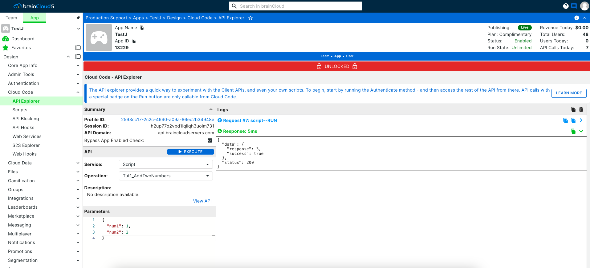

In this tutorial, we'll go through the basics of creating a Cloud Code script, and teach you how to pass parameters to/from a script.

## Step 1 - Create the Script

To create our first script, perform the following steps:

- Log into the brainCloud **Design Portal** (if you haven't already)
- Choose your app, and go to **Design | Cloud Code | Scripts**
- Click the **\[+\]** in the top right-hand corner to create a new script
- Give your script a name - for example, _"Tut1\_AddTwoNumbers"_, make it **_Client Callable_**, and set its _**Test Parameters**_ to:

Test Parameters
```js
{   
    "num1": 1,   
    "num2": 2 
} 
```
- Then switch to the **Editor** tab, and copy and paste the following script.

Script
```js
// Retrieve our two paramaters 
var a = data.num1; 
var b = data.num2;
 
// Perform our highly advanced calculation!
var c = a + b; 
// "Return" the result 
c; 
```
- Hit **\[Save\]** and then **\[Close\]** when you're done.

* * *

## Step 2 - Run the Script

Okay, let's see if it works. To run the script:

- Switch to the **API Explorer** by choosing **Design | Cloud Code | API Explorer** from the side menu
- The API Explorer attempts to simulate a client application accessing the brainCloud servers. Thus, just like any brainCloud client, you must first authenticate.  To do so, choose the **Authenticate** _Service_ and the **Authenticate** _Operation_ from the drop-downs, and then click the green **RUN** button.
- Next, we'll run the script. Choose **Script** from the _Service_ drop-down and Run Script "Tut1\_AddTwoNumbers" from the Operation drop-down. _If you don't see your script you probably forgot to make it Client Callable - go to its definition in the Scripts screen, and then come back._
- You'll notice that the default parameters that you set are displayed in the _Parameters_ section of the API Explorer. Edit them if you wish. Then click the RUN button to run the script and see the results.

[](images/Tut1_API_Explorer.png)

* * *

## Step 3 - View the results

The following results are returned from running the script:

- status = the HTTP result of the operation, which will always be 200, unless there were problems with the server
- data = the results from the script itself - which will contain two parts:
    - success = will be true unless an exception was triggered
    - response = the exact results returned from the script

Results
```js
{  
    "status": 200,  
    "data": {   
        "response": 3,   
        "success": true  
    } 
}
```
* * *

## Step 4 - Calling the Script from your client app

Calling scripts from client apps is straight-forward - you simply call the [RunScript()](/api/capi/script/runscript) method, passing in the name of the script, and any required parameters.

Calling the script from a Unity C# app would look like the following:
```js
string scriptName = "Tut1\_AddTwoNumbers";
string jsonScriptData = "{ \\"num1\\": 1, \\"num2\\": 2 }";
SuccessCallback successCallback = (response, cbObject) =>
{
    Debug.Log(string.Format("Success | {0}", response));
};
FailureCallback failureCallback = (status, code, error, cbObject) =>
{
    Debug.Log(string.Format("Failed | {0}  {1}  {2}", status, code, error));
};

// Call the script 
_bc.ScriptService.RunScript(scriptName, jsonScriptData, successCallback, failureCallback);
```