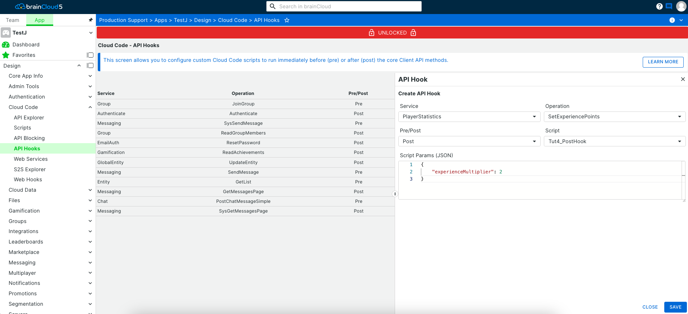

Pre and Post Hooks allow you to attach Cloud Code scripts to brainCloud's Client API - in effect, "hooking" into the API either before (pre) or after (post) the API method has been executed.

Pre-hooks allow you to pre-process data before it is sent to the API method. You can even change the parameters that are sent or abort the API call altogether.

Post-hooks allows you to massage the data that is returned after an API method executes.

To utilize a pre or post-hook to modify brainCloud's behaviour, you:

- First write the cloud code script with the appropriate parameter/return syntax (see below, or the [API Reference](/api/cc/ccscripts/apihooks))
- Then attach the cloud code script to the API method via the **Design | Cloud Code | API Hooks** page of the portal

The format and function of cloud code scripts are different from standard cloud code, so we've created two examples below.

## Pre Hooks

Pre-hook scripts are executed **before** the API call they are hooked to.  They allow you to preprocess the data that gets passed to the API call, or even return an error immediately and skip the API call altogether.

To create a pre-hook script starts by creating a new Cloud Code script in the Cloud Code | Scripts section of the design tab.

Once you've created the script, go to the Edit tab and we'll write the logic for our hook.

#### Accessing & Returning Data

Similar to how regular Cloud Code scripts work, the parameters passed into the hook can be accessed through the "data" object.  However, the fields inside the object are different when the script is a hook. These are the available fields:

- **service ** - The service that the API being hooked belongs to
- **operation** \- The operation name for the hooked API
- **message** \- The parameters being passed to the API
- **parms** \- The custom parameters for the hook.  These are configured when adding the hook in the API Hooks page (covered further down).

In addition to the unique data object passed in, pre-hook scripts return a specific object that contains several fields that must be present for certain operations:

- **status** - When set to a non-200 value the API call will be aborted, and an error return to the calling client
- **messageOverride** - When a hook wants to modify the parameters being passed on to the API, the modified parameters must be assigned to this field of the return object
- **reasonCode** \- A custom reason code for when the status is set to non-200. This is returned to the client as part of the error
- **errorMessage** - A custom error message for when the status is set to non-200. This is returned to the client as part of the error
- **parms** \- The custom parameters for the hook.  These are configured when adding the hook in the API Hooks page (covered further down).

For this tutorial, we will hook onto the PlayerStatisitics | SetExperiencePoints API, and we need to keep in mind the parameters that get passed to it when writing our pre-hook. A single parameter is passed to the SetExperiencePoints API:
```js
{
    "xp\_points": 1
}
```
The goal of our pre-hook is to multiply all XP values passed into this API method, therefore we need to modify the "xp\_points" field of the "message" and add it to the "messageOverride" field of the return object.

To give an example of returning an error, our script will also abort the call if the "xp\_points" value is over a certain threshold.
```js
message = data.message; //get the passed in API parameters
hookParms = data.parms; //get the custom hook parameters

message.xp\_points \*= hookParms.experienceMultiplier; //multiply the XP points value that was passed in

var retval = {}; //prepare the return object

if(message.xp\_points > 10000) // the xp value is too large, return an error
{
   retval.status = 500;
   retval.reasonCode = 50000;
   retval.errorMessage = "XP value is too high!";
} 
else // pass the multiplied XP value onto the API
{
   retval.status = 200;
   retval.messageOverride = message;
}

retval; //return the object
```
## Post Hooks

Post-hook scripts are called after executing a particular API call. Post-hook scripts can do some post-processing for an API call as well as optionally modifying the data returned to the client.

Let's create a post hook for the SetExperiencePoints method.  The process is similar to creating a pre-hook, but once again the input "data" object and return object fields have changed.

#### Accessing & Returning Data

Similar to pre-hook scripts, the “service”, “operation” and “parms” are passed to the script. The “message” component is the result of the call rather than the original calling message data. The original calling message is passed in as “callingMessage”.

- **service ** - The service that the API being hooked belongs to
- **operation** \- The operation name for the hooked API
- **message** \- The result of the API call
- **callingMessage** - The original message parameters passed into the API
- **parms** \- The custom parameters for the hook.  These are configured when adding the hook in the API Hooks page (covered further down).

The returned object for post hooks also differs slightly from pre hooks.  First, a null return object from the script will cause the return message from the API to be sent without modification.  Like the pre-hook, returning a non-200 status will return an error to the calling client with the specified reason code and error message.

To override the message data returned to the client, assign the modified message to the "data" field of the return object.

These are all the return object fields:

- **status** - When set to a non-200 value the API call will be aborted, and an error return to the calling client
- **data**\- When a hook wants to modify the message being returned to the client, the modified parameters must be assigned to this field of the return object
- **reasonCode** \- A custom reason code for when the status is set to non-200. This is returned to the client as part of the error
- **errorMessage** - A custom error message for when the status is set to non-200. This is returned to the client as part of the error

In our example script, we will simply append a bool to the return data.
```js
message = data.message; //get the result of the API call

message.wasPostHooked = true; //append the bool to the result

var retval = {};
retval.status = 200;
retval.data = message;  //add the modified message to the return object

retval; //return the object
```
## Adding A Hook

Now we'll go over how a hook is configured in the portal.  This is the process of assigning a script to a specific API method, as a pre or post hook.

- First, you will need to have your script created in the Cloud Code | Scripts section of the design tab.
- Next, go to the API Hooks tab (also under the Cloud Code heading).
- Click the Create button to configure a new hook. You will see the dialogue below.

[](images/Tut4_PrePostHook-1.png)

The dialogue is fairly straightforward.  Select the Service and Operation you want to hook, choose whether it is a pre (before API execution) or post (after API execution) hook, and then select the actual hook script.

The Params section is where you can configure the custom data passed into your hook.  In our example, we are hooking onto the SetExperiencePoints method, and our post hook script will modify the XP amount that gets set.  It will multiply the original value passed in with the call and multiply it by the parameter we have set here, experienceMultiplier.

Once you've configured your parameters you're done!  Your hook script will be executed whenever and wherever the hooked API method is called.
