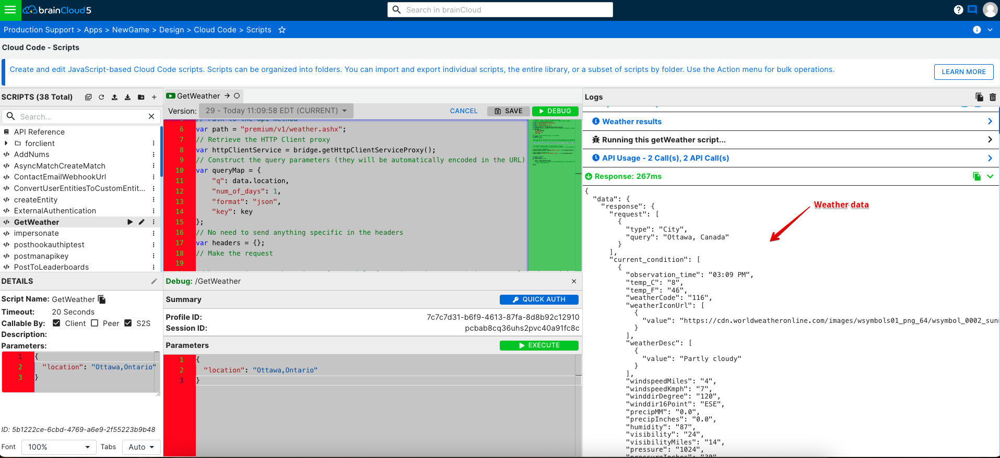

brainCloud provides an HTTP Client proxy object, retrieved via the [bridge](/api/cc/bridge "Bridge – Client"), that allows you to make HTTP GET requests to external 3rd party servers.

The HTTPClientProxyObject currently has a number of public methods.  The methods are defined at the bottom of this page. The 'serviceCode' parameter in these methods refers to the value assigned in the portal configuration.

* * *

## External Web Service Example

The following is an example script for requesting weather information from [World Weather Online](http://www.worldweatheronline.com/api/ "World Weather Online").
```js
// GetWeather script - takes the following parameters
// location - location to get the weather for - example "Ottawa, Canada"
// API key from WorldWeatherOnline.com
var key = "ad1c12629a14edf04a8796042206a";
// Path to the api method
var path = "free/v2/weather.ashx";
// Retrieve the HTTP Client proxy
var httpClientService = bridge.getHttpClientServiceProxy();
// Construct the query parameters (they will be automatically encoded in the URL)
var queryMap = {
    "q": data.location,
    "num\_of\_days": 1,
    "format": "json",
    "key": key
};
// No need to send anything specific in the headers
var headers = {};
// Make the request
var result = httpClientService.getResponseJson("getweather", path, queryMap, headers);
// Log the results (debugging)
bridge.getLogServiceProxy().logInfo("Weather results", JSON.stringify(result));
// Return the results
var retval = null;
if (result.status === 200)
{
    retval = result.data.json.data;
}
retval;
```
In order to access 3rd party servers, it's base URL must be configured in the portal under Design | Cloud Code | Web Services. This example needs a server named "getweather" with an URL of "https://api.worldweatheronline.com" added to list.

* * *

## Try it yourself

Follow these steps to try this for yourself.

### Step 1 - **Create the Script**

_Via **Design | Cloud Code | Edit Scripts** in the portal._

[](images/Tut_5_1.png)


### Step 2 - **Add the Service to the Whitelist**

_Via **Design | Cloud Code | Web Services** in the portal._

[](images/Tut_5_3.png)

### Step 3 - **Test from the API Explorer**

- **Go to API Explorer** (**Design | Cloud Code | API Explorer**)
- **Authenticate the user** - select the _Authenticate_ service, then _Authenticate_ Operation, and click the **Go** icon (Green Right Triangle).  You may have to play with the authentication parameters a bit (to ensure you're specifying a valid platform, etc.)
- **Call the Cloud Script** - choose the _Script_ service, then "_Run Script GetWeather_" for the operation.  Customize the parameters if you'd like, and then hit **Go**.

[](images/Tut_5_4.png)

Et voila!

_Note - if you are going to use this service in your app, please go to **WorldWeatherOnline** and **get your own API key**!_

* * *

### getResponseJson
```js
/\*\*
 \* Gets a JSON formatted document via HTTP.
 \* @param serviceCode Web service service code
 \* @param path Resource path.
 \* @param query Optional query.
 \* @param headers map of extra headers
 \* @return Json object.
 \*        
 \* {
 \*    status : 200,
 \*    data : {
 \*        statusCode : 200,
 \*        json : {
 \*            "key" : "value"
 \*        }
 \*    }
 \* }
 \*/
public NativeObject getResponseJson(String serviceCode, String path, NativeObject query, NativeObject headers)
```
### getResponseText
```js
/\*\*
 \* Gets text document via HTTP.
 \* @param serviceCode Web service service code
 \* @param path Resource path.
 \* @param query Optional query.
 \* @param headers map of extra headers
 \* @return Json object.
 \* {
 \*    status : 200,
 \*    data : {
 \*        statusCode : 200,
 \*        text : "text string"
 \*    }
 \* }
 \*/
public NativeObject getResponseText(String serviceCode, String path, NativeObject query, NativeObject headers)
```
### postFormResponseJson
```js
/\*\*
 \* Posts a form encoded document via HTTP and expects a JSON response.
 \* @param serviceCode Web service service code
 \* @param path Resource path.
 \* @param headers map of extra headers
 \* @param form form parameters.
 \* @return Json object.
 \* {
 \*    status : 200,
 \*    data : {
 \*        statusCode : 200,
 \*        json : {
 \*            "key" : "value"
 \*        }
 \*    }
 \* }
 \*/
public NativeObject postFormResponseJson(String serviceCode, String path, NativeObject headers, NativeObject form)
```
### postFormResponseText
```js
/\*\*
 \* Posts a form encoded document via HTTP and expects a Text response.
 \* @param serviceCode Web service service code
 \* @param path Resource path.
 \* @param headers map of extra headers
 \* @param form form parameters.
 \* @return Json object.
 \* {
 \*    status : 200,
 \*    data : {
 \*        statusCode : 200,
 \*        text : "text string"
 \*    }
 \* }
 \*/
public NativeObject postFormResponseText(String serviceCode, String path, NativeObject headers, NativeObject form)
```
### postJsonResponseJson
```js
/\*\*
 \* Posts a JSON formatted document via HTTP and expects a JSON response.
 \* @param serviceCode Web service service code
 \* @param path Resource path.
 \* @param headers map of extra headers
 \* @param json JSON formatted data to post.
 \* @return Json object.
 \* {
 \*    status : 200,
 \*    data : {
 \*        statusCode : 200,
 \*        json : {
 \*            "key" : "value"
 \*        }
 \*    }
 \* }
 \*/
public NativeObject postJsonResponseJson(String serviceCode, String path, NativeObject headers, NativeObject json)
```
### postTextResponseText
```js
/\*\*
 \* Posts a text document via HTTP and expects a Text response.
 \* @param serviceCode Web service service code
 \* @param path Resource path.
 \* @param headers map of extra headers
 \* @param form form parameters.
 \* @return Json object.
 \* {
 \*    status : 200,
 \*    data : {
 \*        statusCode : 200,
 \*        text : "text string"
 \*    }
 \* }
 \*/
public NativeObject postTextResponseText(String serviceCode, String path, NativeObject headers, String text)
```