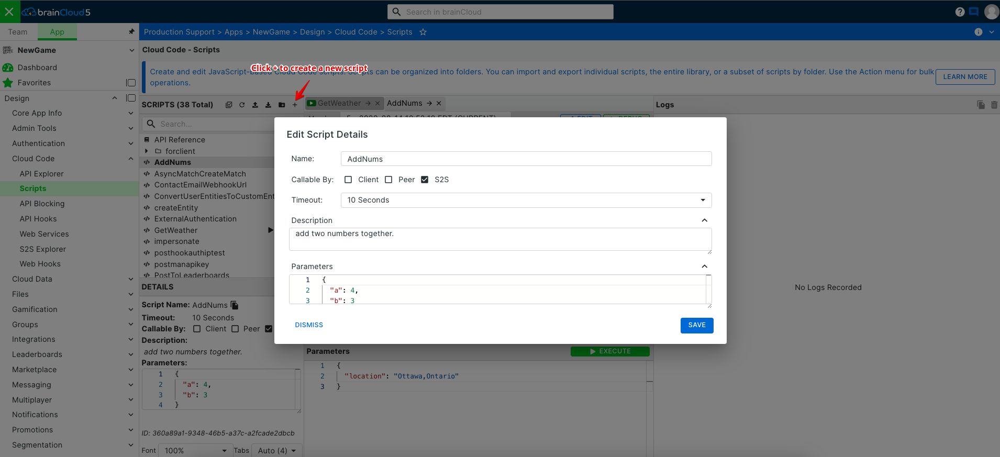
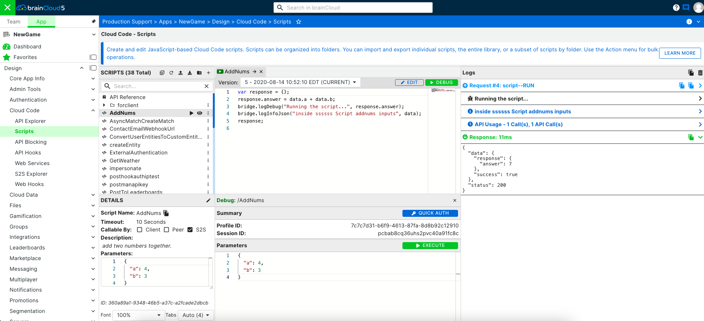
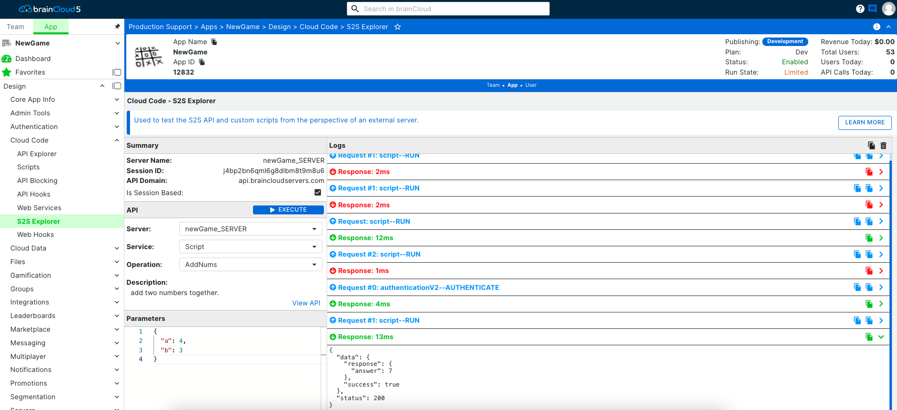
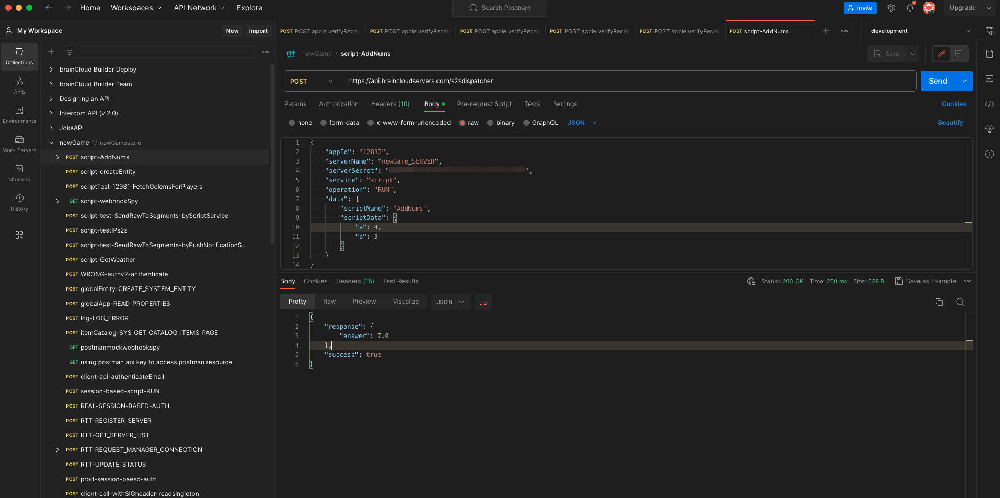
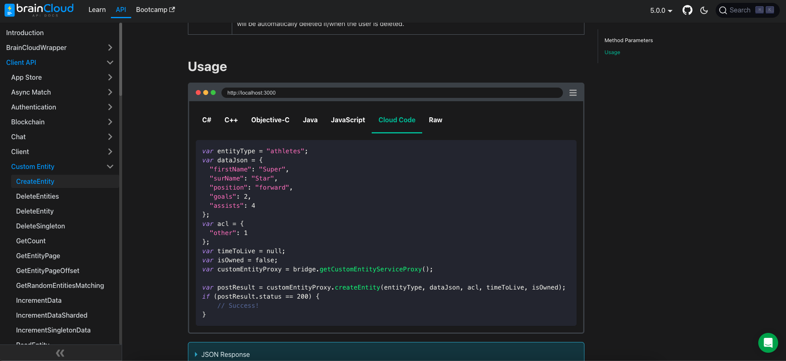

Want to create S2S cloud code script, but don't know where to start?

In this tutorial, we will take you through the process of creating a simple S2S script, and calling it from an external client (Postman).

### Step 1 - Create the S2S Script (AddNumbers)

- Go to the brainCloud Portal and open the **Design | Cloud Code | Scripts** page

[](images/S2S-Start-1.png)

- Click the **\[+\]** Plus icon to start adding a new Script

[](images/S2S-AddScript-1.png)

- Give the Script a _name_ and _description_. Also, ensure the _\[x\] S2S_ checkbox is checked.  
    _Note: Client callable is optional, but it's a good idea to disable it if the script will never be used client side._

- Create some Test Parameters to use. For this tutorial, enter:  
    _{ "a": 4, "b": 3 }_

- You're done in the **Details** tab, click on the **Editor** tab. Here, enter the following:

var response = {};
response.answer = data.a + data.b;
response;

_Note: The last line is always what will be returned in the response._

-  You should have something that looks like this after.

[](images/S2S-Details.png)

[](images/S2S-Editor-1.png)

- The last tab is the **Run** tab. Here, you can do a **\[Quick Authenticate\]**, and **\[Run\]** your new script to view the return!  
    (**\[Save\]** and **\[Close\]** when you are done editing and testing your script)

[](images/S2S-RunScript.png)

### Step 2 - Configure an S2S Server to call it from

- Now go to the brainCloud Portal and open the **Design | Cloud Code | My Servers** page, and click **\[New Server\]**
- Enter a name for your server, such as APP\_SERVER, and click save. This will generate a secret for your server  
    Note: You can also limit the IP ranges for your server. This is highly recommended for production deployments.

_Your script and server should now be visible in the S2S Explorer._

[](images/S2S-Explorer-1.png)

### Step 3 - Call it!

- Let's try calling it from Postman!  (If you don't already have it, you can download it from [here](https://www.getpostman.com).)
- Launch Postman, and configure a new request.
- Set the _request type_ to "POST"
- Set the _request URL_ to "https://sharedprod.braincloudservers.com/s2sdispatcher"
- Send the following in the body (setting a type of "raw", sub-type "JSON"), replacing the:
    - _gameId_ with your appId
    - _serverName_ with the name of the server that you configured above in _step 2_
    - and the _gameSecret_ with the secret of the server that you configured above in _step 2_
```js
{
    "gameId": "11549",
    "serverName": "APP\_SERVER",
    "gameSecret": "97e1d95d-69f4-472e-904f-39f372777aee",
    "service": "script",
    "operation": "RUN",
    "data": {
        "scriptName": "AddNums",
        "scriptData": {
            "a": 3,
            "b": 4
        }
    }
}
```
[](images/S2S-PostMan.png)

- Hit **\[Send\]**. If you app is properly configured, you should see this response:
```js
{
    "response": {
        "answer": 7
    },
    "success": true
}
```
### Step 4 - Experiment!

That's cool, but let's try exercising the brainCloud API?  Try creating and executing the following script:
```js
var profileId = "";
//Get the passed in profileId
//ex. {
// "profileId": "c82b45c0-d906-42a9-8879-2db9c9d8dbc2"
// }
profileId = data.profileId;
//Create a session with that user
var session = bridge.getSessionForProfile(profileId);

//Grab the enity service with the current profile session
var entityProxy = bridge.getEntityServiceProxy(session);

//Now let's create a new entity that will be attached to that profile
var entityType = "address";
var entityData = { "street" : "1309 Carling" };
var acl = { "other": 0 };
var response = entityProxy.createEntity(entityType, entityData, acl);

//And return the response
response;
```
[](images/S2S-Documentation.png)

- If you haven't checked out our API docs yet, you should check them out here:  [S2S](/api/s2s)  
    You can find more examples on how to use the brainCloud cloud scripts for your application!
