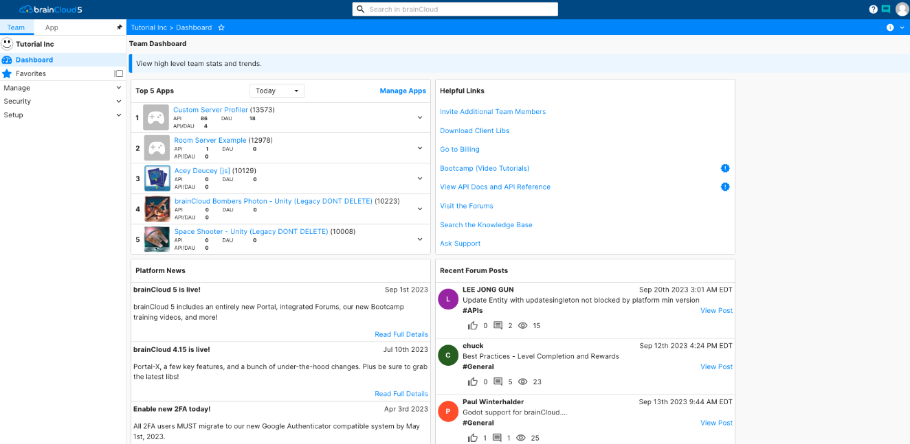
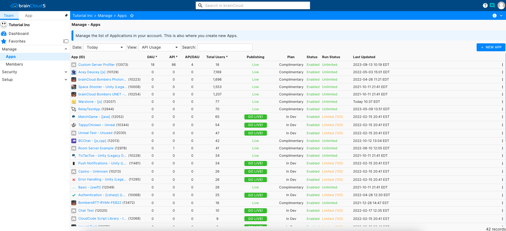
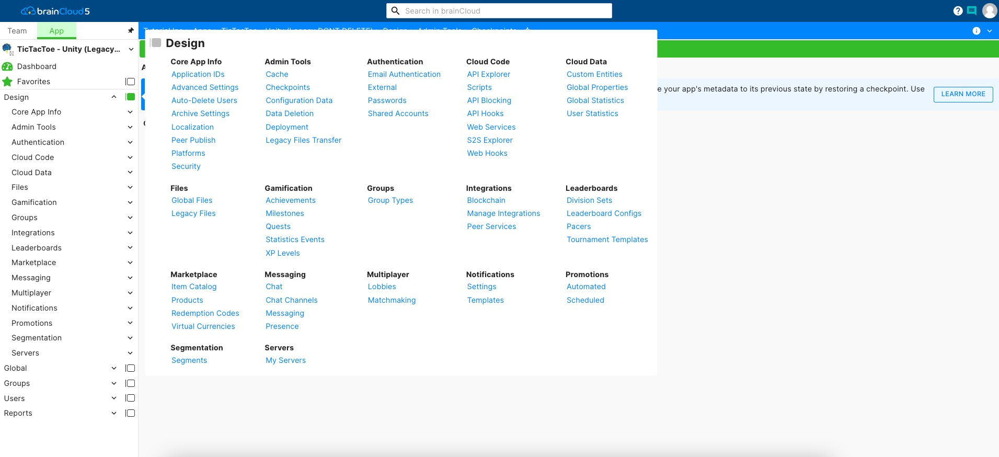
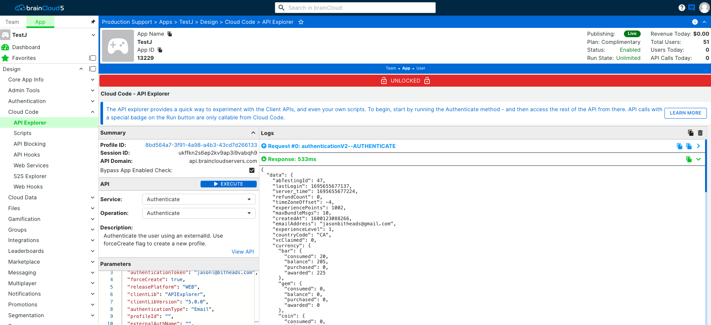

## Before we start

Before we start, ensure that you've signed up with brainCloud and have logged in.  It's free and simple - go to [http://getbraincloud.com](http://getbraincloud.com).

## Home Page

When you first log in to the portal, you'll arrive at the Team Home Page.

Key components of this page include:

- The list of **Your Apps** (with quick links to jump to them)
- The latest **brainCloud News**
- Quick links for common actions - like **Inviting Team Members**
- The green **Help** button in the bottom-right hand corner - click to talk to us!

The **Home Page** is the actually just the main page of the **Administration** section of the portal. You can view the other admin pages by clicking on the appropriate tabs on the left-hand side of the page.  You can return to the home page at any time by clicking on the **<Gear\>** icon in the top-right-hand corner.

## Creating an App

The first thing you'll want to do is create an app.  Doing so is simple - just click the **\[+\]** button in the corner of the **Your Apps** section, and fill in the dialog.

You can choose whether or not to _Enable Game Features_ - this justs shows and/or hides the gaming features of the design portal - like Achievements, Leaderboards, etc. If your app isn't planning to use these features, you can hide them to keep the portal simpler. Note you can always choose to enable them later.

You'll want to pick at least one _Supported Platform_. brainCloud's APIs check the platform passed in during authentication - if the platform isn't enabled the authentication will be rejected. So be sure to enable both your development and deployment platforms. _\[Note - the API Explorer defaults to iOS for Authentication calls. It is convenient during development to enable that platform, even if you don't intend to deploy to it.\]_

## App Management

After creating the app you'll be placed in the **Administration | App Management** page.  This is where you view and control the publishing of your apps - see the Actions menu on the right-hand side of your app.

For now, we're just going to move along to the design settings for this app. _Click on your app's name in the list._

## Design

The Design section is the heart of the brainCloud Portal - it's where you _set up the rules_ about what your app can do, configure integrations with other services, write custom cloud code scripts, and even test API _calls_ live with the system.

Before we get too far, we should mention the navigation items at the top of the screen.

There are four main sections - _Team_, _Design_, _Monitoring_, and _Reports_. As you switch sections you'll notice that the tabs along the left-hand of the screen update. Note also that most of these tabs are expandable to detailed sub-tabs.

You can also quickly change the currently selected game via the combo box.

For now, let's go back to Design - we're going to try a very simple test of our game.

## API Explorer

The API explorer is a central feature of the brainCloud Portal. You can use it to:

- Explore how the API is laid out (in terms of services and operations)
- Test new APIs before implementing them in your app
- Confirm the json response format of API calls
- Debug user support scenarios

As a simple test, we'll try authenticating with brainCloud. You always have to authenticate with brainCloud before you perform any other operations.

The brainCloud API is organized into Services and Operations.  First, choose the **Service** (in this case _Authenticate_) and then the **Operation** (in this case, also _Authenticate_). You can customize the parameters sent into the API call in the **Parameters** text box.

As you can see, the default Authenticate command will simulate and e-mail based authentication from an iOS device and is using the developer's e-mail address as the account. Note that _<forceCreate\>_ is set to true, which means that the user account will be created if it doesn't already exist.

These defaults seem fine - click the green **<Run\>** button (the play symbol) to send the API call to the brainCloud server. You should see the _API Request_ echoed to the **Log** window, followed by brainCloud's _Response_ a second later.

Now that you're logged in (_authenticated_), you can try additional API calls at your leisure.

And that's it - you've created your first app and logged in. Congrats!

_\[P.S. Check your e-mail. brainCloud automatically sends a message to validate the e-mail address provided during account creation. You can customize this functionality in the **Design | Core App Info | Advanced Settings** page of the portal.\]_
