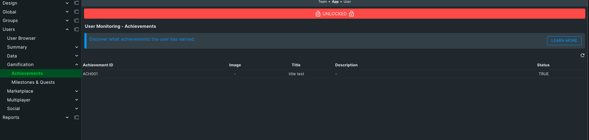

The Achievements tab lets you see the status of all Achievements for the selected User.

The section is sortable by Achievement ID, Title, and Status.  **Status** is TRUE if the User has earned the achievement, FALSE if not.  Clicking the **{...}** button in the top right beside record count will display the raw JSON data for the Achievements listed on the page.
