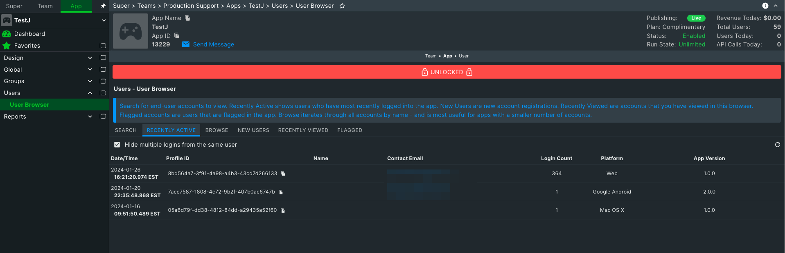
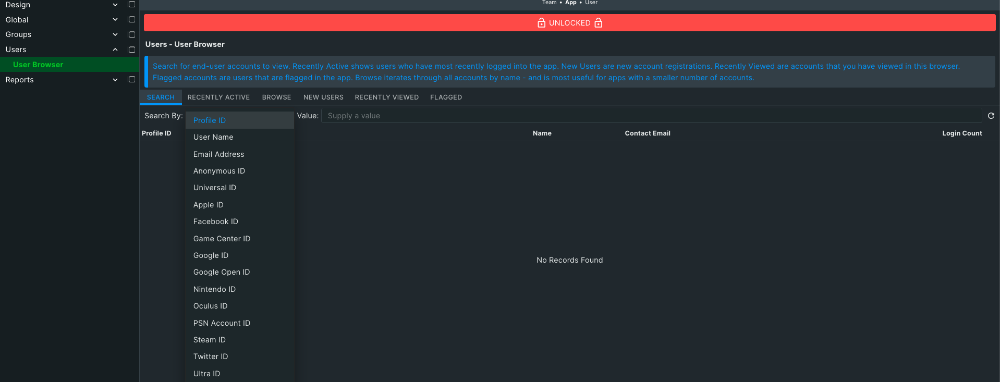
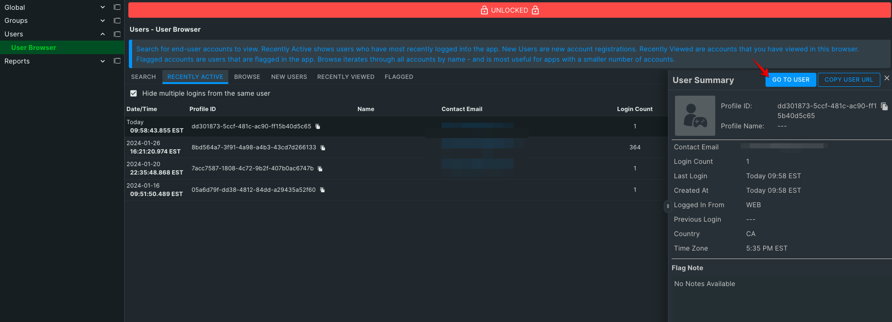

The first step is to get to the User Monitoring section. From the side navigation bar click on the Monitoring tab at the top, followed by the User Monitoring tab below.

From here you will be in the User Summary tab of the User Monitoring section.  If you haven't previously selected a user you will see the New Users page.  You can now click the Select User button to open the Select User popup, or select a user from the list of New Users below.

Once the Select User popup is open you have a variety of options available to find the users you're looking for.  From the search tab you can perform a number of search types from the drop down to the left of the search bar (default is Name).

- **Name** - This is the name that is set by calling the [UpdatePlayerName](/apidocs/apiref/#capi-playerstate-updateplayername) function of the PlayerState service.  Sometimes referred to as Profile Name.
- **Anonymous** - The anonymous ID of the player created when the player was authenticated using [AuthenticateAnonymous](/apidocs/apiref/#capi-auth-authenticateanonymous).
- **Facebook ID** - The Facebook ID associated with a user through either [AuthenticateFacebook](/apidocs/apiref/#capi-auth-authenticatefacebook) or [AttachFacebookIdentity](/apidocs/apiref/#capi-identity-attachfacebookidentity).
- **Email** \- The email address associated with a user through either [AuthenticateEmailPassword](/apidocs/apiref/#capi-auth-authenticateemailpassword) or [AttachEmailIdentity](/apidocs/apiref/#capi-identity-attachemailidentity).
- **Steam** \- The Steam ID associated with a user through either [AuthenticateSteam](/apidocs/apiref/#capi-auth-authenticatesteam) or [AttachSteamIdentity](/apidocs/apiref/#capi-identity-attachsteamidentity).
- **Universal** - The Universal ID associated with a user through either [AuthenticateUniversal](/apidocs/apiref/#capi-auth-authenticateuniversal) or [AttachUniversalIdentity](/apidocs/apiref/#capi-identity-attachuniversalidentity).
- **Profile ID** - The unique ID generated for every user when they are created.  Used throughout the API to refer to individual users.

Clicking the Search button will produce a list of relevant results.

From the results you can click on any of the returned players Profile IDs to view detailed information about them. You can switch Users at any time by clicking the Change User button at the top right of the page.

