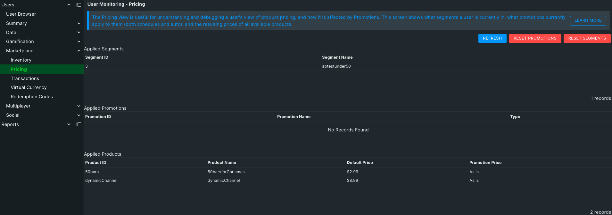

The Pricing tab is useful for understanding and debugging a user's view of product pricing, and how it is affected by Promotions. This tab shows what segments a user is currently in, what promotions currently apply to them (both scheduled and automatic), and the resulting prices of all available products.

At the top of the page are 3 buttons.  **Refresh** will update the information displayed on the page by re-evaluating the User's candidacy for both Promotions and Segments. **Reset Promotions** and **Reset Segments** will remove the User from any currently applied Segments or Promotions.

The first section of the page, **Applied Segments**, displays the Segments currently applied to the User.  They can be sorted by their ID or Name.

The next section, **Applied Promotions,** lists the currently applied promotions.  They can be sorted by ID, Name, and Type.  If your promotions are based on Segments you can use these two sections to be sure a User is receiving the correct promotions.

The final section, **Applied Prices**, shows all the Products the User is eligible for along with their default price and current price after Promotions are applied.
