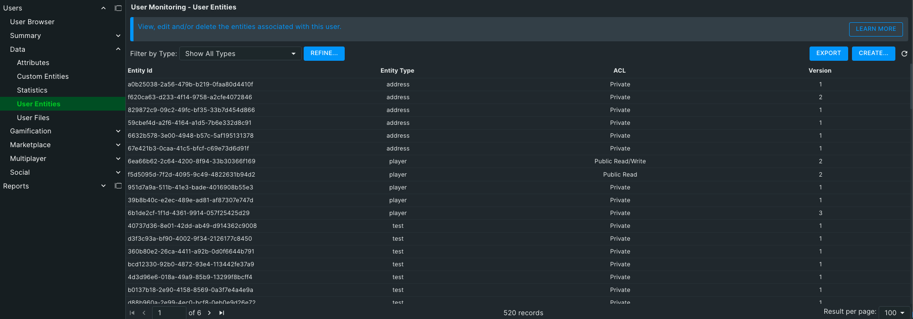
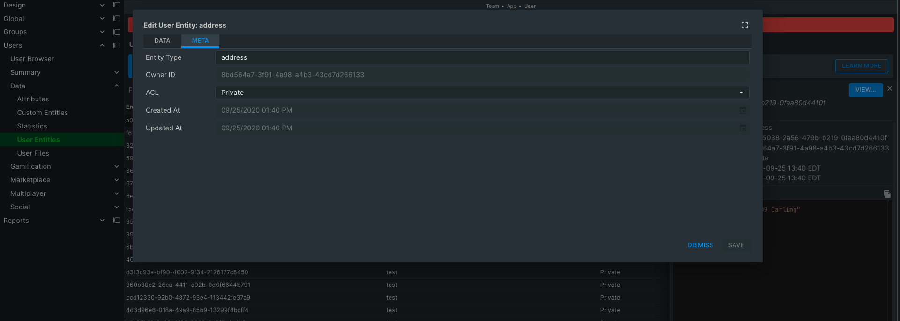

The user entities tab allows you to view and edit all the selected User's entities.

Entities can be filtered using the **Filter by Type** drop down list. The list can be sorted by Entity Id, Entity Type, Version, and ACL.   To see the raw JSON for all the entities listed click the **{...}** icon beside the total record count at the top right.  Clicking the eye icon to the right of an entity listing will open the Entity Data popup.  From here you can view and edit the entity's data directly.

The **Entity Data** popup allows you to view and edit the entity's data.  You can edit Entity Type, Entity Subtype, ACL, and the raw JSON data that makes up the entity.

The three buttons at the bottom of the popup are fairly self explanatory.  **Cancel** will close the popup without saving any changes, **Delete** will permanently delete the entity, and **Save** will save any changes made to the entity.
