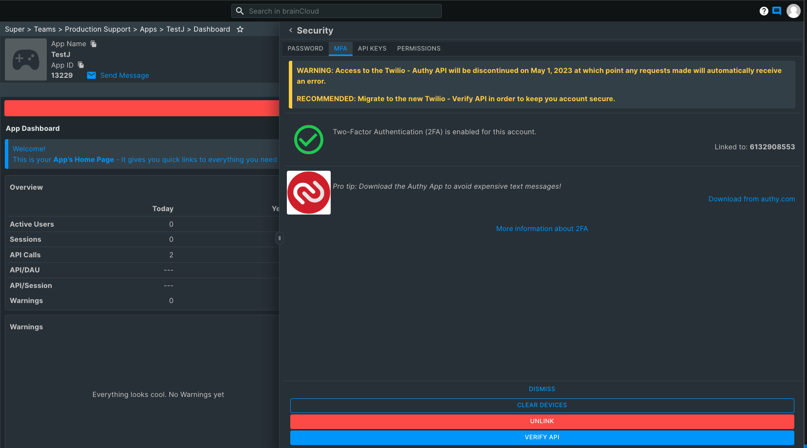

brainCloud's Two-factor Authentication (2FA) support keeps intruders out of your Team Member account by requiring both your password and your phone to log in.

It works by sending a special verification code to your mobile device whenever you log into brainCloud from a new computer (or if it's been 30 days since your last verification). This significantly increases the security of your brainCloud account and it's associated applications.

brainCloud 2FA uses [Authy](https://www.authy.com), which gives the flexibility of performing authentication via text message or the Authy App (which is available for iOS, Android, Mac OS, Windows, Chrome and more). For the best possible experience, we recommend that folks download the [Authy App](https://www.authy.com/app/mobile/).

## To enable 2FA

- Log into the brainCloud Portal
- Choose the **Edit Profile** option from the top-right **Power** menu
- Go to the **Two-factor** tab
- Click the green **\[Click to enable 2FA\]** button
- Follow the prompts!

## Logging in with 2FA

Logging in with 2FA is pretty simple:

- Log into the brainCloud Portal with **email + password** just like normal
- If it's your first time using this computer (or it's been more than 30 days since your last verification), you'll be prompted to enter a verification code (i.e. one-time password)
- Check your phone. You may have been sent the code via SMS, or you may have received a push notification to the Authy app if you have it installed. Even if you didn't receive the push notification, you can just launch the authy app directly.
- Enter the code into the dialog and hit **\[Verify\]**. If you're on a public computer, be sure to un-check the "remember this computer" option during verification. Otherwise, leave it checked so that you don't have to do this for another 30 days!
- Voila, you're in.

## Disabling 2FA

If you decide that you no longer want to use 2FA for your account, you can click the red **\[Unlink\]** button from the Edit Profile screen.

## Frequently Asked Questions

1. **Will I need my phone to log in \*every time\*?**  
    No. You can tell brainCloud to remember the computer that you are logging in from. It will remember it for 30 days, and thus not ask you for the verification code during that time.
2. **Is the Authy app like Google Authenticator? Can I use that instead?**  
    The Authy app \*is\* a lot like Google Authenticator, and you can even configure it to perform authentication for Google Authenticator-based sites. But the inverse is not true. You cannot use Google Authenticator for sites that use Authy (i.e. brainCloud).
3. **Why did brainCloud choose Authy?**  
    We choose Authy for the richness of features (app, text or voice authentication, plus one-touch, which we'll be adding soon), ease of integration, and better management features for our users (i.e. you can switch phones, use multiple devices, etc. without issue using Authy).
4. **I don't have a cellphone. Can I still use 2FA?**  
    Yes, though it isn't recommended (since a land-line phone is less likely to be dedicated to a single person). But if you find yourself in that situation, you can enter the number for the phone, and choose the voice call options during authentication.
5. **This is cool. Can I add Authy to my apps?**  
    Funny you should mention that. We're working on it right now. :)
