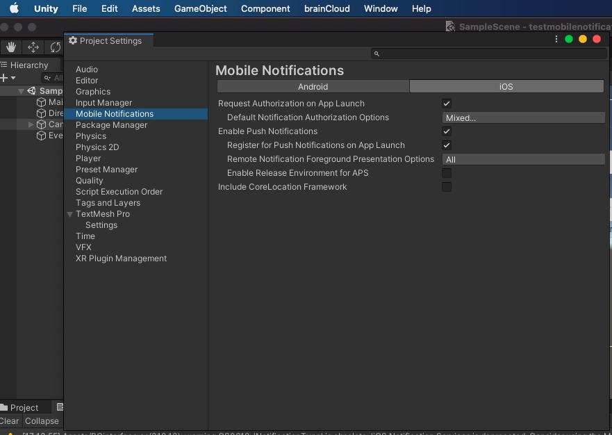
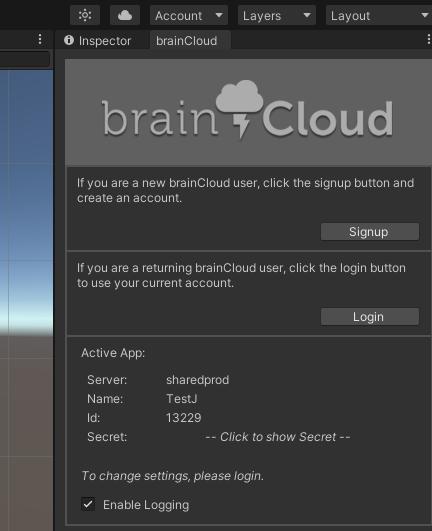
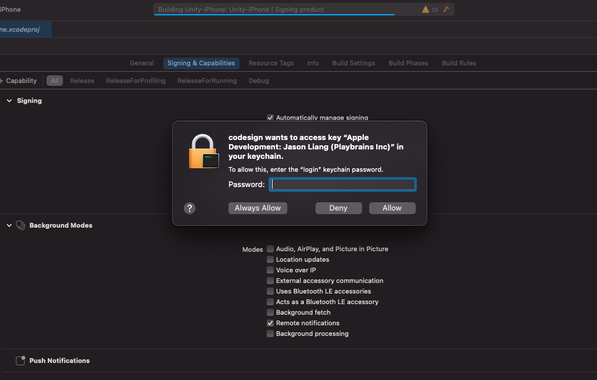

This article will walk you through the steps of setting up push notifications (iOS) with brainCloud.

#### **Prerequisites**

- You have an Apple developer account
- You have a physical iOS 10 and above testing device

#### **Step 1: Create an application on Unity editor**

- Open Unity hub and create a new project.
- Download and import the latest [brainCloud client Unity package](https://github.com/getbraincloud/braincloud-csharp/releases) to this project. Once imported the plugin correctly, you will find the brainCloud tab appears on the editor menu.

[](https://downloads.intercomcdn.com/i/o/287322489/19de350205641bd3409c95f9/Screen+Shot+2021-01-13+at+17.50.42.png)

- Download and import the latest `Mobile Notifications` package from package manager to your project.

[](https://downloads.intercomcdn.com/i/o/287324032/c2515dcc176e4eb52d277676/Screen+Shot+2021-01-13+at+17.56.24.png)

- Set up mobile notifications for iOS from edit->project settings

[](https://downloads.intercomcdn.com/i/o/287326591/b3481fc6474f0d4aee31ff2c/Screen+Shot+2021-01-13+at+18.07.00.png)

- Open brainCloud setting from the tab, select or create a brainCloud back-end app linked to your project.

[](https://downloads.intercomcdn.com/i/o/285889725/1386428122ce5d7142643b2f/Screen+Shot+2021-01-10+at+9.11.08+PM.png)

- Create some basic functional UI elements in your project and link the code behind them as the following image.

[](https://downloads.intercomcdn.com/i/o/287327658/5ee06930a5d156ac1bf7d580/Screen+Shot+2021-01-13+at+18.12.07.png)

- Functions and its code that linked behind the button \[Register device token\] are similar to below. Once authenticate end-user with their brainCloud account, from the Authorization request, retrieve the device token and pass it to brainCloud device token register method -- `RegisterPushNotificationDeviceToken`()
```js
    IEnumerator RequestAuthorization()  
    {  
        var authorizationOption = AuthorizationOption.Alert | AuthorizationOption.Badge;  
        using (var req = new AuthorizationRequest(authorizationOption, true))  
        {  
            while (!req.IsFinished)  
            {  
                yield return null;  
            };  
            string res = "\\n RequestAuthorization:";  
            res += "\\n finished: " + req.IsFinished;  
            res += "\\n granted:  " + req.Granted;  
            res += "\\n error:  " + req.Error;  
            res += "\\n deviceToken:  " + req.DeviceToken;  
            Debug.Log("debug inside ienumerator the res: "+ res);  
            \_bc.PushNotificationService.RegisterPushNotificationDeviceToken(req.DeviceToken, authSuccess\_BCcall, authError\_BCcall);  
        }  
    }  
  
    //click register token button  
    public void RegisterDeviceToken()
  
    {
  
        StartCoroutine(RequestAuthorization());  
    }
```
- Finish the rest methods and callbacks code in your script.
- Click `Build Settings` from Unity `File` tab, switch platform to iOS.

[](https://downloads.intercomcdn.com/i/o/285894570/a762ccc8796ffd0f0e9c1df2/Screen+Shot+2021-01-10+at+9.44.33+PM.png)

- Set up project `Bundle Identifier` and `target SDK` via `Player Settings` .

[](https://downloads.intercomcdn.com/i/o/287330568/371b1e49aef2bc7faa85c973/Screen+Shot+2021-01-13+at+18.23.48.png)

- Click `Build and Run`, then create a folder to save this Xcode project on your local storage.

[](https://downloads.intercomcdn.com/i/o/287390067/92da66f43ec70edc81d6df55/Screen+Shot+2021-01-13+at+18.28.27.png)

#### **Step 2: Setup your project on Xcode editor**

- Once Xcode is opened from the above step, open `Signing & Capabilities` from your target device in the project panel.

[](https://downloads.intercomcdn.com/i/o/287332931/9ea846c0e0fc9a649d4f8ad4/Screen+Shot+2021-01-12+at+11.08.24+AM.png)

- Click `Automatically manage signing` checkbox and enable it.

[](https://downloads.intercomcdn.com/i/o/287333985/3fa16a94553c0429e9607890/Screen+Shot+2021-01-12+at+11.30.32+AM.png)

- Then, login into your team and provisioning profile.

[](https://downloads.intercomcdn.com/i/o/287334370/ca810aec10460e8b49721c0e/Screen+Shot+2021-01-13+at+18.43.17.png)

#### **Step 3: Create and download a notification p12 file from your apple account**

- You should find your project identifier is created from the above step on the list of Identifiers under the `Certificates, Identifiers & Profiles` section of your apple developer account.

[](https://downloads.intercomcdn.com/i/o/287335685/b6e2099fe768ca04e4c8aaaa/Screen+Shot+2021-01-12+at+11.37.28+AM.png)

- Click it and scroll down to `Pushnotification` row, then click `configure`.

[](https://downloads.intercomcdn.com/i/o/287336087/2066988a19f724ce0432035b/Screen+Shot+2021-01-12+at+11.40.01+AM.png)

- Click `create certificate` under an environment type ( you will use the same environment type when configuring push notification settings on brainCloud), then click `continue` to create a CSR file.

[](https://downloads.intercomcdn.com/i/o/287337173/d4f877c56bc8fd93cbf180b7/Screen+Shot+2021-01-12+at+14.48.39.png)

- You will be asked to upload a certificate then.

[](https://downloads.intercomcdn.com/i/o/287337551/72ed23d7d3d2c7ef219968be/Screen+Shot+2021-01-12+at+14.51.05.png)

- Open Keychain from your Mac, click the `Certificate Assistant` menu and select `Request a Certificate From a Certificate Authority` under the `Keychain Access` tab.

[](https://downloads.intercomcdn.com/i/o/287374513/d33bf2b774eef6983f226bde/Screen+Shot+2021-01-12+at+14.56.51.png)

- Fill out the fields and select `Saved` to disk, then click Continue.

[](https://downloads.intercomcdn.com/i/o/287391648/79083ea308019bb976de4ae7/image.png)

- Choose a folder to save this cert.

[](https://downloads.intercomcdn.com/i/o/287375462/422a3a206a4186c917c52c0d/Screen+Shot+2021-01-12+at+15.00.35.png)

- This cert file will be saved to your local folder.

[](https://downloads.intercomcdn.com/i/o/287375513/3146bafae68c0e3a484e052a/Screen+Shot+2021-01-12+at+15.02.04.png)

- Go back to your apple account page, upload this signing request file there, and hit `Continue`.

[](https://downloads.intercomcdn.com/i/o/287375611/212eda2959d53517bdcd02d5/Screen+Shot+2021-01-12+at+15.02.39.png)

- Click download to save this certificate.

[](https://downloads.intercomcdn.com/i/o/287375690/cd77c2f5ae2faa436704899d/Screen+Shot+2021-01-12+at+15.03.03.png)

- Go back to your Keychain app again, drag this certificate file from the above step to the `certificates` section of the `login` keychains

[](https://downloads.intercomcdn.com/i/o/287375830/6e6bdb87b912432aa9458d43/Screen+Shot+2021-01-12+at+15.06.48.png)

- You will find the `push services certificate` is added to the `certificates` list.

[](https://downloads.intercomcdn.com/i/o/287376016/cd824be05dc106c0c33e1b29/Screen+Shot+2021-01-12+at+15.09.17.png)

- Right-click the `push services certificate` and export it to local storage.

[](https://downloads.intercomcdn.com/i/o/287375943/eeca4df3a7d8aa6455531171/Screen+Shot+2021-01-12+at+15.09.34.png)

- Enter your login password and click `continue`

[](https://downloads.intercomcdn.com/i/o/287382305/86ed20b48c8dc83b96c5c868/image.png)

- Click `Save`.

[](https://downloads.intercomcdn.com/i/o/287376872/58323d3cda08002fe99511fc/Screen+Shot+2021-01-12+at+15.10.28.png)

- Leave a password for this file, you will need this password later when configuring push notification on your brainCloud portal.

[](https://downloads.intercomcdn.com/i/o/287377005/decadb39c052f8149b7b654b/Screen+Shot+2021-01-12+at+15.12.07.png)

#### **Step 4: Upload a p12 certificate file to your app on brainCloud portal**

- Go to `Design | Notifications | Settings` page, click `edit settings` under the `Actions` column of `Apple`, upload the p12 certificate you get from the previous steps.

[](https://downloads.intercomcdn.com/i/o/287377081/e5c03a8e6aa3ce07184ab675/Screen+Shot+2021-01-12+at+15.14.10.png)

- Enter the p12 file protect-password and select the certificate environment accordingly. It should match the type when you created this certificate from your apple account.

[](https://downloads.intercomcdn.com/i/o/287377217/781843f96e2fa862afd01b49/Screen+Shot+2021-01-12+at+15.14.44.png)

- Set an expiration day.

[](https://downloads.intercomcdn.com/i/o/287377266/cd140124231eb54737077ff6/Screen+Shot+2021-01-12+at+15.15.10.png)

#### **Step 5: Run app via Xcode**

- Go back to Xcode editor

[](https://downloads.intercomcdn.com/i/o/287377455/580c9fc451f38606327f0457/Screen+Shot+2021-01-12+at+15.56.55.png)

- Connect your test device to Xcode and run this project.

[](https://downloads.intercomcdn.com/i/o/287377565/3d97740598324990d47a36cb/Screen+Shot+2021-01-12+at+15.58.34.png)

- Click `Allow` when asking for notification authorization.

[](https://downloads.intercomcdn.com/i/o/287378264/b362ad92745b441b0dc0ca67/IMG_0596.PNG)

- Authenticate an end-user and register device token with brainCloud.

[](https://downloads.intercomcdn.com/i/o/287378280/04977ba1dcad130d48653503/IMG_0597.PNG)

- Check the sent notification.

[](https://downloads.intercomcdn.com/i/o/287378312/a6c5bc31ac18a92f8f50cf08/IMG_0598.PNG)

- Check the registered device token of the end-user from brainCloud portal.

[](https://downloads.intercomcdn.com/i/o/287378522/aa4f9dcb5b8ffab534ff98a2/Screen+Shot+2021-01-13+at+11.24.13.png)
