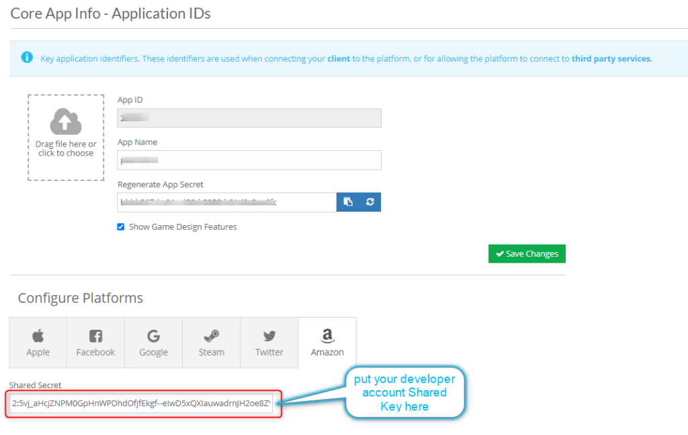
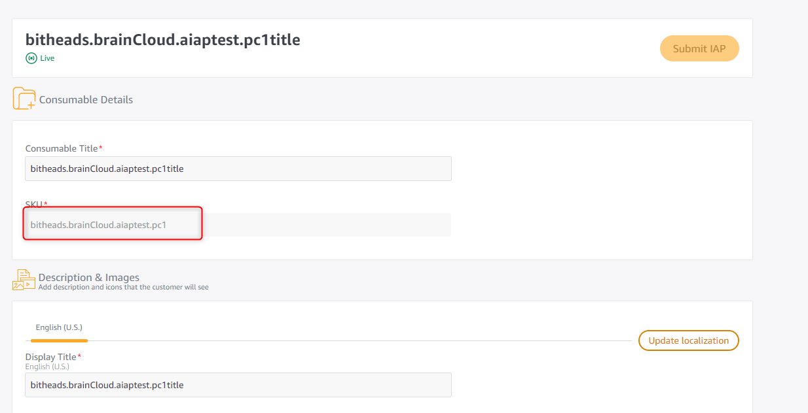

In this tutorial, we’ll look at integrating the Amazon Appstore with the brainCloud marketplace. By doing this, Amazon users will have the ability to validate purchased items from the Amazon Appstore with brainCloud.

Note that apps still have to make the purchase directly with the Amazon Appstore. For more information on this process refer to the Amazon Appstore [developer console](https://developer.amazon.com/apps-and-games) site.

## brainCloud Portal Setup

Here are the steps to configure brainCloud for Amazon Appstore purchases.

Prerequisites

- You should have set up your products in the brainCloud marketplace. Please refer to the [Marketplace Configuration](/learn/portal-tutorials/marketplace-configuration/) guide.
- You should have created the Amazon Appstore In-App products(items) as per the [Amazon Appstore Developer documentation](https://developer.amazon.com/docs/in-app-purchasing/iap-overview.html). (Refer to our Unity example [here](https://github.com/getbraincloud/examples-unity/tree/develop/BCAmazonIAP).)

### Associate Amazon In-App Items with brainCloud Products

After setting up your products in the brainCloud marketplace, you’ll want to associate them with the Amazon In-App product SKU. In particular, we will be grabbing the product SKU from the Amazon developer site and entering them into the appropriate brainCloud products.

- Log into the [Amazon Developer](https://developer.amazon.com/) site and go to the [Developer Console](https://developer.amazon.com/dashboard) dashboard.


- Click Apps & Services tab from the developer console.


- Select your App and go to the “In-App Items” section


- Select your In-App item and grab the SKU, make sure the item is ready to test (Status is **Live**).


(for this tutorial we'll assume that the product(item) SKU is _bitheads.brainCloud.aiaptest.pc1_)

Warning

If you skip registering your Amazon product(item) SKU to the brainCloud portal, you will get an error like below when calling verifying purchase API.  
`"transactionResultCode": 102,`  
`"errorMessage": "Product not found",`

- Log into the brainCloud Portal
- Go to the “Marketplace | Products” page in the Design tab  
    
    [](images/brainCloud_dashboard_productsTab.jpg)
    
- Select the product you would like to associate with.


- [](images/brainCloud_dashboard_addFbProduct1.jpg)
    
    Click the **\[+ Edit Product\]** button to make it editable.


- Find your Price (or create one by click **\[+\]** icon) and click the edit icon


- In the Edit Price dialog, click the + icon to add an entry for Amazon


- Enter your Amazon item SKU for this price – in our case “bitheads.brainCloud.aiaptest.pc1”.


- [](images/brainCloud_dashboard_addFbProduct3.jpg)
    
    At this point, you may want to select your price to be the default if it isn’t already selected. You can do this back in the Edit Product page.
    


- You can now verify that your Product is coming back with the correct Amazon In-app item SKU. Here is the output from the API Explorer “**_Appstore.GetSaleInventory_**” call using "amazon" as the platform:

```js
{
  "data": {
    "productInventory": [
      {
        "itemId": "coinbundle10",
        "type": "Consumable",
        "category": "coin",
        "title": "product",
        "description": "coinbundle10",
        "imageUrl": null,
        "currency": {},
        "parentCurrency": {},
        "peerCurrency": {
          "deploypeer": {
            "gems": 1
          }
        },
        "data": null,
        "createdAt": 1592542611282,
        "updatedAt": 1592852462791,
        "version": 9,
        "priceData": {
          "id": "bitheads.brainCloud.aiaptest.pc1",
          "referencePrice": 399,
          "isPromotion": false
        }
      }
    ],
    "serverTime": 1592857819454
  },
  "status": 200
}
```

:::warning

If you skip registering your Amazon product(item) SKU to the brainCloud portal, you will get an error like below when calling verifying purchase API.  
`"transactionResultCode": 102,`  
`"errorMessage": "Product not found",`
:::
:::info

If you add more than one product associate with the same Amazon In-App Item SKU, you will only get one product transition recorded from brainCloud.
:::
### Amazon Certificates and Credentials

Once the products have been configured, you will need to add the appropriate Amazon credentials to brainCloud.

- Navigate to the Application IDs page  
    
    [](images/portal_addGoogProd4.jpg)
    
- Click the Amazon icon and notice the following field is needed to fill in.



- You can find this information from your Amazon developer console through Setting->Identity.


- You should now be able to validate purchase with brainCloud.

Warning

Make sure your In-App Item's SKU is unique against all of your apps.  


Information

Test your App with Live App Testing after filling in all the necessary info of your app and uploading your app APK file.  
  
Add Testers from Live App Testing screen  
  
Notice your test status became **Processing** once submit your test, then **Publishing**, and when ready, the status will change to **Test in Progress**.  


### Confirming the purchase Client Side

After making a purchase client-side, Amazon Appstore will return a receipt with a receiptId, SKU, itemType, purchaseDate and userId such info, we will need receiptId and userId that are used by the [VerifyPurchase](/api/capi/product/confirmgoogleplaypurchase) API call.

- If your using Amazon IAP Plugin for Unity, some of your code may look like this:
```js
using System;
using System.Collections.Generic;
using UnityEngine;
using UnityEngine.UI;
using com.amazon.device.iap.cpt;

public class BCinterface : MonoBehaviour
{
    IAmazonIapV2 iapService = AmazonIapV2Impl.Instance;
    public BrainCloudWrapper _bc;
    string aiapReceipt = "";
    string aiapUserId = "";
    string aiapReceiptUpdateResponse = "";
    string aiapUserIdUpdateResponse = "";
    // Start is called before the first frame update
    void Start()
    {
        // Register for an event
        iapService.AddGetUserDataResponseListener(EventHandler);

       iapService.AddPurchaseResponseListener(PurchaseResponseEventHandler);

        iapService.AddGetPurchaseUpdatesResponseListener(PurchaseUpdateResponseEventHandler);
    }

    //click authentication button
    public void AuthenticateBC()
    {
        _bc.AuthenticateEmailPassword("unityuser@unity.com", "unitytest", true, authSuccess\_BCcall, authError\_BCcall);
    }
    private void Awake()
    {
        DontDestroyOnLoad(gameObject);
        _bc = gameObject.AddComponent<BrainCloudWrapper>();
        _bc.WrapperName = gameObject.name;
        _bc.Init();
    }

    //purchase button click
    public void Amazonpurchase()
    {
        // Construct object passed to operation as input
        SkuInput request = new SkuInput();

        // Set input value
        request.Sku = "com.braincloud.amazoniap.pc1";

        // Call synchronous operation with input object
        RequestOutput response = iapService.Purchase(request);

    }

    //looks like we don't need the user data info, but list here just in case
    private void EventHandler(GetUserDataResponse args)
    {
        string requestId = args.RequestId;
        string userId = args.AmazonUserData.UserId;
        string marketplace = args.AmazonUserData.Marketplace;
        string status = args.Status;
    }

    private void PurchaseResponseEventHandler(PurchaseResponse args)
    {
        string requestId = args.RequestId;
        string userId = args.AmazonUserData.UserId;
        string marketplace = args.AmazonUserData.Marketplace;
        string receiptId = args.PurchaseReceipt.ReceiptId;
        long cancelDate = args.PurchaseReceipt.CancelDate;
        long purchaseDate = args.PurchaseReceipt.PurchaseDate;
        string sku = args.PurchaseReceipt.Sku;
        string productType = args.PurchaseReceipt.ProductType;
        string status = args.Status;

        aiapReceipt = receiptId;
        aiapUserId = userId;

    }

    // Define event handler
    private void PurchaseUpdateResponseEventHandler(GetPurchaseUpdatesResponse args)
    {
        string requestId = args.RequestId;
        string userId = args.AmazonUserData.UserId;
        string marketplace = args.AmazonUserData.Marketplace;
        List<PurchaseReceipt> receipts = args.Receipts;
        string status = args.Status;
        bool hasMore = args.HasMore;

        // for each purchase receipt you can get the following values
        string receiptId = receipts\[0\].ReceiptId;
        long cancelDate = receipts\[0\].CancelDate;
        long purchaseDate = receipts\[0\].PurchaseDate;
        string sku = receipts\[0\].Sku;
        string productType = receipts\[0\].ProductType;

        aiapReceiptUpdateResponse = receiptId;
        aiapUserIdUpdateResponse = userId;
    }

    //brainCloud verify pruchase button click
    public void BrainCloudVerifyPurchase()
    {
        if (String.IsNullOrEmpty(aiapReceipt))
        {
            //call purchase updateResonse verify if purchase is not fulfilled
            string receiptData = "{\\"receiptId\\":\\"" + aiapReceiptUpdateResponse + "\\",\\"userId\\":\\"" + aiapUserIdUpdateResponse + "\\"}";
            Debug.Log("BrainCloudVerifyPurchase click with purchase updateResonse receiptData:" + receiptData);
            _bc.AppStoreService.VerifyPurchase("amazon", receiptData, veriSuccess\_BCcall, veriError\_BCcall);

        }
        else
        {
            //call purchase Resonse verify
            string receiptData = "{\\"receiptId\\":\\"" + aiapReceipt + "\\",\\"userId\\":\\"" + aiapUserId + "\\"}";
            Debug.Log("BrainCloudVerifyPurchase click with purchase Resonse receiptData:" + receiptData);
            _bc.AppStoreService.VerifyPurchase("amazon", receiptData, veriSuccess\_BCcall, veriError\_BCcall);
        }
    }

    public void authSuccess_BCcall(string responseData, object cbObject)
    {
        Debug.Log("bc authentication success call back");
    }

    public void authError_BCcall(int statusCode, int reasonCode, string statusMessage, object cbObject)
    {
        Debug.Log("bc authentication error call back");
    }

    public void veriSuccess_BCcall(string responseData, object cbObject)
    {
        Debug.Log("bc verify purchase success call back");
    }

    public void veriError_BCcall(int statusCode, int reasonCode, string statusMessage, object cbObject)
    {
        Debug.Log("bc verify purchase error call back");
    }
}
```
- If using Amazon IAP for Android, some of your code snippets may look like the following:
```js
...
//import amazon iap and brainCould client
import com.amazon.device.iap.PurchasingListener;
import com.amazon.device.iap.PurchasingService;
import com.amazon.device.iap.model.ProductDataResponse;
import com.amazon.device.iap.model.PurchaseResponse;
import com.amazon.device.iap.model.PurchaseUpdatesResponse;
import com.amazon.device.iap.model.Receipt;
import com.amazon.device.iap.model.UserDataResponse;
import com.bitheads.braincloud.client.IServerCallback;
import com.bitheads.braincloud.client.ServiceName;
import com.bitheads.braincloud.client.ServiceOperation;
import org.json.JSONException;
import org.json.JSONObject;
...

...
//define your product
public enum MySku {
    // This is the product to purchase and in the code.
    PRODUCT1("bitheads.brainCloud.aiaptest.pc1", "US"),
...

...
//register purchasingListener
        sampleIapManager = new SampleIapManager(this);
        sampleIapManager.activate();
        final SamplePurchasingListener purchasingListener = new SamplePurchasingListener(sampleIapManager);
        Log.d(TAG, "onCreate: registering PurchasingListener");
        PurchasingService.registerListener(this.getApplicationContext(), purchasingListener);
        Log.d(TAG, "IS_SANDBOX_MODE:" + PurchasingService.IS\_SANDBOX\_MODE);
...

...
//when click a product buying button, passing your product sku
final RequestId requestId = PurchasingService.purchase(MySku.PRODUCT1.getSku());
...

...
//in your listener implements Amazon PurchasingListener and brainCloud callback
public class SamplePurchasingListener implements PurchasingListener, IServerCallback {
    IServerCallback theCallback;
...

...
//inside onPurchaseResponse verify the purchase with brainCloud
    public void onPurchaseResponse(final PurchaseResponse response) {
...
        switch (status) {
        case SUCCESSFUL:
            final Receipt receipt = response.getReceipt();
            iapManager.setAmazonUserId(response.getUserData().getUserId(), response.getUserData().getMarketplace());
            Log.d(TAG, "onPurchaseResponse: receipt json:" + receipt.toJSON());
            iapManager.handleReceipt(receipt, response.getUserData());
            iapManager.refreshOranges();
            String userIda = response.getUserData().getUserId();
            String receiptId = response.getReceipt().getReceiptId();
            JSONObject receiptData = new JSONObject();
            try {
                receiptData.put("receiptId", receiptId);
                receiptData.put("userId",userIda);
            } catch (JSONException e) {
                e.printStackTrace();
            }  

MainActivity._bc.GetWrapper().getAppStoreService().verifyPurchase("amazon", receiptData.toString(), theCallback);
            break;
...
```
### Confirming the transactions from brainCloud Portal

Check the transactions from brainCloud portal page on **Monitoring | User Monitoring | Transactions** after making a purchase from the test app.


