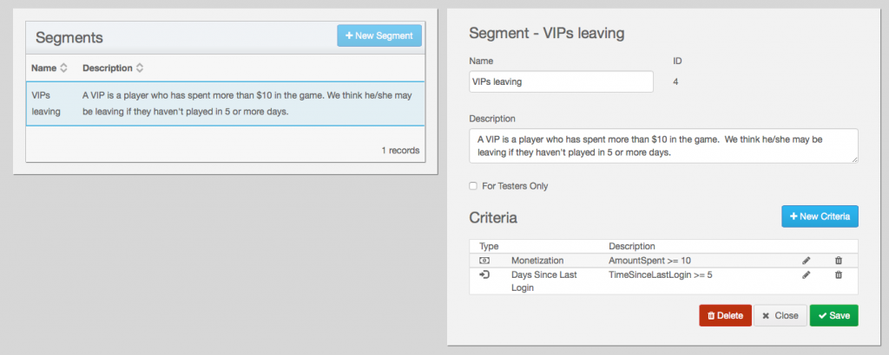

We're pleased to announce the full public availability of **brainCloud 2.3.0!**

New features in this release include:

**Highlights**

- **E-mail Identity improvements** - you asked, we delivered - brainCloud now supports **E-mail Validation** for those of you using our E-mail + Password Identity Authentication.  We've added **Forgotten Password** flows as well - all customizable with your own text and branding.
- **Segment Definitions** - we've completely re-done our Segment design screens, made them simpler and more flexible, while vastly improving the underlying data structures that represent segment criteria.  This was necessary work to support new segment features to come.

_Note - the new segment data structures aren't compatible with how things were being defined in 2.2.X and previous.  As a result, we've disabled any previously defined Segments - apologies about that.  You'll need to select each of your segments, quickly recreate the criteria, and save them.  Once again, apologies, but this was a one-time situation that couldn't be helped (and it's honestly very quick to fix)._

 

**Portal Changes**

- **Design | Core Game Info | E-mail Authentication** - options for customizing the e-mails sent for validation and forgotten passwords.  Includes a **\[Test\]** button to send a test e-mail to validate (note that the test e-mails don't actually contain the URL links)
- **Design | Segments** - screens have been completely redone

**API Changes**

- New Forgotten Password API for EmailPassword Authentication

**Misc Fixes**

- Fixes to **Import Configuration** to properly re-evaluate level caps if new XP levels have been added
- Misc fixes and performance improvements
