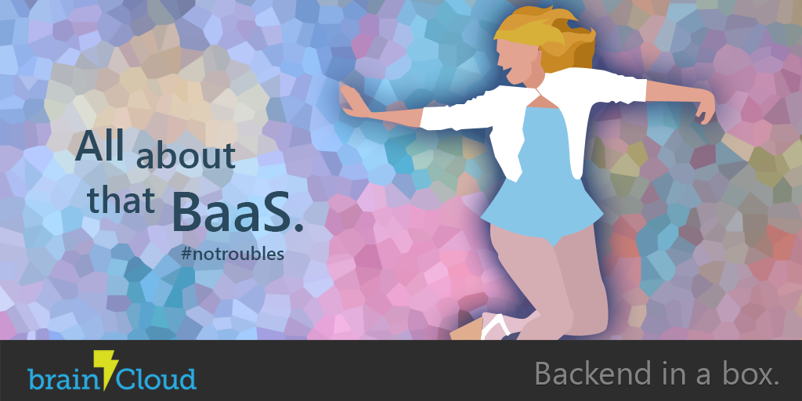

Just in time for GDC - it's brainCloud 2.5!

Okay, truthfully this is more of a housekeeping update as we prep some bigger features for releases to come.

Speaking of housekeeping - we notice that some of you may have inadvertently created **multiple company accounts**. This can happen when multiple team members register for brainCloud independently, instead of inviting additional members to their account.

In hindsight, _the old process was clunky_.  You needed to first add the user, including picking a password for them, and then separately communicate with them their account information so that they could log in (whereupon they'd want to change their password).

You'll be happy to know that we've cleaned that up.  Now you only need to enter a name and e-mail, and we'll handle the e-mailing for you - including prompting the team member to pick their own password.  Easy peasy!

If any of you with multiple accounts would like to merge them, just hit the green **Chat** button and we'll help you out.  It's pretty simple to do, but the tools are only available to us super-users right now.

Anyway, check out the release details below - and remember, if you're going to GDC be sure to look us up - we'd love to meet you!

### Highlights

- **Google Play Services Authentication** added.  Great for your Android games!
- **Updated Java Library.**  We've done a major update to our Java library - you'll find it on the **Client Libs** download page
- **Updated Javascript Library.**  We've updated our Javascript library - you'll find it on the **Client Libs** download page.
- **Updated Javascript Example.**  In case you missed it, we introduced a Javascript Example Game last week - Acey Deucey!

### Portal Changes

- **New invite team member flow** \- now just type in their name and e-mail address, and brainCloud sends the invite for you.  _[Yeah, we know, it always should have been that way!]_
- **Improved [Select Players] screen** - now finding players to view and debug in **Player Monitoring** is easier than ever!
- **(Minor) Versioning** tab under **Design | Core Game Info** has been renamed to **Platforms.**

### API Changes

- **AuthenticateGoogle()** added to the brainCloud client APIs.
- **Android libs** now support capturing of region, timezone and language during authentication. _[Note - requires some custom client configuration - instructions coming soon!]_

### Misc Fixes

- **S2S Improvements** - we've added access to more services and APIs, and squashed a few bugs!
- **Google Play Purchases -** we've streamlined our implementation to make it more compatible with 3rd party libraries (like Prime31)
- **Javascript documentation** - we've updated much of the documentation with the lastest JavaScript APIs. We still have a bit further to go - bear with us!

