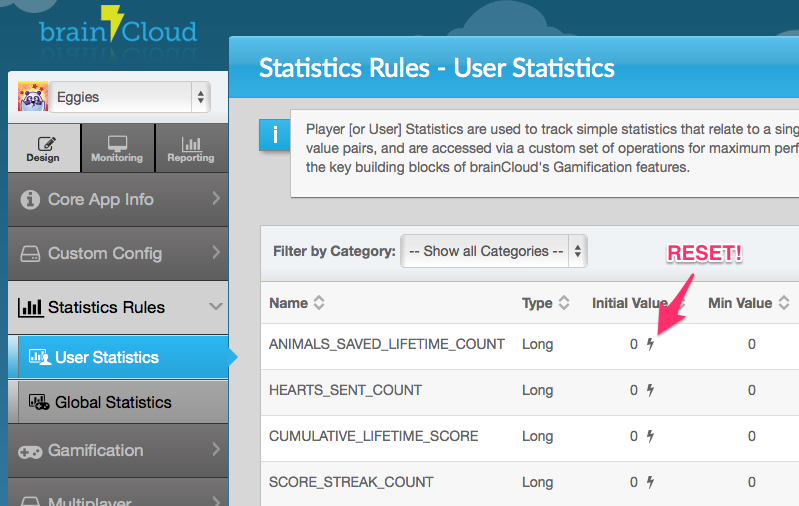

We're happy to present brainCloud 2.7 - Easter Bunny Edition! :)

It's been a busy couple of weeks as we prepare brainCloud for some pretty significant updates.  In the meantime, we're delivering some smaller easter eggs of goodness just in time for the holidays.

### Highlights

- **External Web Services** - Cloud Code scripts can now call external web services.  This greatly opens up the power of Cloud Code - allowing your apps to securely integrate with your own custom servers and/or third party services.  More details, including a tutorial.
- **Leaderboard API changes** - in release 2.6 we introduced paging and relative views to our global leaderboards. The response was very favourable (some of you have already live with the new APIs!) - but alas we believe we missed a feature or two - like returning the total number of entries. We've addressed this, and restructured the APIs a bit to allow even more features in the future!
- **Reset User Stats** - another popular request - it is now possible to reset a stat to its original value for the entire population of your app! Just click on the lightning bolt!

### 

### Portal Changes

- **[New] Cloud Code Web Services Page** - located under **Design | Cloud Code | Web Services**, this page is used to construct a whitelist of services that can be called from your Cloud Code scripts.
- **[Updated] User Stats Page** - new **<Lightning Bolt\>** button allows you to reset a stat across all users
- **[Updated] Apps Management Page** - redesigned to allow us to add additional features/functions in the future.  As a bonus, now includes a count of the number of users your app has...  (calculated nightly)
- **[Redesigned]** **User Monitor Page** - redesigned user monitoring page, with a new **[Log In As User]** button at the bottom.

### API Changes / Additions

- **New** **HttpProxyService** - called from Cloud Code to allow calls to external web services.  Developers must create an entry in the web services whitelist first. [Go to **Design | Cloud Code | Web Services** ].  For more details, see the API Docs.
- **Leaderboard API changes** - Based on developer feedback, we've made some modifications to the Leaderboard APIs introduced in Release 2.6.  The updated APIs can be viewed on the API Docs page.  _Important Note - Release 2.7 still supports the 2.6 parameters, but that support will be removed in 2.8 (targeted for April 15th) - so upgrade to the new APIs now!_

### Misc Changes

- **[Updated] API Explorer - Authenticate service**  - E-mail authentication is now the default authentication type. We've also changed the system defaults so that e-mail validation is \*not\* required for users to log in...  (a friendlier default for most apps)
- **Misc Improvements / Updates to the API Docs**
