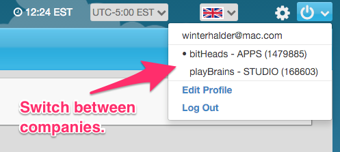

We hope the holidays were good to everyone. The brainCloud team took a few days to relax and regroup with family, and now we're back at it.  Release **2.20.0** delivers some key customer-requested features, and sets the stage for a bunch more.

Without further ado, here's what we've got.

## Release Highlights

- **Multi-team Accounts** - brainCloud now allows your Team Member (i.e. Developer) account to be associated with multiple Teams (i.e. Companies). This is a much-requested feature, and will be especially useful to developers working on apps for multiple client companies, those with developer-publisher relationships, etc. You will immediately notice the new **Team Selection** dialog that displays after logging into the portal.

- **Team Administrators** - As part of the Multi-team feature, we added the concept of Team Administrators. Now, only team administrators can perform team-level operations like Manage Users, Manage and Publish Apps, Edit company billing info, etc. Note - this does not affect the access of data within individual apps - all team members still have full privileges. This is the first step towards the **Role Security** feature that is currently in development. __Note that all existing users have Team Administrator access by default - you'll want to go to Admin | Team Members and adjust this permission accordingly.__

- **User Files** - this release brings support for storage of User Files - that is, binary files that are associated with individual apps (as opposed to our Custom Files, which are global). User Files can be organized by path (directories), can have shareable URLs, and can be up to 20 MB in size. The C++, C# (.Net/Unity), and Objective-C libraries have all been updated to support our new File APIs - which include support for uploading, listing, retrieving and managing files. Support for the other libraries will follow soon. __Note - User Files are not yet visible in the Design Portal - that feature will be in an upcoming release.__

- **New Segment Criteria** - we've added support for two new pieces of Segment Criteria: timezones and AB Test ID. Timezones are as you'd expect - the timezone that a user is in. The AB Test ID is a random number between 0 and 99 that gets assigned to every new user when they are created. If, for example, you'd like to try a sales promotion with half of your user base (to see if it effects their monetization) you could define a segment for AB Seed values of 0-49, and then associate the Promotion and any push notifications with that Segment. Note that AB Test IDs are also included in the Identity data that gets passed through our DataStream Architecture - so you can hookup any number of back-end tools to analyze the behavioural results of such a test.

## Portal Changes

- **Team is the New Company** - given the new Multi-Team feature, the portal is now largely using the word "team" in place of "company", which will now be used primarily for billing purposes.
- **Team Selection** - you'll immediately notice the new Team Selection page that displays immediately upon logging into the portal. Just choose your team and you're into the same portal interface you're used to -- you are only ever logged into a single team at a time. But never fear, switching active teams is quick and easy - just click on the team name from the right-hand-corner menu.

- **Team Members Screen** - has been revamped to show whether a member has Team Administrator privilege, and who how many apps they have access to. Currently all users have access to all apps, but that will change when we add our **Role Security** feature in the near future. Also note that you no longer _**Delete**_ team members, you _**Remove**_ them from your team. The user's **TeamMember** account will continue to exist - allowing it to still be used to log into other teams.
- **Edit Team Member** - Users may now change their e-mail address, as well as their password. Team Members (even Team Administrators) may no longer change another Team Member's password.
- **Reporting | API Usage** - File Storage stats are now reported in the section with File Transfer stats. _Note - we don't currently extrapolate the amount of storage that we think will be used by the end of the month._
- **Timezones** - we've expanded the list of options in the Timezone selector of the portal. You are welcome Newfoundland! :)

## API  Changes / Additions

- New User Files API - A robust API for uploading, listing, and managing files. Supports files up to 20MB in size. See the BrainCloudFile api docs page.
- Update Picture URL - now that you can upload files, it makes sense that users can have custom profile pics. So just upload the file (with a shareable URL), and then set the picture URL accordingly.
- Session expiry - the Client Libraries have been enhanced to better handle session errors (session expired, invalidated due to login, etc.). This includes fixing heartbeats so that they no longer get sent if the session is gone.
- Client libraries have been updated for this release. As always, if your app is currently live, we recommend that you test thoroughly before releasing on the updated libraries.

## Miscellaneous Changes / Fixes

- New, clearer error message returned when apps "in development" have reached their daily active user limit.
- System now returns better error information if Google Push support has not been properly configured.
- Additional data integrity checks when deleting dependent items in the portal - i.e. deleting an Achivement that is referred to by an XP Level, etc.
- Apple and Android device tokens (for push notifications) are now deleted if they are reported as invalid by Apple and/or Google's servers.
- Miscellaneour fixes and performance improvements
