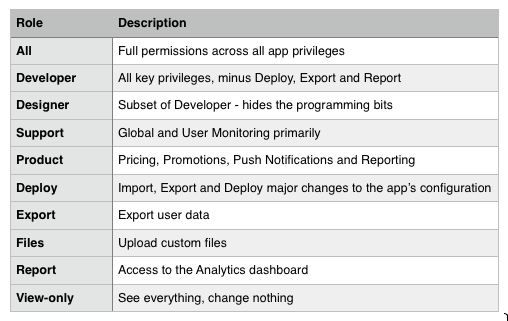
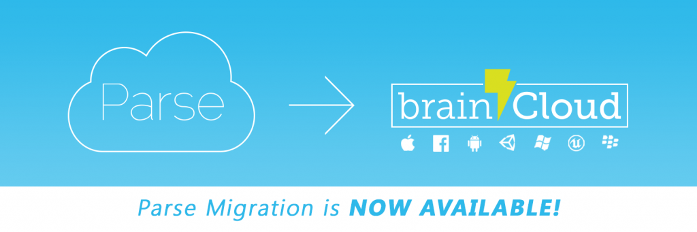

Okay, this one got away from us a little bit. The release is absolutely chock-full of new features - hopefully there is something for everyone!

## Release Highlights

### Team Member Roles

brainCloud now supports assigning permissions to Team Members on an app-by-app basis. The roles available are pre-defined (we don't offer custom roles _yet_), but we've taken considerable care in defining a flexible set of roles based on customer feedback. And of course, you can combine roles to meet your needs.

Roles are assigned via the new **Administration | Permissions** page, which is accessible by Team Administrators. You can view the individual privileges that make up each role via the _Roles_ tab of the page.

 

### Live Lock

While we were implementing our permissions system, we decided to go one step further, and implement an extra level of protection for Live apps. The result is our new Live Lock feature, which ensures that you don't inadvertently edit the configuration of your live app, even if you have the privileges to do so.

Our new "App is Live" banner will display on the portal pages for live apps, and will prevent the app from being modified without the user first unlocking it. Once unlocked, the banner turns yellow as a warning to be careful. Apps remain unlocked for the duration of your session - so it won't unnecessarily affect your workflow.

 

### Parse Import

As you might expect, brainCloud has seen an uptick in new sign-ups due to the Parse shutdown. We've received great feedback from our new arrivals, who find that brainCloud not only matches Parse's featureset, but truly offers a whole lot more.

In an effort to be extra welcoming, we are pleased to roll-out Phase 1 of brainCloud's Parse Migration support - which allows for easy importing of Parse data into our Cloud Data system (as Global Entities). This facility is especially useful for teams that had Parse apps in development, and want to quickly import their data and keep moving forward with a brainCloud-based implementation.

This is just the first step of our plan to assist customers migrate their apps from Parse. Stay tuned as we add additional features in the coming weeks, and be sure to fill in our [Parse Migration Survey](https://www.surveymonkey.com/r/W93BKYC) to ensure that your requirements are heard.

 

### New <Beta\> API Reference

New, faster, more searchable API documentation? Don't mind if we do!

The new system is in beta, and the examples focus primarily on C# for now - but we think it's already better than the old reference documentation - so we're releasing it early. Going forward, our overview and tutorials will remain under the Docs header, with service and method references in the new system under API.

Let us know what you think! Check out the new docs [here](/apidocs/apiref/)!

 

### Swift and Objective-C CocoaPods

We've totally refactored our Apple libraries to work better with Swift and Objective-C, and repackaged them using [CocoaPods](https://cocoapods.org) to make them easier to integrate into your projects.

There are two CocoaPod libraries available:

- [BrainCloud](https://cocoapods.org/pods/BrainCloud) - for Objective-C and Swift projects
- [BrainCloudCpp](https://cocoapods.org/pods/BrainCloudCpp) - for C++ projects

These libraries support iOS, OS X and tvOS.

You can find more information on using CocoaPods in your Xcode project in their [Guides section](https://guides.cocoapods.org/).

* * *

## Portal Changes

The following changes have been made to the Design Portal:

- **(New) Administration | Permissions screen** - used to set per-app permissions for your Team Members. Only accessible by Team Administrators.
- **(New) Live Lock banner** - tells you whether you app is live, and allows you to unlock it for editing.
- **(New) Parse Import** - available from the **Global Monitoring | Global Entity** screen.
- **(Improved) User Monitor** - we now display the User's Profile picture if they have attached their Facebook identity.
- **(Improved) Select Team screen** - we've updated the look of the Select Team screen that appears immediately upon login. And as a bonus, it automatically remembers the last team that you logged into - allowing you to quickly skip past by clicking the \[Continue\] button
- **(Improved) Edit Profile dialog** - you can view your app access permissions by choosing Edit Profile from the sign out menu drop-down.
- **(Improved) Log Viewer** - you can now click through from the Global Logs to the User Logs by clicking on the profile id in any log entry.
- **(Improved) Analytics Charts** - improved and standardized the colors used in the charts on our Analytics page.

 

* * *

## API Changes

There have been significant changes to the error handling and communication subsystems in several of the libraries. We recommend that you test well before updating clients in the field.

- Network Error Message Caching
    - This feature allows you to cache in-transit messages to the brainCloud server when a network error occurs.
    - More details can be [found here](/apidocs/tutorials/general-api-tutorials/network-error-message-caching/)
- Global Error callback
    - brainCloud now allows you to register a Global Error callback method which is called anytime an error is encountered.
- Authentication methods returning 202 error now go to error callback.
    - This only applies to C++ and Unreal libraries. If you'd prefer the old behaviour, you call BrainCloudClient.setErrorCallbackOn202Status(false)
- New Matchmaking API call
    - FindPlayerWithFilterAndAttributes() method added - allows the system to narrow the list of candidates before sending each candidate to the players custom filter. Useful for when the population of users you are looking for is a very small portion of the overall population.
- Improved Web Service APIs
    - We've added support for POST operations with external web services
    - We've also simplified the API so that you don't have to repeat the URL being used (since you're already declaring the URL as part of the external service configuration)
- Push Notifications
    - New server-to-server method, [SendNormalizedToSegments()](/apidocs/apiref/#s2s-push-sendnormalizedtosegments), for sending push notifications with custom parameters
    - New server-to-server method for returning a list of segments
- Leaderboards
    - Social Leaderboard calls now properly support LOWER\_IS\_BETTER leaderboards by returning the results in ascending order
- Miscellaneous
    - New method for looking up a user's credentials given their profileId - [GetExternalIdForProfileId()](/apidocs/apiref/#capi-friend-getexternalidforprofileid)
    - [UpdateContactEmail()](/apidocs/apiref/#capi-playerstate-updatecontactemail) method added which allows you to update the user's email address (used for informational purposes, not authentication, which is controlled via the EmailIdentity)
    - Added API for generating anonymous id (GUID) to the Android / Java libs

 

* * *

## Miscellaneous Changes / Fixes

- New Apple SDKs!  Our new iOS / Mac OS X / Apple TV SDKs have been revamped with better Objective-C and Swift support - and are now packaged using **CocoaPods** for easy addition to your projects!
- Revamped the Android Getting Started documentation
- Roku has been added as a supported platform
- New Marmalade C++ Client SDK
- Improved searching for users in User Monitoring - search now looks for a sub-string of the text entered
- Improved user logs performance
- Miscellaneous fixes and performance improvements
