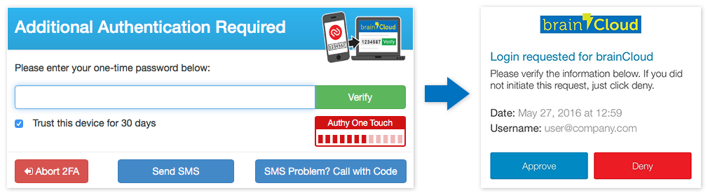

We've got a smaller release for you this time. We've got a few bigger features cooking in the fires -  but in the meantime we thought we'd push out a few of the polish items and customer requests that we have queued.

## Release Highlights

### Authy OneTouch

We have enhanced our Two-Factor Authentication implementation to take advantage of Authy OneTouch for those users who are using the [Authy App](https://www.authy.com/app/mobile/). It's super convenient - no codes to enter! Just click **[Approve]** to confirm your login.

### Customer API Requests

We've also released a few API enhancements at the request of some key customers. There are updates to Groups, Identities and the Cloud Code bridge. We hope you like them!

 

* * *

## Portal Changes

We've made the following portal changes:

- **Login**
    - During Two-Factor Authentication you'll notice the red One Touch meter. It tells you that we've detected that you have the Authy app, and have sent a request that you can simply **[Approve]** without having to enter the authentication code. __Note: The login screen will stop monitoring for One Touch approval after 5 minutes, after which you can still enter the verification code.__
- **Power | Edit User**
    - To ease the burden of 2FA, our login process optionally allows you to flag a device as _trusted_, so you won't need to re-verify for 30 days. But what if you mistakenly hit that option when logging in from a public computer? Witness the new **[Clear Trusted Devices]** option on the **Two-Factor** tab of the **Edit User** dialog. Ta-dah! :)
    - Team Administrators can now unlink Two-factor Authentication from other user's accounts (allows self-fixing of TFA-issues should they arise)
- **General**
    - Minor updates (for clarification and consistancy) to icons used throughout the portal.

 

* * *

## API Changes

The following changes/additions have affected the brainCloud API:

- **Cloud Code Bridge**
    - New [GetProfileId()](/api/cc/bridge/getprofileid) method returns the profile id of the current user. Saves having to call to the PlayerState proxy for the information.
    - New [GetName()](/api/cc/bridge/getname) method returns the name of the current user
    - New [GetEmail()](/api/cc/bridge/getemail) method returns the email address of the current user
- **Groups API**
    - Updated [GetMyGroups()](/api/capi/group/getmygroups) method to additionally return groups that you have been invited to and have requested to join.
- **Identity API**
    - New [GetIdentities()](/api/capi/identity/getidentities) method returns a list of the non-anonymous identities associate with the current profile. This method is useful to learn if the user has already associated a Facebook account with their profile, for example.
    - New [GetExpiredIdentities()](/api/capi/identity/getexpiredidentities) method returns a list of identitities with the current profile whose authentication tokens  that have expired (and should be refreshed)

We have also deprecated the following methods:

- **Authentication Service**
    - Deprecated GenerateGUID() and GenerateNewAnonymousId() - replaced with [GenerateAnonymousId](/api/capi/authentication/generateanonymousid)() method, which works in a more consistant manner.

* * *

## Miscellaneous Changes / Fixes

- Updated libraries
    - All libraries have been updated with the latest API enhancements. Go get 'em!
- Documentation updates
    - Added Versioning overview to the Appendix summary of the API REF docs
    - Updated AsyncMatch documentation
    - Updated Leaderboard documentation
    - Better pre-hook cloud code examples
- Source updates
    - Removed JSON return data from the client source code, since that data is now included (and more likely to be up-to-date) in the API REF documentation
- Important Fixes
    - During login, if user's timezone has changed, the user's timezone as recorded in segments is updated as well
    - Fix to Facebook purchase handling which could sometimes cause virtual currencies to be awarded twice in some circumstances
    - Added Facebook real-time payments transactions to the request logs
- Plus miscellaneous fixes and performance enhancements...
