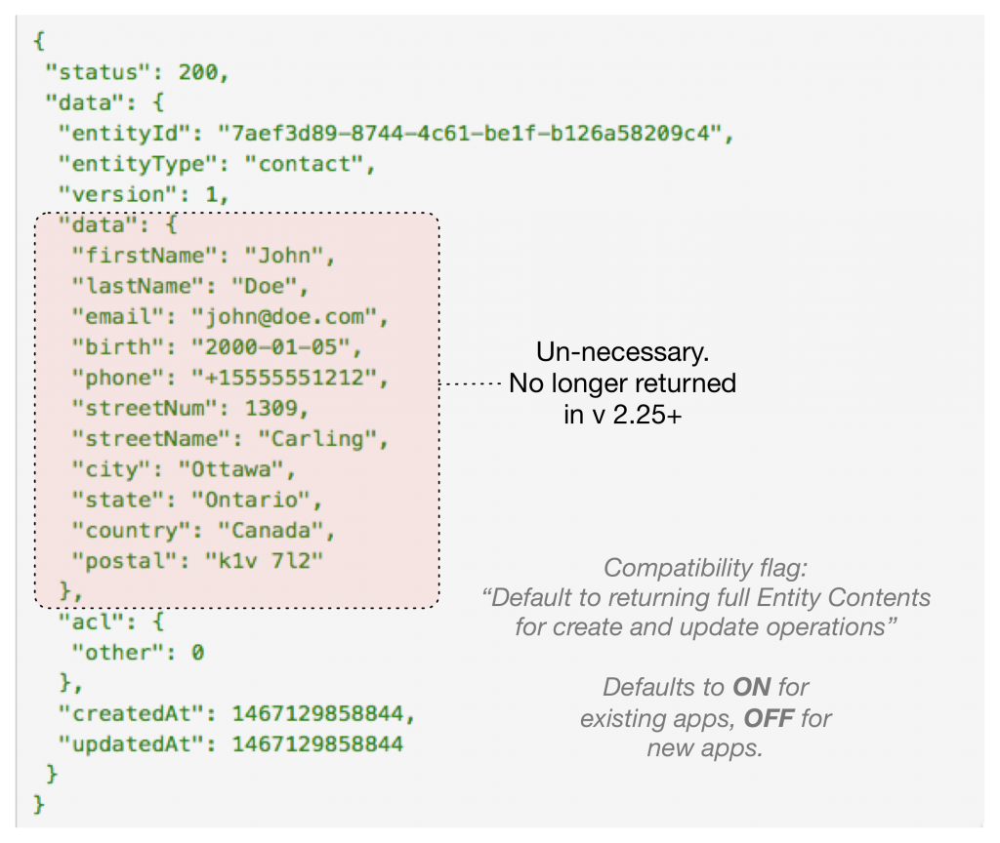
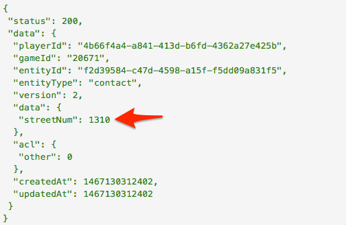

We've got a doozy of a release for you heading into the Summer Holidays!

## 

## Release Highlights

### WebHooks!

brainCloud now supports WebHooks! Which means it's easier than ever to have your brainCloud app respond to events triggered from outside apps and services.

[WebHooks](https://en.wikipedia.org/wiki/Webhook) are app-defined HTTP-callbacks that are triggered by events on another web service, and can be configured to invoke scripts in your app. The capabilities are similar to our Server-to-Server (S2S) interface, with the advantage that it is a more standardized mechanism, so tons of services already support it.

Examples of useful services that employ WebHooks include: Photon, Twilio, MailChimp, HipChat, Slack, Zapier, etc.

Setting up a WebHook integration is pretty simple:

- **Write a new Cloud Code method** that accepts our [_WebHook Parameter Syntax_](/api/cc/writingscript#webhooks). The parameters you receive will be defined by the _External Service_ that is calling you.
- **Configure the WebHook using the Design Portal.** You'll give the hook a name, determine how you are securing it, and link it to your **Cloud Code** method. You use the **Design | Cloud Code | WebHooks** screen to configure your WebHooks.
- **Register your WebHook URL in the external service.** Finally, go to the external service and configure your WebHook, specifying the WebHook endpoint from the Design Portal, and any additional parameters that you require to be sent to your method.

_Note - as with every external integration, we have to protect our servers from misuse. We have provided several mechanisms (server ip-validation and secret validation) to help your app confirm the identity of the service invoking the webhook. You should also ensure that your cloud script validates the validity of the incoming request._ 

_API Counts: Note that incoming webhook invocations count as 1 API count for the webhook itself, and 1 API count for the cloud code script being invoked._

_[Note - we'll be putting together a WebHooks tutorial in the next couple of days to better illustrate how they work.]_

 

### Faster File Downloads

We have re-factored our file-handling services to enable significantly faster downloads. The executive summary is that now when the client attempts to download a file via the URLs that are returned from [`GetFileList()`](/api/capi/s3handling/getfilelist), [`GetUpdatedFiles()`](/api/capi/s3handling/getupdatedfiles), and [`ListUserFiles()`](/api/capi/file/listuserfiles) - it will automatically be redirected to a cached version of the file located on a Content Distribution Network (CDN) node that is closer to them geographically.

The hitch is that Unity doesn't natively support redirection (currently), so this doesn't _transparently_ work for our Unity apps. But don't worry, there are two simple solutions:

#1 - Directly request the CDN-cached version of the File Url via the new [`GetCDNURL()`](/api/capi/s3handling/getcdnurl) methods (there are separate similarly-named methods for custom files vs. user files)

#2 - Use the [UniWeb](https://www.assetstore.unity3d.com/en/#!/content/483) ($25) plug-in, which \*does\* support redirection, to retrieve the files instead of the built-in Unity libraries

#3 - Turn it off. Support for this behaviour can be turned off using the elegantly named "Funnel Custom and User File retrieval through app servers (slower)" compatibility option. You'll find the option under **Design | Core App Info | Advanced Settings**, in the _Compatibility Settings_ section.

Note - for maximum compatibility, the compatility flag defaults to _enabled_ (that is, slower, legacy-mode behavior) for all existing apps. If your app would benefit from this speed increase, be sure to go disable the legacy setting!

 

### Improved Entity Updates

We have revised our `Create()` and `Update()` Entity APIs to be much more efficient - and have revised the `Increment()` APIs to bring them into greater alignment with the others.

The biggest change is that the `Create()` and `Update()` methods no longer return the full entity data upon success. Returning the fully rendered object originally \*seemed\* like a good idea - and certainly looks good in the API Explorer for small objects. But if you are an storing larger objects, returning all that data in the API response just eats up the data connection (and isn't useful to the app, since it already knows the data that it sent!).

Not that although the `Create()` and `Update()` methods for Entities\* (i.e. _User Entities_, _Global Entities_, _Groups_ and _Group Entities_) no longer return the _full_ object upon success, they do still return the object skeleton (or summary), which includes the entityId, entityType, version, etc. The diagram below should better illustrate the change.

As always, we've added a new Compatibility Flag ("Default to returning full Entity contents for create and update operations") to preserve the old behaviour if your app requires it. This flag defaults to _ON_ for existing apps, and _OFF_ for new apps moving forward.

Secondly, we've revised the new `IncrementData()` APIs to bring them into better alignment with the `Create()` and `Update()` methods. For example, like the methods above, [`IncrementUserEntityData()`](/api/capi/entity/incrementuserentitydata), will now return the full object skeleton upon success -- with one addition - it will also return the updated balance of any fields that were incremented.

This new protocol was implemented by removing the old `returnData` parameter, which was a less optimal attempt to give the user control over what data is returned. The old method still works for apps using the 2.24 version of the libraries, but devs updating to 2.25+ will need to adjust their method calls accordingly.

 

* * *

## Portal Changes

We've made the following portal changes:

- **Design | Cloud Code | WebHooks**
    - New screens for defining WebHooks. See the feature section above for details.
- **Design | Marketplace | Products**
    - We have enhanced the workflows so that you no longer have to manually press the **[Facebook Register Products]** button after making changes to the Facebook pricing information for products - it is now done automatically. We have left the button to support advanced scenarios where manually re-registering still makes sense.
- **Monitoring | User Monitoring** 
    - The new **User Files** screen allows you to view the files uploaded to an individual user account.
    - We have moved the in-app purchases that were displayed as part of the **Virtual Currency** screen to their own **Transactions** screen.
- **Reporting**
    - The  _Sessions_ graph on the **Analytics** page now displays values according to local time.
    - We've added a new _Incoming WebHooks_ count to the **API Usage** page.
- **Miscellaneous**
    - _Faster App Deletion_ - Deleting an app now immediately _marks it for deletion_, to be completed by a background task during non-peak hours.
    - _Password confirmations_  - We have added more safety checks, where brainCloud will prompt you  re-enter your password for destructive operations (deleting an app, etc). We'll be further enhancing these safety mechanisms in future updates.

 

* * *

## API Changes

The following changes/additions have affected the brainCloud API:

- **`Authenticate()` and `ReadPlayerState()` methods**
    - `countryCode` is now being returned
    - New `isTester` flag is being returned for users. This corresponds ot the **[x] Is Tester** checkbox that is selectable from **Monitoring | User Monitoring | User Summary**.  This is very handy if you want to trigger special logging, debug screens, etc to be available to testers but not regular users of your app.
- **Client**
    - New method ([`EndOfMessageBundleMarker()`](/api/capi/client/insertendofmessagebundlemarker)) for forcing the end of a message bundle. Useful for ensuring that large brainCloud requests are isolated into seaparate message bundles, and for ensuring that certain key calls (like [`LogOut()`](/api/capi/playerstate/logout)) get to return before continuing message processing.
- **Cloud Code APIs**
    - New [`CancelScheduledScript()`](/api/capi/script/cancelscheduledscript) method to cancel a scheduled cloud code job
- **Currency APIs**
    - Now properly enforces balance server-side for all [`ConsumeCurrency()`](/api/capi/product/consumecurrency) operations. There's a compatibility switch that defaults to ON for existing apps, but we recommend that all devs go to **Design | Core App Info | Advanced Settings**, and turn the _"Enable legacy Currency handling (balance not enforced for Consume)"_ to OFF for their app (with appropriate testing, of course).
- **Entity Create / Update APIs**
    - As described in the _Release Hilights_ section, API's have been revised so that we do not return the full data content during `Create()` and `Update()` operations. There is a new compatibility flag to maintain the legacy behaviour (by default turned ON for existing apps).
    - The `Increment()` API methods have been revised to return results that are consistant with the rest of the Entity Create()/Update() methods. Revised methods include [`IncrementUserEntityData()`](/api/capi/entity/incrementuserentitydata), [`IncrementSharedUserEntityData()`](/api/capi/entity/incrementshareduserentitydata), [`IncrementGlobalEntityData()`](/api/capi/globalentity/incrementglobalentitydata), [`IncrementGroupData()`](/api/capi/group/incrementgroupdata) and [`IncrementGroupEntityData()`](/api/capi/group/incrementgroupentitydata).
- **Friend API**
    - New [`GetSummaryDataForProfileId()`](/api/capi/friend/getsummarydataforprofileid) method - returns the name, email, pictureUrl, and summary data for the specified user.
- **Group APIs**
    - New [`AutoJoinGroup()`](/api/capi/group/autojoingroup) method allows you to automatically join a group that meets the provided criteria. Useful for quickly creating arbitrary grops of users.
    - The [`ReadGroupData()`](/api/capi/group/readgroupdata) method has been added to client libraries (was missed last release - oops!)
- **Identity APIs**
    - New [`RefreshIdentity()`](/api/capi/identity/refreshidentity) method allows you to update identity tokens that are not the primary login identity

We have also removed / deprecated the following methods:

- **Increment methods**
    - We have removed the versions of the Entity Increment methods that accepted the `returnData` parameter.

* * *

## Miscellaneous Changes / Fixes

- IPv6 Support
    - We have updated the C++ / Objective-C libraries to support IPv6.
    - We have re-confirmed that all other libraries properly support IPv6.
- Documentation
    - Completely revised and updated [Cloud Code](/api/cc/writingscript) documentation section!
- Updated libraries
    - All of the supported libraries have been updated to support the latest APIs
- Plus miscellaneous fixes and performance enhancements.
- Miscellaneous page improvements - we've been iterating through our pages to add a bit more consistency and presentation polish.
