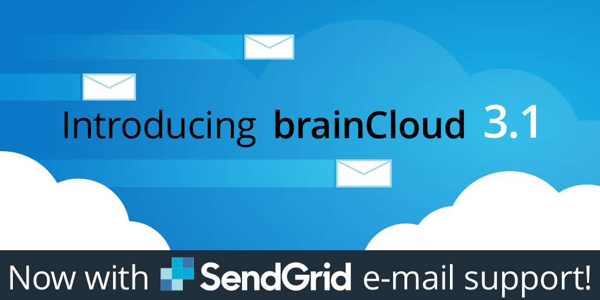

## 

## Release Highlights

Here is a list of all that is cool in brainCloud 3.1...

### SendGrid integration

brainCloud has moved away from our legacy, bare-bones email support (which was Amazon SES-based) to an improved infrastructure that will provide some great new features today and in the future. We have been planning this for some time - largely because we want to deliver a solution that allowed for richer, more customizable communications for our community.

After discussing with several of our key customers, we have chosen [SendGrid](http://sendgrid.com) for our replacement email delivery system due to its rich feature set and reasonable, straight-forward pricing model.

Customers already using our legacy email service will continue to be supported for the foreseeable future - but new apps under development will need to integrate with SendGrid for email delivery. We believe the capabilities of this new approach make the decision easy.

There are many advantages to this new system:

- Configurable from and reply-to addresses (so your emails come from you, not us)
- Full email statistics reporting (via the Sendgrid dashboard)
- Custom templates (see below)
- API-based Transactional Email (see below)

The great news is that SendGrid's pricing starts at free (up to 12,000 emails per month) - and ramps up very reasonably from there ($9.99 for 40,000 emails, $19.99 for 100,000 emails, etc.). Check out the full [SendGrid Pricing](https://sendgrid.com/pricing/) details here (be sure to scroll down to find the free option!).

For step-by-step instructions on integrating brainCloud with your SendGrid account, click [here](/learn/portal-tutorials/email-integration-sendgrid/)!

_Note, we plan to add additional email integrations / features in the future - so feel free to contact us with your feedback and suggestions._

 

### **Rich Email Templates**

With SendGrid support comes support for custom email templates - so you are no longer limited to the pre-formatted brainCloud emails that get sent for verifying a user's email address, resetting passwords, etc.

SendGrid includes the following template features:

- Drag & Drop Editor - quickly create or modify the template design via SendGrid's drag-and-drop editor. Add images and buttons - and customize fonts, colors and other formatting
- Import HTML - designers can easily import and modify email template code using an HTML editor.
- Custom content - use substitution tags to customize email content
- Template library - manage all of your teamplates in one place, and manage multiple versions of a template - useful for updating branding, holiday messaging, etc.

 

### Transactional Emails

In addition to using SendGrid for email authentication, brainCloud now supports a new [Mail Service API](/api/capi/mail) that allow you to send custom transactional emails directly to your users. So it is easy to send emails directly to users based on they're interactions with your app.

 

### Updated Google Authentication

We've updated our Google Authentication support to align with the latest Google libraries. As part of this feature, the Google integration portion of the **Design | Core App Info | Application IDs** screen has been updated to gather more Google configuration parameters.

 

### Updates to Free Account Limits

As most of you know, brainCloud support up to 100 Daily Active Users while your app is In Development. After that, your apps logins are rejected until the next day (which begins at 0:00 UTC) - when the DAU resets back to zero. There is another limit associated with the "In Development" plan - and that is a maximum of 1000 lifetime user accounts. Up until now that's been more of a gentleman's agreement - in that we weren't actually enforcing it. As of Release 3.1, this limit is being enforced.

_So, what if you've been in development for a while and have inadvertantly exceeded your 1000 accounts?_ The simplest fix is to delete some/all of your user/test accounts using the Data Deletion options at the bottom of the **Design | Core App Info | Admin Tools** page.

* * *

## Portal Changes

We've made the following portal changes:

- **Design | Core App Info | Application IDs**
    - We've added new fields to the **Google** tab of the **Configure Platforms** section. These new fields, _Google App Id_, _Google Client Id_, _Google Client Secret_ and _Google Authorization Redirect URI_ are important when adding Google Authentication to your app (using Google's latest libraries)
- **Design | Authentication | Email Authentication**
    - We've reworked this feature to work with Sendgrid. Once you've configured your SendGrid account, choose the (x) Use rich email service templates to switch to using custom templates that you define in SendGrid.
- **Design | Integrations | Manage Integrations**
    - Our new **SendGrid** integration has been added. Just sign-up for a free [SendGrid](http://sendgrid.com) account, and then enter your API key and such here, and you're all set to go.
- **Monitoring | Global Monitoring | Recent Logs**
    - Added a new "Sys Info" category
- **Reporting | Analytics**
    - We've tweaked the platforms presentation to ensure that all platforms can be displayed properly
- **General**
    - The Login, Select Company, Registration and Forgot Password screens have been updated to the new look-and-feel
    - Internet Explorer and Edge browsers are now blocked from using the portal. We used to give warnings but still allow the user through - but we've had some pretty confusing support requests associated with those browsers - and feel its best for all parties just to not allow them.
    - 2FA confirms - we've added Authy OneTouch integration for some of our key confirmations (like when confirming whether an app should be deleted).
    - Bouncing cloud - we have a new "working" gif to distract you when brainCloud is processing your requests!
    - Cloud-code only api methods are now indicated by a new "secure" badge

* * *

## API Changes

The following changes/additions have affected the brainCloud API:

- **BrainCloudWrapper**
    - [Reconnect()](/api/wrapper/reconnect) - a new method that makes it easy to re-establish a session to brainCloud, using the cached anonymousId and profileId of the most recent connection
- **Authentication**
    - New authentication error code - **UNKNOWN\_AUTH\_ERROR (40217)** - for when Authentication() fails, but it is not the fault of the passed in credentials (rather, it's an unexpected server error). The expected response would be to simply retry.
- **Groups**
    - The [ListGroupsPage()](/api/capi/group/listgroupspage) method now returns the `memberCount` of the groups that are returned.
- **Leaderboards**
    - [ListAllLeaderboards()](/api/capi/leaderboard/listallleaderboards) - returns a list of all of the leaderboards for an app.
    - _Management APIs_ - note that these methods are only callable from cloud code.
        - [CreateLeaderboard()](/api/capi/leaderboard/createleaderboard) - creates a new leaderboard.
        - [EditLeaderboard()](/api/capi/leaderboard/editleaderboard) - updates an existing leaderboard definition.
        - [DeleteLeaderboard()](/api/capi/leaderboard/deleteleaderboards) - deletes an existing leaderboard configuration, together with all versions and entries.
- **Log Service**
    - The [LogServiceProxy](/api/cc/bridge/getlogserviceproxy) has been added to S2S - so you can now send log messages from both client-context cloud code and S2S-based cloud code
- **New Mail Service**
    - [SendBasicEmail()](/api/capi/mail/sendbasicemail) - a quick and easy API for sending email messages to your users
    - [SendAdvancedEmail()](/api/capi/mail/sendadvancedemail) - an advanced API that allows your app to take advantage of the richness of the email provider when sending email messages to your users

 

* * *

## Miscellaneous Changes / Fixes

- Updated libraries
    - All libraries have been updated with the latest API enhancements. Go get 'em!
- Documentation updates
    - We've updated the docs to better describe the mechanisms for client apps to download files
- Important Fixes
    - Fixed: Parent scripts can now properly call other parent scripts
    - Fixed: Added updated _User Entity_ methods that accept the entity version parameter (as expected and documented)
    - Fixed: Added GetGlobalGameStatisticsServiceProxy() to the cloud code bridge
- Performance improvements
    - Improved performance for global leaderboard calls, especially if your app has multiple leaderboards
    - Background Segment processing optimizations
    - Performance improvements to the design portal for apps with large numbers of users (in particular, we were retrieving the list of recent added users much too often (unnecessarily))
- Miscellaneous fixes
    - All logged in platforms now show up on the User Monitoring | User Summary page (some were missing previously)
    - brainCloud system emails now use rich html -- we're taking advantage of SendGrid too!
- Plus miscellaneous fixes and performance enhancements...
