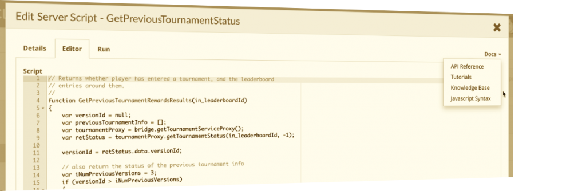
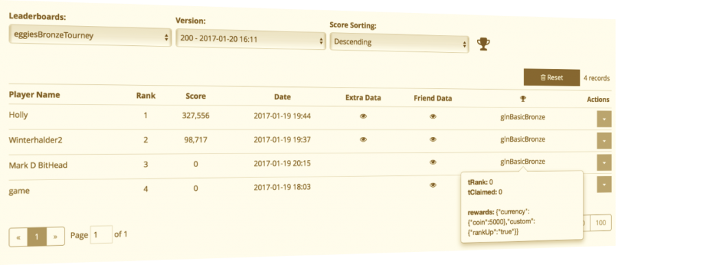

# brainCloud 3.2

We're pleased to present brainCloud 3.2 - arguably our biggest releases ever!

_Note - as always, we have worked very hard to ensure that this update does not break your apps. Scroll to the bottom of this page for a summary of the bigger changes, any recommended actions, and how to confirm the stability of your apps._

 

* * *

## Feature Highlights

### Global Tournaments

brainCloud's new **Global Tournaments** feature is an entirely new system designed to amplify player engagement in your games.

_Global Tournaments_ are suitable for any game where competition centers around _leaderboards_. In fact, in their simplest form, _Global Tournaments_ can be thought of simply as _prize rules_ added to a _leaderboard_.

The power of brainCloud's tournament system comes from how flexible they are, coupled with how much they do for you. Features include:

- Free or Paid - brainCloud collects the entry free for you
- Flexible Prizes - award any combination of currencies, xp, stats and achievements - brainCloud handles it all
- Tournament Cycles - set your tournament to daily, weekly, monthly or an arbitrary number of days
- Tournament Phases - optionally have an exclusive registration vs. play phase - and set up downtime between tournaments
- Notifications - both Push and Email-based notifications - automatically sent by brainCloud throughout the tournament cycle
- Portal Support - configure tournament templates and attach them to leaderboards. And then view tournament results straight from the Leaderboard monitoring screens
- _New Tournaments API_ - for fine control of displaying tournament information, handling player enrollment, recording player scores, and claiming awarded prizes

And of course you can use brainCloud Global Tournament features as building blocks for more advanced tournament variations - for example tournaments brackets.

_Warning - adding a Tournament Template to an existing Leaderboard changes the API required to interact with it (for example, you can no longer post a score to a leaderboard before joining it). For this reason, we do NOT recommend adding tournaments to existing leaderboards in live games._ 

For more information, check out our new [Tournament API](/api/capi/tournament).

 

### Peer Services [Beta]

Another big feature of this release is brainCloud's new Peer Services system. This framework allows the services of one app (the _Peer Service_) to be used by other apps (_Peer Clients_). Peer Services can even be public, so that its services can be leveraged by other teams!

This provides a whole new level of code/service re-use in brainCloud, including allowing new service integrations to be added to brainCloud directly by third party developers. This has the potential to really open up the brainCloud ecosystem, to the benefit of the entire brainCloud community.

Initially we see this being used in two primary scenarios:

- _Sponsored Integrations_ - this mechanism allows brainCloud partners to easily build integrations on our platform, and offer them for your use.
- _Private Services_ - development teams that are building lots of apps can more easily group common functionality into a separate app who's services are leveraged across the others.

Very soon we hope to add support for _Community Services_ as well - where developers in the brainCloud community can offer up peer service components to be used freely by others. We need to do a bit more work on our API tracking for that to work effectively, since in that scenario we would want the API counts for the services usage of brainCloud to be accounted for by the peer clients, not by developer who created the free peer app.

_Note - we'll be introducing our first sponsored Peer Service very soon - stay tuned!_

 

### **Cloud Code Enhancements**

Finally, we've made some significant enhancements to our cloud code system to make writing scripts easier. Changes include:

- **No more Script Types** - We have eliminated the confusing concept of "script types". Now, a script is a script is a script
- **[New] Script Permissions** - scripts are now individually configured to be callable from the _Client API_, the _Server-to-Server (S2S) Interface_, and/or _Peer Clients_. All scripts are callable from other scripts.
- **Three bridges, one consistant interface** - depending upon how your script is called, you will get one of three bridges. _Client Bridge_ (for calls from the client api and/or API hooks), _Server Bridge_ (for scheduled scripts and those from S2S api) and _Peer Bridge_ (special case for calls to peer scripts from peer clients). The APIs for these bridges has been normalized, so you no longer have to call special S2S versions of the proxy methods from the Server bridge. (i.e. getScriptServiceProxy() now works from all of them - though getS2SScriptServiceProxy() still works from the Server Bridge for compatibility).
- **Normalized Proxies** - If you use methods in the proxy that are not implemented in the particular mode (Client/Server), the script will throw a not-implemented exception.
- **Global Properties access** - new [getGlobalProperty()](/api/cc/bridge/getglobalproperty) method allows you to easily use global properties in scripts. No more magic values copied across scripts - simply define the value in **Design | Custom Config | Global Properties** for use.
- **New Documentation menu** - the Cloud Code Editor now contains its own version of the Docs menu for easy reference.
- **Save Deleted Scripts** - we now continue to save a scripts version history even if you delete the script. So if you accidentally delete a script, just create a new one with the same name - and then restore the old version of the script from history!

 

_Compatibility - All of these changes are backwards-compatible, so your scripts **should** keep working as per usual. An exception might be if your script was using exception-handling to test for previously unsupported bridge methods - since unsupported methods are now present, your script(s) may require some quick adjustments._

 

* * *

## Portal Changes

In addition to the changes you would expect to support Tournaments and Peer s expected changes to support Tournaments and Peer Services

#### Design Section

- **Core App Info | Advanced Settings**
    - New compatibility feature settings
        - "Allow Currency Calls from Client" - allows your apps to still directly manage currencies from the client (less secure). Enabled by default for existing apps.
        - "Generate Legacy Event Ids" - we've changed how event ids work this release. If your app already uses our event system, and you aren't yet updating to the new API, you'll want to keep this enabled.
    - For more information on compatibility-related changes, see the API section

- **Core App Info | Peer Publish [NEW!]**
    - Used to publish your app as a Peer Service.

- **Cloud Code | Scripts**
    - New permissions!
        - We've refactored script permissions - and added a new one. Now all scripts can be set to be callable via any combination of Client API, S2S API, Peer API (callable from a peer client), or none at all (in which case the script is only callable from another script).
        - These permissions are settable in the Script Editor, and viewable in the Scripts list
        - _Compatibility: To ensure that we don't break existing apps, all scripts by default have the S2S permission set to "enabled". You should review and disable this permission for any scripts that don't need it._
    - Editor _Docs_ menu
        - A new Docs menu provides quick access to the cloud code API Reference, Tutorials, Knowledge Base and even a Javascript Syntax Search Engine (it's new - and we're going to help to update it)

- **Cloud Code | API Hooks**
    - Now allows you to specify hooks to be run when an API call fails (the default hook only triggers upon success).

- **Cloud Code | S2S Explorer**
    - Now only lists scripts that have the S2S permission set to true

- **Integrations | Peer Services [NEW!]**
    - Used to connect your app to a Peer Service.

- **Leaderboards | Leaderboard Configs**
    - Enhanced to support _Tournaments_. You create a tournament by attaching a tournament template to a Leaderboard.
    - We also added a new _Days_ rotation - that lets you rotate your leaderboard every <x\> days

- **Leaderboards | Tournament Templates [NEW!]**
    - New screen for creating tournament templates

- **Marketplace | Products**
    - Enhanced to allow you to define products that include Peer Currencies.

- **Marketplace | Virtual Currencies**
    - Added support for Peer Currencies

 

#### Monitoring Section

- **Global Monitoring | Leaderboards**
    - The Leaderboards monitoring screens have been enhanced to support tournaments. These features are only shown for leaderboards that have one or more Tournament Templates attached to them:
        - Tournament Schedule - click on the Trophy near the top of the screen
        - Tournament Column - shows which tournament a player is enrolled in. Clicking shows additional information about what prize that player may / has won, and if it has been claimed.

- **Global Monitoring | Job Queue**
    - Enhanced to support Tournament Jobs for processing tournament results and sending tournament notifications

- **Global Monitoring | Global Monitoring | Recent Logs**
    - We've modified the UI behaviour of this screen somewhat. Instead of the screen automatically refreshing as you change filter settings (which caused problems when the log was long and lagging) - you now can change multiple settings, and refresh the list at once via the **[Refresh]** button
    - The response logs are now being truncated if they are too large. The new maximum log response that will be stored for viewing is 10Kb.

- **User Monitoring | User Summary**
    - Peer relationships show up in the relationships section

- **User Monitoring | Virtual Currency**
    - This screen now shows parent currencies and peer currencies when applicable.

- **User Monitoring | Logs**
    - The response logs are now being truncated if they are too large. The new maximum log response that will be stored for viewing is 10Kb.

 

 

#### Reporting Section

- **API Usage**
    - Added a new _Bulk Operations_ count. brainCloud will utilize this category for API calls where a single count doesn't effectively account for the load on our servers. For example, for Tournament Processing, we charge one bulk API count per player in the tournament (charged during award processing).

 

#### Team Section

- **Home**
    - We've added a link to our new [Knowledge Base](http://help.braincloudservers.com) to the docs section of the page.

 

* * *

## Programming/API Changes

The following changes/additions have affected the brainCloud API:

- **Client (behaviour change)**
    - As you may or may not know, the brainCloud client libraries automatically package multiple server requests [sent within a short period of time] into _bundles_ to be processed at the server. This both reduces network traffic and minimizes server utilization. Up until brainCloud 3.2, the client libraries were statically configured to allow up to 50 messages in a bundle [a crazy high number in hind-sight!]
    - In general this approach works very well - and to be fair - the average bundle size is probably 2-3 messages for the average app.
    - However - we've had a few instances where client applications get into endless loops - where the same message is being stuffed into the bundles over-and-over. In those cases, sending 50 messages at a time - especially if those messages are something heavy like leaderboard requests - can generate an unsettling amount of server load!!! :)
    - As of 3.2 and moving forward, this limit is now controlled by the server, and enforced by the 3.2 client libraries. We will initially be setting the limit to 10, but we may notch it down a bit more if
    - _Compatibility - this change has no impact on your app until you move the to 3.2 client libraries, which we \*do\* highly recommend._

 

- **Cloud Code**
    - We have done some reworking of our cloud code system to make it easier to write scripts that can be called any way that you would like - from the client, from another server (s2s), from a peer app, or from another script
    - _Removed the concept of Script Types_ - there are no longer client and server script types. A script is a script is a script. And any script can be called from any other script. (_Note - scripts do still work within different environments - see the bridges section_)
    - _Replaced with Permissions_ - all scripts now have a collection of distinct, independent permissions
        - Client - scripts with client permission can be called from client libraries
        - S2S - scripts with the s2s permission can be called from the Server-to-Server (S2S) API
        - Peer - scripts withe peer permission can be called from peer client apps
    - _Compatibility - to ensure compatibility with existing apps, all apps that were configured as "client scripts" before are now set with Client permission enabled. In addition, the S2S script defaults to true for all existing scripts. For maximum security, you should review your scripts and disable the S2S permission for any scripts that don't require it._

 

- **Cloud Code Bridge(s)**
    - _About Bridges_ - when you run a script, at runtime it gets associated with one of three (3) bridges. Scripts called from the client API get a _Client Bridge_ - which is associated with a user session (and has access to their profile, etc). Scripts called from S2S, or from scheduled jobs and webhooks, get the _Server Bridge (which doesn't have an associated user session)_. And scripts run in a peer app get the new _Peer Bridge_, which can access both a client session and potentially a peer session (if the peer app has profiles).
    - _Bridge Refactoring_ - we have refactored our bridges a bit to make the interfaces between them the same. So now, if you try to access a method like getProfileId() that only makes sense in the client context, instead of getting a method-not-found error you'll receive null instead.
    - _New Convenience Methods_ - we've added some new methods to make writing scripts simpler. Some of the more useful methods include (methods with \* indicate client context only):
        - [callScript()](/api/cc/bridge/callscript) - a simpler method for calling another script from within a script
        - [getAppId()](/api/cc/bridge/getappid) - a method to get the appId of your app (useful in certain situations)
        - [getClientAppId()](/api/cc/bridge/getappid) - useful in peer scripts to get the app id of the calling app
        - [getGlobalProperty()](/api/cc/bridge/getglobalproperty) \- used to retrieve one of the global properties that you've defined in **Design | Custom Config | Global Properties**. _**No more hard-coding magic values in scripts!**_
        - [getEmail()](/api/cc/bridge/getemail)\* - get the email of the user
        - [getName()](/api/cc/bridge/getname)\* - get the name of the user
        - [getProfileId()](/api/cc/bridge/getprofileid)\* - get the profileId of the user
        - [isClientBridge()](/api/cc/bridge/isclientbridge) - returns true if the bridge is a client bridge
        - [isPeerBridge()](/api/cc/bridge/ispeerbridge) - returns true if the bridge is a peer bridge
        - [isServerBridge()](/api/cc/bridge/isserverbridge) - returns true if the bridge is a server bridge

 

- **Event**
    - Working on our the new Tournaments feature gave us an excuse to make some much-needed improvements to our Event System
    - We have made things faster and more reliable - but in doing so we have changed how we handle event ids
    - The new APIs use in evId instead of the old eventId. This id is mostly used when deleting events. All other data about an event remains the same.
    - There are new versions of [DeleteIncomingEvent()](/api/capi/event/deleteincomingevent) and [UpdateIncomingEventData()](/api/capi/event/updateincomingeventdata).
    - The old eventId will still be generated (for compatibility purposes) if the "[x] Generate Legacy Event Ids" flag is set on the **Design | Core App Info | Advanced Settings** page. That option is enabled by default. The old methods are deprecated, but are still available on the client, and work as long as the compatibility option is enabled.

 

- **Friend**
    - [GetProfileInfoForExternalAuthId()](/api/capi/friend/getprofileinfoforexternalauthid) - Allows you to look up users via a custom authentication type
    - [GetProfileInfoForCredential()](/api/capi/friend/getprofileinfoforcredential) - A new version of the now-deprecated GetFriendProfileInfoForExternalId() - a bit better named, and returns an error if the profile cannot be located.
    - [FindPlayerByUniversalId()](/api/capi/friend/finduserbyexactuniversalid) - now returns the users universal id (in field externalId) with the results

 

- **Global Entity**
    - Background: Global Entities, by default, each have an owner - the user that created them. If the owner of an global entity is deleted, the entity will be deleted as well. This is not desirable in all cases - so we've created some methods to adjust the ownership of global entities.
        - [MakeSystemEntity()](/api/capi/globalentity/makesystementity) - changes a global entity to "unowned" - and thus it won't be deleted when a user is deleted.
        - [UpdateEntityOwnerAndACL()](/api/capi/globalentity/updateentityownerandacl) - changes the owner of a global entity to another user.

 

- **Identity**
    - Background - we've added some methods to work with Peer Services.
        - [AttachPeerProfile()](/api/capi/identity/attachpeerprofile) - attach a peer profile to this account (optionally creating it if it doesn't already exist)
        - [DetachPeer()](/api/capi/identity/detachpeer) - detach the specified peer profile
        - [GetPeerProfiles()](/api/capi/identity/getpeerprofiles) - returns the peer profile associated with the specified peer code

 

- **Leaderboard**
    - We've extended [`GetGlobalLeaderboardView()`](/api/capi/leaderboard/getgloballeaderboardview) and [`GetGlobalLeaderboardPage()`](/api/capi/leaderboard/getgloballeaderboardpage) to return the player's profilePic if available. After all, why should social leaderboards have all the fun?
    - [CreateLeaderboard()](/api/capi/leaderboard/createleaderboard) - has been extended to support the new <days\> rotation
    - [New!] [GetPlayerScore()](/api/capi/leaderboard/getplayerscore) - returns the players score from the leaderboard. Note does _not_ return the players rank.
    - [New!] [GetPlayerScoresFromLeaderboards()](/api/capi/leaderboard/getplayerscoresfromleaderboards) - returns the score for the current player from a set of leaderboards
    - [New!] [RemovePlayerScore()](/api/capi/leaderboard/removeplayerscore) method - replaces ResetScore(), which we are deprecating
    - 3.2 Client libraries are now updated to use _leaderboard_ service id instead of _socialLeaderboard_. If for some reason your callbacks are triggering off of the _socialLeaderboard_ service id, you'll need to make adjustments.
    - _**New restriction:**_ We are now limiting the maximum number of leaderboard entries that can be requested in a single page using GetGlobalLeaderboardPage(). If your request exceeds the limit we just adjust it within the limits (beginning from the lower index). The new immediate limit will be 100 entries, but we plan to further reduce that to 50 entries beginning February 15th. _This constant is tweakable per app so contact us if you need us to temporarily adjust that for you._
    - _**API Change - Leaderboard Size:**_ We are removing the <getLeaderboardSize\> field from [GetGlobalLeaderboardPage()](/api/capi/leaderboard/getgloballeaderboardpage). Unfortunately it is an expensive operation that many clients set to true, but often were not using (and certainly doesn't need to be individually retrieved per page). We've replaced this operation with a separate calls, [GetGlobalLeaderboardEntryCount()](/api/capi/leaderboard/getgloballeaderboardentrycount) and [GetGlobalLeaderboardEntryCountByVersion()](/api/capi/leaderboard/getgloballeaderboardentrycountbyversion). _**Compatibility: The old API will continue to work for earlier client libraries. The change is effective starting in client library 3.2 and greater.**_

 

- **Product**
    - Security Improvements - we've made some enhancements to the currency management methods of the Product API
    - By default, the [AwardCurrency()](/api/capi/product/awardcurrency), [ConsumeCurrency()](/api/capi/product/consumecurrency) and [ResetCurrency()](/api/capi/product/resetcurrency) methods are no longer callable from the client. They are, however, callable from cloud code scripts - which is of course a lot more secure.
    - Note that this security enforcement is controlled by a new compatibility option, "_[x] Allow Currency Calls from Client_" which defaults to "on" for existing apps.
    - Note - we've also made the AwardParentCurrency() and ConsumeParentCurrency() methods cloud code only - those weren't in use yet so we have removed them from the client directly.
    - [GetCurrency()](/api/capi/product/getcurrency) now additionally returns parent and peer currencies for convenience

 

- **Script**
    - The script service has been enhanced to support Peer Services
        - [RunPeerScript()](/api/capi/script/runpeerscript) - used to run a peer script
        - [RunPeerScriptAsync()](/api/capi/script/runpeerscriptasync) - used to run a parent script asynchronously (without waiting for a response)

 

- **S2S Script Proxy**
    - We've added the [ScheduleCloudScript()](/api/s2s/script/schedulecloudscript) method to the proxy, so that you no longer need to create a user session to schedule a script

 

- **Tournament Service [NEW!]**
    - Although Tournaments leverage our Leaderboard infrastructure, they add a whole new API for most operations (except for viewing leaderboard results).
    - A quick summary of the new methods:
        - [`GetTournamentStatus()`](/api/capi/tournament/gettournamentstatus) - gets the player's status in the specified tournament leaderboard. Essentially tells you whether the player is enrolled or not, along with information about the tournament.
        - [`JoinTournament()`](/api/capi/tournament/jointournament) - join a tournament on the specified leaderboard
        - [`LeaveTournament()`](/api/capi/tournament/leavetournament) - leave a tournament
        - [`PostTournamentScore()`](/api/capi/tournament/posttournamentscoreutc) - post a score to the tournament. Note that you must have previously joined it.
        - [`PostTournamentScoreWithResults()`](/api/capi/tournament/posttournamentscorewithresultsutc) - post a score to the tournament, and notify any displaced players if a bump them down a notch in the rankings. Note - this is a more expensive API call that has to perform a few leaderboard sorts to accomplish its features. Because of that, we charge 1 Bulk API call in addition when called. But we return the updated leaderboard results though - saving you one API call in return - so it all evens out! :)
        - [`ViewCurrentReward()`](/api/capi/tournament/viewcurrentreward) - used to retrieve what a player might earn if they maintain this rank in the tournament. Note that this value is approximate, and doesn't take ties into account. So the player will get that reward or better!
        - [`ViewReward()`](/api/capi/tournament/viewreward) - used to retrieve what a player actually one in a completed tournament.
        - [`ClaimTournamentReward()`](/api/capi/tournament/claimtournamentreward) - claim the player's winnings! Automatically adjusts the player's balances, and returns the prize data that the player won.
    - For more information, see the [Tournament section](/api/capi/tournament) of the API Reference.

 

* * *

## Miscellaneous Changes / Fixes

- Updated libraries
    - General updates
        - Now dynamically enforce the maximum # of messages per bundle. New limit is 10 messages per bundle.
        - Authenticate message forced to be first
    - C++ library overhauled to better handle the myriad of platforms that we support!
    - Unity Client - now fully compatible with WebGL (no need to enable the development flag!)
    - Action Script - major updates to the ActionScript library to bring them up in line with the other libraries

- Demos
    - brainCloud Bombers improvements - mucho updates, including support for Unity WebGL!

- Documentation updates
    - Updated Unity Tutorial Video

- Important Fixes
    - Global Properties - We are now limiting global properties to 500. This is mostly to ensure that folks don't use the facility for something that is better represented by Global Entities and/or Config Files.
    - Deleting Scripts - when deleting a script, we no longer delete all archived versions of the script. That means that should you want to restore it, you can simply create a new script with the same name, and then browse it's history!
    - Leaderboard Imports - fixed a scenario where importing a game config could cause the leaderboard rotation history to be overwritten.
    - API Hooks for Errors - you can now configure an API hook to be called if a specific API call encounters an error. Previously API Post-hooks would only be called upon success

- Plus miscellaneous fixes and performance enhancements...

 

* * *

 

## Compatibility Summary

We at brainCloud work very hard to ensure that our updates are backwards compatible with our existing community of apps.

That said, it is recommended that that you review your apps for any unexpected issues. The following steps are recommended:

1. Read the release notes to get an understanding of what is changed
2. Log into the Portal and check your apps logs for new errors (chose **Quick | Recent Logs** from the menu)
3. Log into your app to do a quick sanity test

If you see any problems, please let us know right away. Click the chat button and we'll be online to help you ASAP!

 

### API Calls

- Leaderboard restrictions - the new maximum number of leaderboard entries allowed per request could have an impact on your app. If you are currently requesting > 100 leaderboard entries per call, the response will be truncated to just the first 100 entries.
- Tournament API - note that attaching a Tournament Template to a Leaderboard changes the API required to interact with that leaderboard. Do not attach Tournaments to leaderboards that are currently live in production.
- Events - the Event API has changed, but the compatibility flag is enabled by default - so existing applications should not be affected.
- Product - The client-based currency management functions are deprecated, but still available from the Client Libraries.

### Cloud Code Scripts

- All existing scripts by default have the new "S2S callable" permission set to true. For optimal security, you should review your scripts and disable that permission for any scripts that do not require it.
- The refactored bridge interfaces should be completely compatible with your old scripts - except, if maybe you were using the method-not-found exceptions in your scripts to determine how your script is being run - in which case a quick modification will be in order.

### New 3.2 Client Library

- Now enforcing server-controlled maximum bundle size - which is initially set to 10 messages (from the previously hard-coded 50)
- Leaderboard size - the API for retrieving Global Leaderboard pages and views has changed, as you can no longer specify that you would like the leaderboard size returned as well. There are separate methods for that now.
- Leaderboard response handling - the client libs have now been all converted to use the LEADERBOARD service name instead of SOCIALLEADERBOARD for all success and error handling. When updating to the new libraries, you may need to adjust your success and/or error handling routines accordingly
- Leaderboard callbacks - all callbacks are now operating off of the _leaderboard_ service id instead of _socialLeaderboard_

### Billing Notes

- Tournaments - tournaments are available in all billing plans, and the basic charges work as you'd expect (an API count per API call, push notification, email, etc.). There are two additions - at the end of the tournament, the system accrues 1 Bulk API count per participant. And there is 1 Bulk API call added for calls to PostTournamentScoreWithResults() to cover the additional processing.
- Events - Apps with "Enabled checking for Incomfing Events with each API Message" will accrue a 1/2 bulk count per api call.  This new pricing will come into effect on February 15th, 2017.
- Sponsored Peer Apps - calls to Sponsored Peer Apps, including all processing that the Peer App performs, and even the invocations of the Peer's cloud code scripts from the client app, are free to the peer client. (The Sponsored Peer App covers those costs).
- Community Peer Apps - community apps are the opposite. The Peer Client covers all usage costs, including calls made within the peer to service the requests from the Client App.
