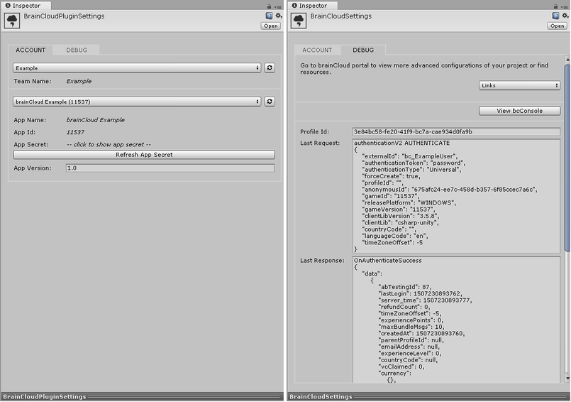

**brainCloud 3.6** is a mid-sized release with a few key improvements. It also includes a lot of refactoring under the hood as we prepare for bigger features that are coming down the pipes.

_Upgrade notes: There are no breaking API changes in this release. Do be careful of importing older Global Entity export files into this release, as the default entityIndexedId field has changed (\_eid -> \_eiid) - just ensure that the correct field is selected during the import. Finally, as always, it is advised the customers update to the latest libraries for maximum performance and stability._

## Release Highlights

### New Unity Plugin

We have an all-new Unity Plug-in for you.

The new plug-in has been totally re-written, and offers the following cool new features:

- Automatically retrieves your appId and secret - no more cutting and pasting!
- Easily switch between brainCloud app configurations - e.g. _develop_ vs. _production_, etc.
- Quickly create new application configurations - right from the plug-in!
- Actively aid in debugging your brainCloud app - displays the currently logged in end-user's _profileId_, as well as most recent server _request_ and _response_
- Provides quick access to the new bcConsole client log pane
- Quick access to the brainCloud Portal and documentation pages
- Unity dark theme support!

To install the new plug-in, simply go to our [GitHub site](https://github.com/getbraincloud/Unity-Csharp) and follow the instructions!

### [Popular Request ❤️] Global Entity Import/Export Enhancements

We have expanded our support for importing and exporting the Global Entities of your apps.

Most importantly, we ha've added support for what we call Raw JSON Object format files - which in addition to serializing the custom _data_ portion of your objects, also serialize the _meta-data_ portion of the Global Entity - which includes the object's `entityId`, `owner`, `ACL`, etc.

This means that a Raw Global Entity export is really an exact representation of your entities - and is much more suitable for backing up your entities, as well as migrating those entities to another app (i.e. moving from development → production).

You will find more details about the Global Entity file formats here.

### [Popular Request ❤️] User Export Enhancements

We've added two popular requests to your User Export functionality:

- **Better end-user filtering** - you can now select whether to include test users or not in your exports
- **User statistics in CSV format exports** - we now allow User Statistics to be included in CSV format exports.  (Previously they were only supported for JSON-format exports.)

You are welcome!

* * *

## Portal Changes

You will notice changes to the following portal screens:

### Design

- **Gamification | Achievements**
    - Improved support for Google Play achievements

### Monitoring

- **Global Monitoring | Global Entities**
    - Added support for additional import/export file formats
    - Includes new Raw JSON Object format, which includes full brainCloud meta-data
    - Improved Import UI to better walk the user through the process
    - Added progress dialog to show activity during larger imports
    - Expanded the maximum # of entities allowed to be imported at a time
    - Updated Bulk Actions menu to better organize the various import, export and deletion options

### Reports

- **Dashboard**
    - Greatly improved presentation and loading behaviour
- **Export Users**
    - Can now choose the _Types of Users_ to export - end-users, test users, or both.
    - Can now choose to include _user statistics_ in the CSV export

### Team

- **Team Members** 
    - Dialog for inviting a new team member has been improved. You no longer have to fill in the user's name if they already have a brainCloud account

### General

- **Banners**
    - Greatly improved banner / notice presentation - now behaves across a wider variety of content and screen resolutions.
    - Also we _finally_ found the corrupt banner defect that would occasionally show up on the login screen. Yay!

* * *

## API Changes

The following changes/additions have affected the brainCloud API:

- **GlobalEntity service**
    - `GetRandomEntitiesMatching()` - new API to return a random set of entities matching the specified criteria.

We have also made the following missing methods available via Cloud Code:

- **PlayerState service**
    - `readUserState()`
    - `deleteUser()`
    - `resetUser()`
    - `updateUserName()`
    - `updateUserPictureUrl()`
- **PlayerStatistics service**
    - `incrementUserStats()`
    - `readAllUserStats()`
    - `readUserStatsForCategory()`
    - `resetAllUserStats()`
- **PlayerStatisticsEvent service**
    - `triggerStatsEvent()`
    - `triggerStatsEvents()`

* * *

## Miscellaneous Changes / Fixes

- Updated libraries
    - All libraries have been updated with the latest API enhancements. Go get 'em!
- Documentation updates
    - Upgrading our API Documentation tech to the latest version of Slate - squashing some bugs!
- Important Fixes
    - BCLD-2436 - Scheduled scripts timing out. Fixed issue associated with timeouts of sub-scripts.
    - BCLD-2447 - Product prices in the product list are different from product details
    - BCLD-2451 - User Entities - The total number of records does not update - fixed!
    - BCLD-2453 - Google play support achievement ids now supported in Achievement service
    - BCLD-2475 - added missing renamed cloud code methods (ReadUserState(), etc.)
    - BCLD-2541 - Removed several instances where errors where server errors were being logged multiple times
- Additional changes/fixes
    - Removed obsolete \_GAME\_LOGINS stat from the Global Stats page
    - Changed the entityIndexedId property included in Simplified Global Entity exports from \_eid to \_eiid
    - Updated to **Facebook Graph API v 2.6** (technically in patch 3.56 prior to this release, but included here for completeness)
- Plus miscellaneous fixes and performance enhancements...
