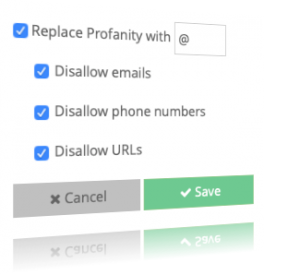

Release 3.10 is a modest release that fulfills a number of customer requests before the holidays. We hope that you find something you like!

# Release Highlights

## Chat Profanity Filter

We have added profanity filter support to our chat service. With it, you can automatically filter profane words (across multiple languages), as well as email and web urls from chat conversations. Offending word segments will be replaced with the character that you specify.

You can configure this via the **Design | Messaging | Chat** page in the [Design Portal](https://portal.braincloudservers.com). Note that you must have signed up for [WebPurify](https://www.webpurify.com/) and configured it via the **Design | Integrations | Manage Integrations** page first.

## Email Validation Enhancements

We have added two new features to make incorporating email verification into your apps easier.

- **_Validation hooks_** \- brainCloud can now automatically trigger a cloud code script to run when a user clicks on the validation URL included in the verification email. The script to be called is configured with the **Design | Cloud Code | API Hooks** page - just choose the EmailAuth service and assign scripts to `Post` and/or `PostFail`.
- _**Continue button**_ \- we have also added a configurable **\[Continue\]** button to the web screen that pops up for email validation. This button is configured to send the user to the web URL of your choice when clicked. Very useful if you want to bring the user to your site login (or back into your app) after validating their email.

The _continue button_ is enabled by configuring a validation hook script (see above) that returns results in the following format when run:

{
  "action": "continue",
  "label": "Continue",
  "hover": "Return to Login",
  "targetUrl": "http://myapp/login"
}

 

## Hand-off API

There are times when it is handy to share a brainCloud login when traversing across multiple software systems (or apps) in real-time. For example, a user logs into _App A_, but to perform some action needs to be passed to a separate user flow in _App B_.

Accomplishing this in brainCloud is possible, but challenging. All three potential solutions have drawbacks:

1. Passing the user's credentials from one system to another <- major security concern
2. Asking the user to login again <- usability issue
3. Passing the active brainCloud sessionId to the other system <- doesn't work due to packetId synchronization

So - we have created a new way to do this, which we call _Handoff_. The idea is pretty simple:

1. App A: The user is logged into brainCloud normally, and a session created
2. App A: The app calls the new [CreateHandoffId()](https://getbraincloud.com/apidocs/apiref/#capi-identity-createhandoffid) method, that creates a temporary `handoffId`and `securityToken`that can be used to remotely log that user in. This _id + token_ is only valid for a short period (~ one hour) and can only be used once.
3. App A: The handoffId + securityToken is passed to the other app/system. How that is done is app-specific. It could be as simple as passing it along in a URL. You could even separate the data - send the id in an email with a clickable link, but text the user the token so that they have to manually enter it <- useful for more security intensive use cases
4. App B: The app calls the new [AuthenticateHandoff()](https://getbraincloud.com/apidocs/apiref/?csharp#capi-auth-authenticatehandoff) API call to log the user into brainCloud

Voila!

_Pro-tip: Hand-off can be combined with the Email Validation Enhancements above to redirect the user back into your app's registration flow!_

 

## Non-login Universal IDs

The brainCloud profile `name`property is a handy way for users to identify themselves. It is used throughout brainCloud (and brainCloud apps) for displaying player names in leaderboards, chat, lists of friends, etc.

Although handy, the `name`property does have some inherent limitations:

1. Names are not unique. Like in the real world, multiple people can have the same name.
2. Searches can be slow. Searching through non-unique collections is slower.

We have long-advocated that developers assign Universal Identities to user accounts to easily enforce uniqueness and make them more searchable. To keep users from being able to inadvertently login via these ids, a generated GUID can be used as the password.

We have now taken the next step and implemented direct support for non-login Universal IDs.

Usage is simple:

- Call [AttachNonLoginUsername( <username\> )](https://getbraincloud.com/apidocs/apiref/#capi-identity-attachnonloginuniversalid) to create a _Universal Identity_ and attach it to the current profile. It will return an error if the username is not unique.
- Later you can call [UpdateUniversalIdLogin()](https://getbraincloud.com/apidocs/apiref/#capi-identity-updateuniversalidlogin) to update the username if the user desires
- To search for the user via the api, use [GetProfileInfoForCredential( "anId", "Universal")](https://getbraincloud.com/apidocs/apiref/#capi-friend-getprofileinfoforcredential)
- Finally, in the Design Portal search by Universal ID -- not by Name! -- to find the user.

_Pro-tip: brainCloud just uses a string for universal identities. They are pretty free-form (i.e. can have spaces, in front, in back, special characters, etc.) If you want to be more restrictive, be sure to filter them and apply your restrictions before creating them!_

 

## S2S Library

We have always had a handy https-based S2S (Server-to-Server) API - but up until now we've left the heavy lifting of calling it to your custom server code.

Enter our new S2S Client Javascript libraries! You can grab them from our [GitHub](https://github.com/getbraincloud/brainclouds2s-node) repo, or from [npm](https://www.npmjs.com/package/brainclouds2s).

They are fairly minimal - you still need to specify raw `service` and `operation`, together with a properly constructed `data` object for the parameters (use the S2S Explorer as your guide to how to format things). We just handle the drudgery of forming the actual requests and sending them to brainCloud servers. And we use the more optimal S2S session-based protocol - so your communications are more efficient and cost you less! It's win-win!

 

## Server Logs

Finally, we are working to make brainCloud's server-to-server interactions a lot more understandable / debuggable.  As a first step in that, we are now logging all incoming S2S requests to a new log that can be viewed on the **Monitoring | Global Monitoring | Server Logs** page.

This page is currently limited to only a maximum of the last 100 requests. It will be enhanced significantly in upcoming releases.

 

* * *

# Portal Changes

## Design

- **Cloud Code | API Explorer**
    - There are new API Calls available in the `Authentication`, `Identity`, and `HttpClient` services.
- **Cloud Code | API Hooks**
    - Added the new `EmailAuth` hook for automatically triggering scripts when a user clicks on the link in the validation email.
- **Messaging | Chat**
    - Added new _Profanity Filtering_ config settings. Note that you need to configure the _WebPurify integration_ from the **Integrations | Manage Integrations** screen first.
- **Segmentation | Segments**
    - Improved the performance of retrieving the list of Segments

## Monitoring

- **\[New!\] Global Monitoring | Server Logs**
    - New page collects S2S requests and responses for easier debugging of server scenarios
    - Note - currently a beta page - will be enhanced soon with pagination features (and later with filtering!)

 

* * *

# API Changes

## Client API

The following changes/additions have affected the client API:

- **Authentication**
    - New Handoff Authentication call added: [AuthenticateHandoff()](https://getbraincloud.com/apidocs/apiref/?csharp#capi-auth-authenticatehandoff)
- **Identity**
    - New API for creating handoff ids: [CreateHandoffId()](https://getbraincloud.com/apidocs/apiref/?cloudcode#capi-identity-createhandoffid)
    - New [AttachNonLoginUniversalId()](https://getbraincloud.com/apidocs/apiref/?cloudcode#capi-identity-attachnonloginuniversalid) API has been added.
- **HttpClient**
    - Added a new [PostJsonResponseText()](https://getbraincloud.com/apidocs/apiref/?cloudcode#cc-httpclient-postjsonresponsetext) method for those weird APIs <cough> _slack_ </cough> that post in JSON but return the result as a string? _I mean really - who does that? :)_
    - The existing [PostJsonResponseJson()](https://getbraincloud.com/apidocs/apiref/#cc-httpclient-postjsonresponsejson) method also more gracefully handles text-only returns - enclosing them in a JSON object with the text in a field called `jsonString`.

 

* * *

# Miscellaneous Changes / Fixes

- _**Updated Client libraries**_
    - The following libraries have been updated with the new 3.10 feature set:
        - Unity + C# libraries
        - Java libraries
        - Javascript libraries
        - Objective-C + Swift libraries
        - Unreal
        - ActionScript (minus RTT features)
    - Additional notes
        - Javascript
            - We have combined our two node.js packages (one for node.js server, one for react) into a single package!
            - Our Javascript library now directly supports NPM. Include "braincloud-js" to grab it!
        - C++ (PS4)
            - FileUploader in place.
        - Objective-C
            - Chat and Lobby services updated.
        - Unreal
            - Unreal wrapper handling smart switching better.
    - _We highly recommend that all apps update to the latest libs!_
- Miscellaneous changes
    - _Improved handling of anonymous device ids_
        - Certain scenarios, like profile merges, result in dormant anonymous ids being associated with a user's profile.
        - brainCloud will now limit the maximum # of device ids per profile, and if there are more, delete then oldest <n\> of them at each login – eventually returning the user to the proper maximum.
        - The default maximum has been set to 10.
    - _Page performance_
        - Improved the performance of the **Design | Segmentation | Segments** and **Design | Core App Info | Admin** pages.
- Documentation updates
    - Improvements to content and accuracy of code examples.
- Important Fixes
    - BCLD-3715 - Fix to SendMessage to allow passing in full jsonContext
    - BCLD-3860 - Scripts: Double-slashes in example parameters were not being preserved during export/import
    - BCLD-3737 - Chat service NPE when attempting to retrieve group chat listeners for a group
    - BCLD-3861 - NPE in lobby service runMatchmaker() API
    - And many, many more!
- Plus miscellaneous fixes and performance improvements.
