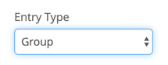

Note - you can also view the highlights in our new [Roadmap](https://portal.productboard.com/braincloud/1-braincloud-roadmap/tabs/4-coming-in-4-1)!

# Release Highlights

## Group Leaderboards

Although brainCloud has long supported filtering leaderboards to group members, it has not supported true Group Leaderboards - where each entry in the leaderboard represent's a Group's (not a Player's) score. Until now that is.

Now, when creating a leaderboard, you will first choose whether it is a **Player** or a **Group** Leaderboard. 

Important notes regarding Group Leaderboards:

- Any member of a group can post a score on behalf of their team
- Post group scores via the new [PostScoreToGroupLeaderboard()](/api/capi/leaderboard/postscoretogroupleaderboard) method. Additional new calls are described in the API section (below).
- Group Leaderboards _cannot_ be used as the basis for Tournaments or Divisions

_Note - we are considering adding Group Tournament and Division support in the future. If it is important to you, vote for it in our [Roadmap](https://getbraincloud.com/roadmap)!_

## Group Enhancements

We have made a bunch of enhancements to Groups and the Group APIs to go along with the new leaderboard support:

- _Group Summary Data_ - we have added the concept of _summary data_ to groups. This is an additional bit of custom JSON, associated with your groups, that can be read by non-members. This is useful when _searching_ for groups with specific qualities and also when _viewing group leaderboards_ ← the summary data gets returned in the leaderboard calls
- _Enhanced Searching_ - when searching for groups, you can now include additional fields (`isOpenGroup`, `updateAt`, `createdAt`, and `summaryData`) in the filter and sorting clauses.
- _Get Random Groups_ - we have added a new API call for retrieving a random selection of groups that fit the specified criteria. See [GetRandomGroupsMatching()](/api/capi/group/getrandomgroupsmatching).

## Voting Leaderboards

Since we were already in the Leaderboard code, we thought we would cover another customer request.

Voting Leaderboards are special leaderboards where the user doesn't post their _own_ score - rather, a player increments the score of _another player_. This makes the most sense for a `CUMULATIVE` leaderboard (where posts from players increment a total). You can imagine using this system to allow players to vote on custom content created by other players - like custom maps layouts, etc.

Important notes:

- This technically isn't a new type of leaderboard - it's merely a new leaderboard call - [PostScoreToLeaderboardOnBehalfOf()](/api/capi/leaderboard/postscoretoleaderboardonbehalfof). Note that this call be made from Cloud Code only.
- The API does not prevent users from voting (i.e. posting on behalf of another user) multiple times. We leave that enforcement up to the app (if desired, of course).

## Multi-Region Support

In V4 we introduced the ability to host Relay and Room Servers. When configuring your servers, you had the ability to choose _which_ region to host them in.

This was a good start, but for global coverage developers would need to create individual server configurations for each of the regions they want to support. And if they're using our matchmaking and lobby services, they would need to set up separate lobby configurations for each region as well.

Release 4.1 greatly improves things:

- You can now select _multiple regions_ for a _Room or Relay Server_ configuration in **My Servers**
- There are new **Client APIs** that allow you to retrieve the _list of regions_ associated with lobby type(s), and calculate the latency (i.e. _ping times)_ to them
- When launching a _Room or Relay Server_ from a lobby, the **Lobby Service** will now automatically choose the _best region_ for the members of that lobby

## Dynamic Chat Channels

And last but not least, this release introduces a new type of chat channel.

Dynamic chat channels are special channels that any user can create and/or join. They exist only for as long as there is activity. Once the channel inactivity timeout expires (typically 30 days), the history (and the channel itself) are automatically deleted and cleaned up.

Note that developers need to manage the "membership" to the channels themselves. If a user of an app connects to a dynamic channel during a session, and you want them to reconnect the next time the app launches as well - you'll need to save that information somewhere in your app (likely in a user entity).

* * *

# Portal Changes

We have made the following portal changes:

## Design

- **Core App Info | Application IDs**
    - Renamed "Facebook Secret" to "Facebook App Secret" to better clarify what it is
- **Core App Info | Admin Tools**
    - Added new options to the **Deployment** section to prevent overwriting the **Lobbies** and **MyServers** page settings. This is important because you very likely want to configure different performance + availability settings for dev vs. prod environments
- **Cloud Code | My Servers**
    - Enhanced the Room Server and Relay Server configuration screens to support multiple regions
    - Note that each region can use the default configuration settings (server size, # containers, etc); or you can override those settings on a region-by-region basis
- **Leaderboards | Leaderboard Configs**
    - When creating a new Leaderboard config, you can now choose between **Player** and **Group** entry types (default is Player).
    - Once the entry type has been set, it cannot be changed
    - Tournaments and Division Templates cannot be enabled for Group leaderboards
    - The entry type has been added to the Leaderboard Config list screen as well

## Monitoring

- **Global Monitoring | Leaderboards**
    - Have been enhanced to show the results of **Group Leaderboards**
    - The column displayed now automatically change depending upon the leaderboard type being displayed
    - Clicking on a **group id** will bring you to the group.

## General

- **DOCS** menu
    - Added a link to the new [Roadmap](https://getbraincloud.com/roadmap) site

* * *

# API Changes

The following changes/additions have affected the brainCloud API:

- **Chat Service**
    - **[SysCreateChannel()](/api/capi/chat/syscreatechannel)** can be used to create a new dynamic chat channel. Cloud code only.
    - **[SysDeleteChannel()](/api/capi/chat/sysdeletechannel)** is used to delete the specified chat channel. Cloud code only.
- **Group Service**
    - **[New!] CreateGroupWithSummaryData()** allows the creation of a group with summary data.
    - **[New!] [GetRandomGroupsMatching()](/api/capi/group/getrandomgroupsmatching)** returns a list of random groups that match the supplied criteria
    - **[New!] [SysChangeGroupType()](/api/capi/group/syschangegrouptype)** changes the group type of a group. Useful for leveling up the maximum number of players in a group. Cloud code only.
    - **[New!] [UpdateGroupSummaryData()](/api/capi/group/updategroupsummarydata)** allows a member to update the summary data of the app. Note that the user must be the owner of the group; or the group's data ACL must be set to "member": 2 to perform the update.
    - **[Update] ReadGroup(), GetMyGroups(), ListGroupsPage()**, and **ListGroupsPageByOffset()** will now return the `summaryData` associated with groups
    - **[Update]** Additional fields (`updatedAt`, `createdAt`, `isOpenGroup`, and `summaryData`) can now be used as filter and sort criteria in group calls.
- **Leaderboard Service**
    - **[New!] [GetGroupLeaderboardView()](/api/capi/leaderboard/getgroupleaderboardview)** and **[GetGroupLeaderboardViewByVersion()](/api/capi/leaderboard/getgroupleaderboardviewbyversion)** for retrieving the leaderboard results, relative to the specified group
    - **[New!] [PostScoreToGroupLeaderboard()](/api/capi/leaderboard/postscoretogroupleaderboard)** for posting scores to group leaderboards. Note that the user must be a member of the specified group.
    - **[New!] [PostScoreToLeaderboardOnBehalfOf()](/api/capi/leaderboard/postscoretoleaderboardonbehalfof)** for posting scores to a leaderboard on behalf of another player. Cloud code only.
    - **[New!] [RemoveGroupScore()](/api/capi/leaderboard/removegroupscore)** for removing a group score.
- **Lobby Service**
    - **[New!] [GetRegionsForLobbies()](/api/capi/lobby/getregionsforlobbies)** retrieves a list of super-set of regions for the specified list of lobbies. Is used by the client app to determine with regions to ping test.
    - **[New!] [PingRegions()](/api/capi/lobby/pingregions)** tells the client to ping the retrieved set of regions. Should be called after GetRegionsForLobbies() has completed.
    - **[New!] [CreateLobbyWithPingData()](/api/capi/lobby/createlobbywithpingdata), [FindLobbyWithPingData()](/api/capi/lobby/findlobbywithpingdata), [FindOrCreateLobbyWithPingData()](/api/capi/lobby/findorcreatelobbywithpingdata)** and **[JoinLobbyWithPingData()](/api/capi/lobby/joinlobbywithpingdata)** are enhanced versions of the regular calls, with the obvious addition of ping data that the server will use to select the best region when launching a Room or Relay Server. Note that the library will automatically provide the ping data for those calls (there are no additional parameters)
    - **[New!] [SysSendSignal()](/api/capi/lobby/syssendsignal)** allows cloud code scripts to send signals to members of a lobby.
    - **[New!] [SysDisbandLobby()](/api/capi/lobby/sysdisbandlobby)** allows cloud code scripts to disband a lobby.
- **Tournament Service**
    - **[New!] [PostTournamentScoreOnBehalfOf()](/api/capi/tournament/posttournamentscoreonbehalfof)** for posting scores to a leaderboard on behalf of another player. Cloud code only.

_Note that we have also made a small change to [GetGlobalLeaderboardViewByVersion()](/api/capi/leaderboard/getgloballeaderboardviewbyversion) and [GetGlobalLeaderboardPageByVersion()](/api/capi/leaderboard/getgloballeaderboardviewbyversion) to allow you to once again pass in -1 as the version id. That_ _behaviour_ _had regressed in 4.0. Apologies for the inconvenience!_

* * *

# Miscellaneous Changes / Fixes

- Updated libraries
    - All libraries have been updated for the 4.1 release! Go get 'em!
    - The Unreal Library now includes beta-level support for our Relay Communications protocol!
    - **Warning - there is a known issue with Unity 2019 on IOS devices that affects brainCloud (and really any app making web requests).** [More info here!](/blog/2019/06/17/warning-unity-2019-x-ios-issues)
- Documentation updates
    - New Roadmap Site - check it out at [https://getbraincloud.com/roadmap](https://getbraincloud.com/roadmap)
    - Significant updates to the S2S sections of the API Reference 
    - Docs updated with all 4.1 APIs
- Important Fixes
    - BCLD-4714 Mismatch of Service and Operation on API Explorer after quick authenticate
    - BCLD-4833 Importing an invalid script zip file and choosing "Full Sync" deletes all existing scripts
    - BCLD-4832 Facebook transactions - some transactions are being displayed as "null"
    - BCLD-4812 Need ability to preserve My Servers and Lobby configurations on Deploy and Import
    - BCLD-3193 SendEvent operations gives a positive response without entering profileID
    - BCLD-4751 Descriptive text on "Edit Lobby Type" popup is out-of-date
    - BCLD-4737 Can't delete a group after using "Delete Users"
- Plus miscellaneous fixes and performance enhancements...
