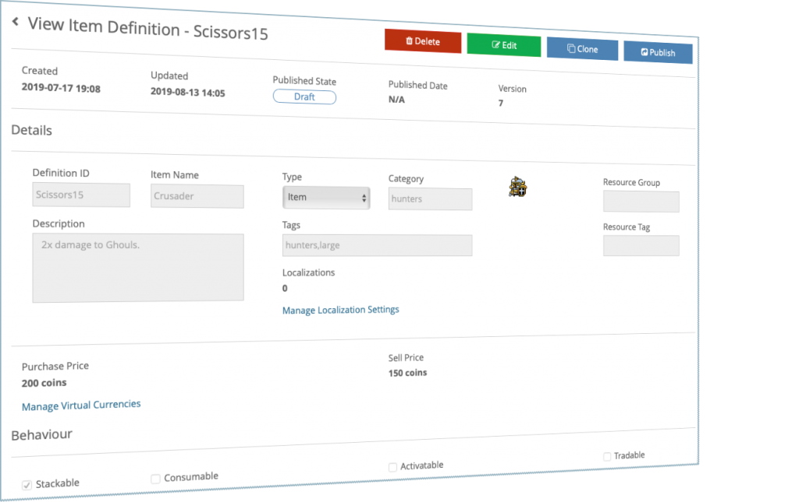

Release 4.2 contains the first versions of some new heavy-hitter features. Read on for details!

## Release Highlights

### Item Management

We are very pleased to introduce the first iteration of brainCloud's new **Item Management** system - which incorporates both an `ItemCatalog` service to manage the master catalog of items, and a `UserItems` service to manage the list of items that users own.

Together with a new **Catalog Editor**, these services make it easy to create experiences where users can be awarded, purchase, sell, trade and consume a rich variety of items (with custom behaviours).

Key features of this system include:

- Localizable names and descriptions
- Item categories and tags for organization
- Item pricing (in multiple virtual currencies)
- Custom item meta-data
- Item "use" management
- Activate-able status effects
- Cool-down and recovery times
- Stackable items
- Upload images and assign resource/asset tags
- Publishing states - draft, published, retired and revoked
- Deployment integration
- And with brainCloud's new Blockchain Framework, you can even trade items on the Blockchain! (_see below!_)

### Custom Entities (beta!)

brainCloud already has some great APIs for managing data in your apps - but due to the challenges of keeping things light and scalable, none of them offer the true flexibility needed for heavy data-oriented applications.

Our existing Global Entity system, for example, only indexes entities by the fixed `entityIndexedId`. Although fine for simple applications - in most scenarios this means that Global Entities don't scale efficiently past 1000 objects.

Our Custom Entities system is different, in that it allows the developer to define multiple, custom indexes per entity type. This totally opens the door to much richer applications, with more intense data needs.

Note - because it's brainCloud, Custom Entities still include:

- ACL ownership
- TTL
- `createdAt`, `updatedAt` timestamps
- concurrency versioning

Note - this is a beta release, so there are some limitations:

- **We don't have a web UI yet - so you cannot view /** **edit / delete** **custom entities in our Design Portal.** _You can access them via the API Explorer, of course._
- **We don't yet support importing / exporting / pushing of custom entities.** So basically custom entities are currently trapped within the apps that created them (for now).

We plan to address these limitations very soon. _And also note, when Custom Entities is released it will be a premium feature with additional data storage charges. Details coming soon._

And that's not all. We have big plans for Custom Entities going forward - so stay tuned!

### Timed Status Effects

When building our Item Management system we thought it would be nice to include status effects - as in, when you _use_ an item, you might trigger a status effect like "double-xp" or "invulnerability" for a period of time.

Once we got to implementing things though, we realized that this status system would be useful on its own as well - so we've made it accessible via new APIs in the `PlayerState` service.

It's super-simple to use. Just apply a "named" status effect to the user via the `SetUserStatus()` call - specifying a duration that it should be applied for, and optionally some custom JSON. We'll save that state - and return it if you call `GetUserStatus()` - as well as automatically when the user logs in.

_Note - brainCloud won't pro-actively notify you that a status has expired. The app should set it's own timers based on the data returned by the APIs._

### Blockchain Integration

We've been busy adding blockchain support deep into the heart of brainCloud.

This is part of our continuing efforts to ensure that brainCloud is the best foundation for your apps - both today and for the future! 

Elements of the blockChain integration in 4.2 include:

- _Blockchain Integration Framework (BIF)_ - brainCloud has been enhanced with a new framework to allow connections to multiple blockChain technologies. Currently EOS integration is in place (more will come soon!)
- _Blockchain configuration_ - attach a blockchain configuration to an app. Currently limited to a single blockchain per app, but we may enhance that in the future.
- _Blockchain Identities_ - attach a users public key to a user's profile - used to identify and modify items that the user owns on the blockchain ← _note, it's up to the client app to ensure that the user is who they say they are!_
- _Item Management Blockchain Sync_ - items can be published to and traded on the blockchain - with updates automatically synced in brainCloud
- _Blockchain Entity Support_ - brainCloud's new Custom Entities are built to support integration with the BIF for blockchain-based ownership management
- _Blockchain Purchase Support_ - with the key Blockchain Integration and Blockchain Identity components now in place, brainCloud is now ready to support custom blockchain-based purchases (either via Item Trades or custom AppStores)

Obviously, this is just the beginning. Stay tuned as we evolve our blockchain support in future releases!

### Kafka Integration

brainCloud now offers Kafka integration in addition to our pre-existing Segment integration for DataStream events.

With Kafka and Segment both supported out-of-the-box, there are literally hundreds (if not thousands) of systems that you can hook up to your brainCloud apps for deeper data analytics, data mining, etc. 

### Other Features

But wait - there is more! brainCloud 4.2 also includes these goodies:

- _Crash Reporting_ - new API calls for sending crash reports to DataStream services like Segment and Kafka.
- _New platforms!_ - brainCloud private instances now support both _Google Cloud Platform_ and _Microsoft Azure_.
- _External lookups!_ - ability to lookup users via the External ID in User Monitoring

* * *

## Portal Changes

We've made the following portal changes:

### Design

- **Integrations | Blockchain**
    - A new screen where you can configure the blockchain integration settings for your app
- **Integration | Manage Integrations**
    - Kafka has been added as a new DataStream destination
- **Item Management | Catalog**
    - New screen for creating your app's item catalog

### Monitoring

- **Group Monitoring | Group Entities**
    - The group entity editor has been greatly improved!
- **User Monitoring | Select User**
    - You can now look-up users via their External Auth id (if they have one) 

* * *

## API Changes

The following changes/additions have affected the brainCloud API:

- **Authentication**
    - AuthenticateExternal - We've added the ability for External Auth scripts to override the externalId that will be stored, and to even provide the specific profileId to load. More details in the _Advanced_ section of the [External Authentication](https://getbraincloud.com/apidocs/api-modules/authentication/external-authentication/) overview page in API Docs.
- **DataStream**
    - New CrashReporting API has been added. Send crash reports to your back-end system for further analysis.
    - For more information, see the DataStream service documentation
- **\[New!\] Item Catalog**
    - These APIs allow devs to read and modify the central item catalog
    - Purchases and other operations are handled via the User Items Service (below)
    - For more information, see the ItemCatalog service documentation
- **Player State**
    - New Timed Status Effect API methods have been added to the Player State service
    - For more information, see the PlayerState service documentation
- **\[New!\] User Items**
    - This service provides the functionality for purchasing, selling, trading, and using items
    - For more information, see the UserItem service documentation

* * *

## Miscellaneous Changes / Fixes

- Updated libraries
    - The 4.2 libraries have the latest APIs - and will be release very soon - stay tuned!
    - C#/Unity
        - Updated HTTP libraries (note, wrapped in the Braincloud namespace, so they shouldn't conflict with anything)
        - Added BC\_DEBUG\_LOG\_ENABLED macro for better log control, and improved profiler performance
        - **Important: Unity folder structure has been changed.** _Clients will need to delete their brainCloud plug-in and re-import it to properly update the folder structure on older projects._ The brainCloud Folder needs to be directly in the Assets folder. Changes were made because the plugin's Resources folder was conflicting with the Unity Resources folder, and messing with some build systems. Thus we have restructured our assets and renamed our resources folder to BCResources to compensate.
    - Javascript
        - Ping data APIs now supported (for geo matchmaking)
    - AS3
        - 4.2 version coming soon.
- Documentation updates
    - Check out the APIDocs for information on the latest APIs - [https://getbraincloud.com/apidocs/apiref](https://getbraincloud.com/apidocs/apiref) 
    - Don't forget to check out our expanded knowledge base - [http://help.getbraincloud.com](http://help.getbraincloud.com/) 
- Plus miscellaneous fixes and performance enhancements...
