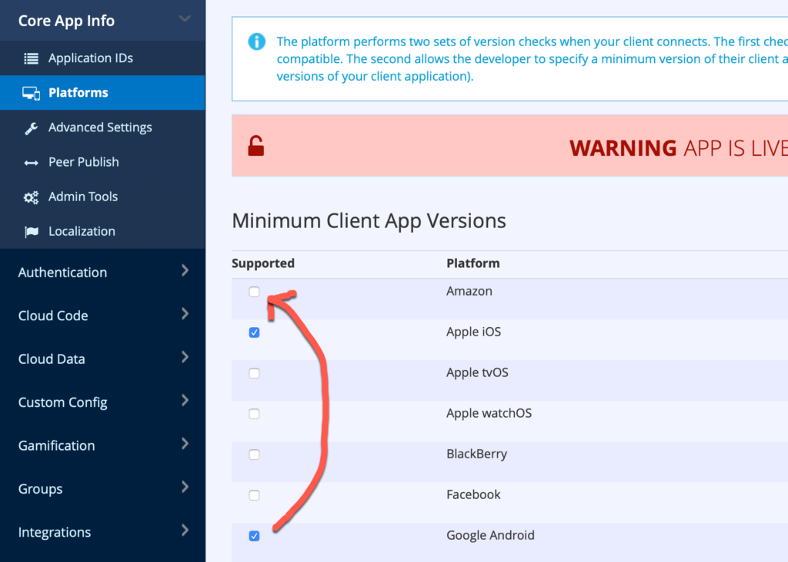

In [Release 4.5.5](/release/2020/07/15/release-4-5-5/) we added support for _Amazon In-app Purchases_. As part of that feature, we also expanded brainCloud to include Amazon devices as a separate _Platform_ - essentially so that devs implementing Amazon IAP would be able to get a better feel of the monetization of users on that platform.

Regrettably, we neglected to properly anticipate and publicize the side effect of that change - with is that **brainCloud apps using the 4.5.5+ libs running on Amazon now need to have the new "Amazon" platform enabled.**

So - if you are building Android apps, and you want them to run on Amazon devices (whether you are using IAP or not), please go _now_ and **turn on Amazon platform support** _before_ upgrading to our 4.5.5 libs.

_(Note - to be precise, only the Unity 4.5.5 libs have Amazon platform detection right now. The rest of the libs are getting a 4.5.6 update soon with it though.)_

Apologies for the confusion!
