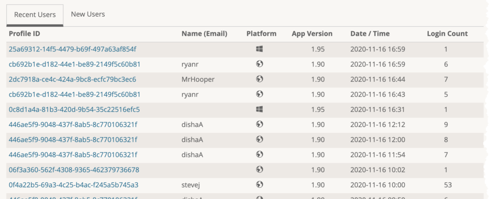

brainCloud 4.6 is mostly an under-the-covers technology refresh:

- We have reworked our _database access layer to be compatible with MongoDB 4.0_ and beyond – all while maintaining API compatibility for our customers, of course.
- We have moved our _reporting services_ from our API Servers to our Datastream Servers for _improved performance and stability_ for _larger exports_.
- We have improved the _RTT connection handling_ code in our _client libraries_.
- We have removed a slew of older _deprecated calls_ from our _client libraries._

On top of all that, we did add a few new features - so read on for the details!

* * *

## Release Highlights

### **Script API Usage Stats**

We have added a new feature to our _API Explorer_ and _Script Editor_ to help you assess and tune the performance of your scripts.

The new API Usage log lists the API calls (by service and operation) that your script made, and calculates the API Count that will be used for billing purposes. Handy!

(Remember, the first 3 calls from a script are free - and each call after that is 1/2 count).

Fewer calls = lower server utilization = lower costs = faster scripts. It’s win:win:win folks!

### SAML End-user Authentication

brainCloud has been enhanced to support SAML for end-user authentication. This is mostly relevant for non-gaming\* customers who want to integrate their brainCloud app with a corporate directory.

Our SAML authentication builds upon the External Authentication feature, providing several key endpoints that can be used for initiating calls and receiving callback from the SAML identity provider.

See the SAML Authentication knowledge-base article for more information.

Advice

brainCloud for non-gaming apps? Certainly! All the qualities that make brainCloud great for games (fast, reliable, scalable and inexpensive) make it great for enterprise apps as well as games. Heck - even the gaming features are useful for engaging consumers via Gamification. brainCloud for all the things! 🙂

### Random Custom Entities

We have added a new API that supports the retrieval of random custom entities.

The new API is called `GetRandomEntitiesMatching()` and takes as parameters the entityType, a JSON query filter, and the number of entities to return. 

### API Keys

We are developing a new Builder API mechanism for developers. This will enable API-driven management of teams, apps, and scripts via external services and tools.

We are hopeful that this, together with Cloud Code folders (coming soon), will allow devs to more efficiently integrate brainCloud with their build processes.

Our new API keys system is a foundational building block. To access any Builder API method, the following conditions must be met:

- Builder API access must be enabled for the _Team_ itself
- Builder API access must be enabled for the _User_ who owns the key (on the target _Team_)
- The Builder API _key_ must be _valid_ and _not expired_

We will provide more information on the Builder API in the coming months.

### RTT Connection Handling

As mentioned above, we have made significant improvements to RTT Connection Handling in the client libraries.

The improvements across all libraries include:

- Refactored the underlying code to keep track of RTT connection state via a new RTTConnectionStatus enum with the following values - CONNECTED, DISCONNECTED, CONNECTING and DISCONNECTING.
- Added a new GetConnectionStatus() method to return this status. 
- The existing IsRTTEnabled() call still works - but now simply returns true if the status is CONNECTED.

In Unity and Unreal, we have also:

- Added a new WebsocketStatus enum (with values OPEN, CLOSED, MESSAGE, ERROR, and NONE) which is used internally to keep track of the WebSocket status. This allows the library to catch an annoying Android background app bug where the RTT connection closes because of the WebSocket closing -- and notify the client app to re-establish its RTT connection.
- Improved error handling in Unity RTT now gives more information about what happened with the RTT connection.

* * *

## Portal Changes

We have made the following portal changes:

### Team

- **Manage | Members**
    - Added a column to show which users have API Keys defined for this team
    - Also added a new _Builder API Access_ option to the _Permissions_ tab of the user settings
- **Manage | Team Info**
    - Added a toggle for enabling Builder API Access

### Design

- **Cloud Code | API Explorer**
    - The new API Usage Stats log is now added to response when cloud code scripts are called.
- **Cloud Code | Scripts, Script Editor**
    - The new API Usage Stats log is also appended to the responses in the Run tab of the Script Editor.
- **Cloud Data | Custom Entities**
    - The index list screen now displays the index **key fields** - providing a much better overview of index coverage.
- **Integrations | Manage Integrations**
    - A new **SAML Settings** section has been added to the integrations screen.

### Monitor

- **Group Monitoring | Groups**
    - We have added a new feature that allows Portal users to **remove members** from groups.
- **User Monitoring | Recent Users**
    - We now capture and display the version of the client app that users are using to login.
- **User Monitoring | Logs**
    - A new **\[Refresh\]** button has been added. Very useful when viewing the live logs of a user while debugging.

_App Version now displayed in Recent Users list..._

### Reporting

- **API Usage**
    - We now break down custom entity operations by entity type - providing better insight into the performance of individual entity types.

### General

- **Edit Profile | API Keys** 
    - You can now create API Keys for use with our Builder API - coming soon! 

* * *

## API Changes

The following changes/additions have affected the brainCloud API:

- **Custom Entity**
    - **(New!)** `GetRandomEntitiesMatching()` call added for returning a set of random entities from a filtered list of candidates.
- **File**
    - **(New!)** `FileUploadFromMemory()` call added to allow uploads to happen in situations where local file access is not possible or convenient. For example, screenshots from Unity-based WebGL apps. _Note - Unity client only._
- **Group**
    - **(Improved!)** Sys APIs for Groups and Group Entities are now available from S2S
- **RTT**
    - **(New!)** `GetConnectionStatus()` call returns the status of the RTT WebSocket connection ( CONNECTED, DISCONNECTED, CONNECTING and DISCONNECTING).

The following methods are newly marked as deprecated:

- **PlayerState**
    - `UpdateName()` deprecated - use `UpdateUserName()` instead… (which is no longer marked as deprecated - it was a mistake!)

The following _previously deprecated_ methods have been _removed_ from the 4.6+ client libraries:

- **Authentication**
    - `GenerateGUID()` and `GenerateNewAnonymousId()` removed - use `GenerateAnonymousId()` instead.
- **Client**
    - `GetGameId()` removed - use `GetAppId()` instead.
    - `GetGameVersion()` and `GetVersion()` removed - use `GetAppVersion()` instead.
- **Entity**
    - `GetSharedEntityForPlayerId()` removed - use `GetSharedEntityForProfileId()` instead.
    - `GetSharedEntitiesForPlayerId()` removed - use `GetSharedEntitiesForProfileId()` instead.
    - `GetSharedEntititesListforPlayerId()` removed - use `GetSharedEntitiesListForProfileId()` instead.
- **Friend**
    - `FindPlayerByUniversalId()` and `FindUserByUniversalId()` removed - use `FindUserByExactUniversalId()` or instead.
    - `ReadFriendPlayerState()` removed - use `ReadFriendUserState()` instead.
- **Gamification**
    - `ResetMilestones()` removed from client libs - still available from cloud code.
- **PlaybackStream**
    - `GetStreamSummariesForInitiatingPlayer()` removed - use `GetRecentStreamsForInitiatingPlayer()` instead.
    - `GetStreamSummariesForTargetPlayer()` removed - use `GetRecentStreamsForTargetPlayer()` instead.
- **PlayerState**
    - `DeletePlayer()` removed - use `DeleteUser()` instead.
    - `ReadPlayerState()` removed - use `ReadUserState()` instead.
    - `ResetPlayer()` removed - use `ResetUser()` instead.
    - `UpdatePlayerName()` removed - use `UpdateUserName()` instead.
    - `UpdatePlayerPictureUrl()` removed - use `UpdateUserPictureUrl()` instead.
- **PlayerStatistics**
    - `IncrementPlayerStats()` removed - use `IncrementUserStats()` instead.
    - `ReadAllPlayerStats()` removed - use `ReadAllUserStats()` instead.
    - `ReadPlayerStatsForCategory()` removed - use `ReadUserStatsForCategory()` instead.
    - `ReadPlayerStatsSubset()` removed - use `ReadUserStatsSubset()` instead.
    - `ResetAllPlayerStats()` removed - use `ResetAllUserStats()` instead.
- **PlayerStatisticsEvent**
    - `TriggerPlayerStatisticsEvent()` removed - use `TriggerStatsEvent()` instead.
    - `TriggerPlayerStatisticsEvents()` removed - use `TriggerStatsEvents()` instead.
- **Product**
    - This legacy `Product` service has been been removed. Use the replacement `AppStore` or `VirtualCurrency` services instead.

* * *

## Miscellaneous Changes / Fixes

- Updated libraries
    - All libraries have been updated. Go get 'em!
- Documentation updates
    - Added new knowledgebase articles for dozens of portal screens. Look for the _Learn More_ links!
- Important Fixes
    - BCLD-6427 - In API Explorer/Scripts/S2S Explorer the up/down arrows in the log are not working
    - BCLD-6389 - Restore Checkpoint now properly deletes new custom collections (created or imported) since the selected checkpoint
    - BCLD-6344 - When viewing indexes, the index fields box is not pretty printed
    - BCLD-6352 - ADHOC Division Set Leaderboard Template with Tournament in progress is losing required tournament data on import/deploy
    - BCLD-6320 - C++ cannot tear down WebSocket on Win32
    - BCLD-6343 - Deleting custom indexes shows wrong text - asks if you want to delete the “entity type” instead
    - BCLD-6327 - Import/Deploy custom entity configs (and migratable custom entities) only if target app has applicable billing plan
    - BCLD-6251 - Added support to manage groups and group entities from S2S
    - BCLD-6304 - Identity - GET\_EXPIRED\_IDENTITIES throwing exception for expired/invalidated Facebook identities
    - BCLD-6322 - Reporting | Analytics page not showing session graph if between 7-8 pm Eastern
    - BCLD-5969 - Added null check for “push content” call in Unity for Abandon/Complete Match with summary data
    - BCLD-6283 - VerifyReceipt() for product that is “Not for Sale” should still work
    - BCLD-6183 - User Items not being exported as part of user data export/archive
    - BCLD-6184 - User Items not being deleted when the user is deleted
    - BCLD-6294 - UpdateGroupData and UpdateGroupName methods not updating UpdatedAt field
    - BCLD-6246 - GoogleOpenId identity cannot be detached
- Plus miscellaneous fixes and performance enhancements...
