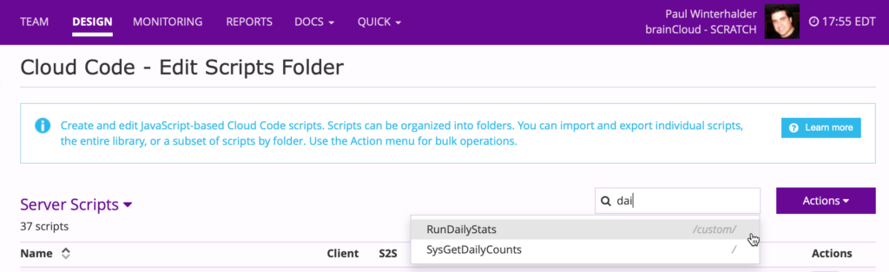
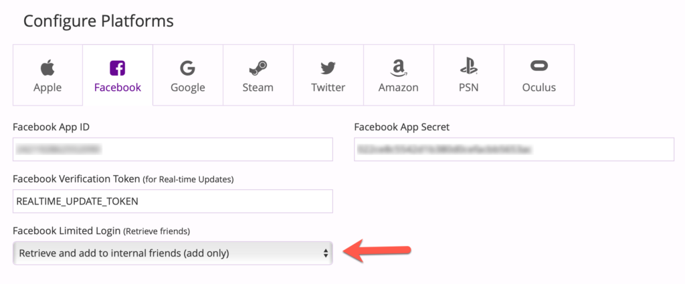
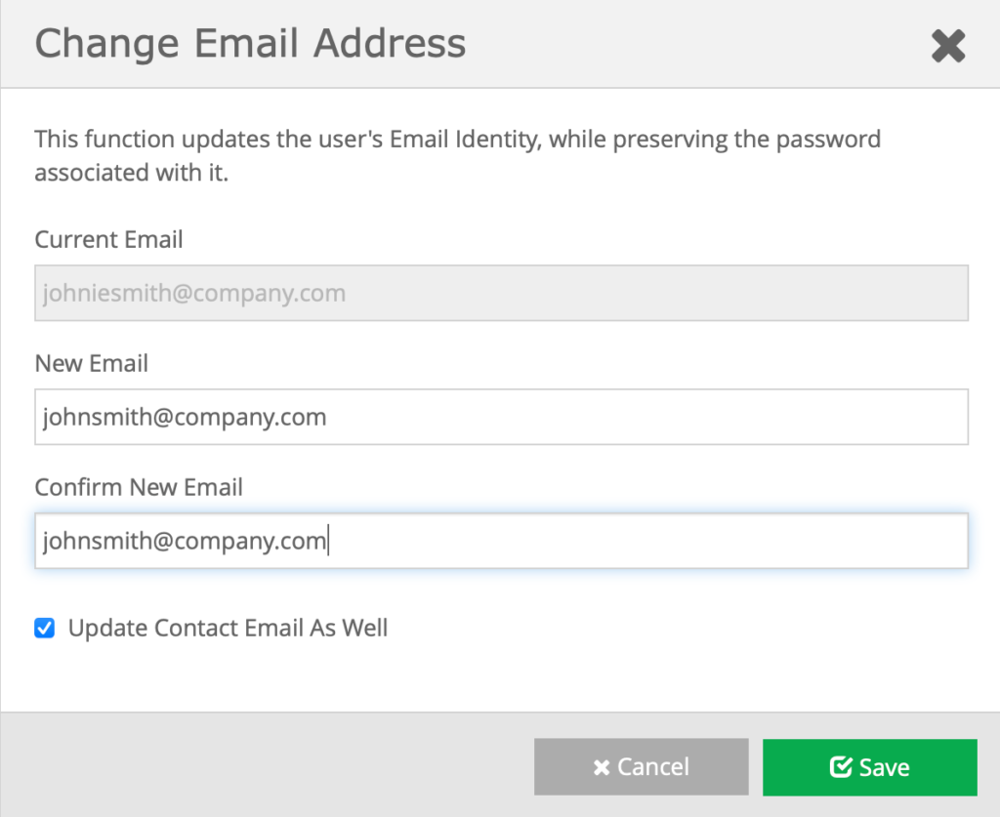

This is an early summer release with a few timely features - plus a bunch of _under-the-hood_ improvements to support future updates.

## Release Highlights

### Search Cloud Code Scripts

Got a lot of scripts? Getting hard to find the one you want? You can now search for cloud code scripts by name - across all your folders. 

Just type a few letters, and then click on the script name to jump to it!

### Facebook Limited Login Friends

Facebook has enhanced their new **Limited Login Mode** to support retrieval of the logged-in user's **friends** ([https://developers.facebook.com/blog/post/2021/04/12/announcing-expanded-functionality-limited-login/](https://developers.facebook.com/blog/post/2021/04/12/announcing-expanded-functionality-limited-login/)) - and thus we have extended brainCloud to support friend retrieval as well!

Facebook only allows apps to retrieve the user's friends during the initial authentication operation. Since brainCloud Friend and Social Leaderboard APIs can be called anytime (during the current or subsequent play sessions) - we need to store a copy of the Facebook friends in the internal brainCloud friend list. If this feature is enabled, when a user logs in via the `AuthenticateFacebookLimited()` call, brainCloud will retrieve the user's Facebook friends and add them to the internal friend list for that user. Note - all friends in brainCloud are bi-directional - so their friend's friend lists get updated as well.

To enable this feature, go to the **Design | Core App Info | Application IDs** page, choose the **Facebook** tab, and set the _Facebook Limited Login (Retrieve friends)_ drop-down to "Retrieve and add to internal friends (add only)."

Advice

For our customers that are using _3rd party authentication services_: If you are getting a list of Facebook friends from another service, you can use the new `AddFriendsFromPlatform()` call to add those friends to the internal list all at once.

### Account Migration Support

The brainCloud community has long been interested in being able to migrate player accounts on-demand from one instance to another.

This is useful when:

- migrating to brainCloud from another service
- beta-testing a new release in a separate brainCloud app (or server) instance

brainCloud's security and privacy frameworks can make this very challenging (as they should!). In brainCloud 4.8 we’ve added some new features + APIs, that when used together, can make this use case achievable.

The new features / APIs are:

- **Authentication postFail** - you can now attach a custom script to an Authentication failure. This allows your custom script to perform some work (like account retrieval and creation) when an authenticate operation fails. The script then returns a special status (199) to tell the dispatcher to re-try the authentication from the beginning.
- `GetSessionForValidatedCredential()` - a new S2S method that allows a client authentication to be performed via an S2S script. Once authenticated, the script can then retrieve and return select data from the user account. 
- `SysGetUserExport()` - a new cloud-code only method that allows a script to retrieve an export of the data associated with a user.

By putting these features together, a developer can:

- Write an _authentication postFail script_ for the **target app**, that will catch authentication failures and attempt to retrieve the missing user account
- Write an _account retrieval script_ for the **source app**, that can be called via S2S to retrieve the data from a user account if the supplied credentials are valid

Information

For full instructions on these use cases, see the _brainCloud Knowledgebase_.

### Edit User Email Identities

The brainCloud Design Portal has been updated to provide a simple way for Support personnel to update the Email Identity + Contact Emails of users.

Simply navigate to the _Credentials_ section of the **User Summary** page in **User Monitoring**, and click the **pen** icon next to the user's _email identity_.

Note that if you _only_ want to edit a user's Contact Email - we have added an edit feature (via another **pen** icon) near that field as well.

### Miscellaneous

In addition, the following new changes have been added to the platform:

- _**Division improvements**_ - we have adjusted the Division Set algorithms to allow players to post scores for rounds that started _before_ the Division instance was created. This is important because some apps have their user’s join divisions just-in-time as they are posting their first score - and thus if the user is the first player in the division, their play round would have begun _before_ the division tournament itself had been created! (And thus it was rejected by brainCloud). The new algorithm will dynamically adjust the start time of the division if a player attempts to record a score from before the Division was created. Note that the start time of the round must be within 2 X the Buffer time defined for the tournament.
- _**Authentication Pre- and PostFail- hooks**_ - we have added both pre- and postFail- hook support for the Authentication services. This work was done in association with the Account Migration feature (above) - but they will undoubtedly will be useful in their own right!
- _**Lobby + Relay Server protocol improvements**_ \- we have tightened up the data structures and IDs commonly used between Lobby Services and Relay Services to be more consistent. This is in preparation for new Multiplayer features coming in the near future. The biggest impact of this is the replacement of the `owner` field in the Lobby data with the proper `ownerCxId` field. To help migrate to the new structure, a new compatibility flag has been introduced, which when enabled, causes both the `owner` and `ownerCxId` fields to be present in Lobby data messages. _(This flag is currently forced to enabled for both new and existing apps.)_
- _**New Client Library calls**_ \- we have added a few calls that were introduced in recent releases as _cloud-code only_, to the 4.8 client libs:
    - AppStore - the `RefreshPromotions()` call has been added
    - Events - the `DeleteIncomingEvents()`, `DeleteIncomingEventsOlderThan()` and `DeleteIncomingEventsByTypeOlderThan()` calls have been added
    - User Files - we have added the `UploadFileFromMemory()` call to the JavaScript library, and likewise improved the Unity implementation of the call.
- _**Audit Logging**_
    - Added additional tracking for changes to Team information
- _**Cloud-code Script Performance**_
    - Updated Rhino engine from `1.7.12` to `1.7.13`
    - We have enhanced the API Server bootup strategy to pre-load and cache both scripts and leaderboard configurations for active apps - resulting in faster launch performance for cold servers
    - Added big message support to user batch script operations
- _**Group & GroupEntity Performance Improvements**_
    - We have adjusted the indexes and sharding strategies for _Groups_ and _Group Entities_ to improve performance.
- _**Scheduled / S2S Scripts**_
    - Improved error logging for Scheduled and S2S Scripts

* * *

## Portal Changes

We have made the following portal improvements:

### Design

- **Core App Info | Application IDs**
    - New option to retrieve friends when using **Facebook Limited Login** added to the **Facebook** tab
- **Core App Info | Advanced Settings**
    - New compatibility feature: _Include legacy lobby ‘owner’ field in API output_. Note - the new code + features that use this flag aren’t completely ready yet - so changing the flag is disabled. The flag will be set to true (enabled) for both new and existing apps.
- **Cloud Code | Scripts**
    - There is a new search box on the cloud code scripts page. Just type a few letters, and click on the name of the script you want to view/edit!
- **Leaderboards | Leaderboard Configs**
    - The _Leaderboard Configs_ page has been refactored to better support apps with thousands of leaderboards
- **General**
    - Privileges + Permissions handling - We have re-worked the underlying permissions and privilege caching and enforcement code to be more consistent

### Monitoring

- **User Monitoring | User Summary**
    - You can now change a user’s email identity credentials by clicking on the pen icon next to their email identity in the **Credentials** section of the page. When editing the user’s email identity, you are also given the option to change the user’s _contact email_ as well.
    - You can also change the user’s _contact email_ directly via the **pen** icon by the _Contact Email_ field in the _Account Information_ section. 

Warning

_Note that changing a user’s contact email alone does not change their email identity (which is the email address used to log into your app)._

* * *

## API Changes

The following changes/additions have affected the brainCloud API:

- **Bridge**
    - New `Sleep( <millis> )` call added to facilitate waiting before retry operations. Can only be called from cloud-code. Note - the max sleep time is restricted to the timeout setting of the script.
    - New `GetSessionForValidatedCredential()` allows an S2S script to acquire a client session for the account associated with the provided user credentials, after first confirming that the credentials are valid, of course
- **Friend**
    - New `AddFriendsFromPlatform()` call allows devs to add multiple friends to the internal brainCloud friends list, specifying the platform-specific external IDs, instead of brainCloud profileIds. ← saving multiple lookup calls.
- **Global App**
    - New `SysGetAppSecret()` method returns the secret for the current session. Useful for apps using the Shared Accounts feature (between Parent and Child apps), and that don’t want to package the secrets of all child apps in the client binary.
- **Global Files V3**
    - New cloud-code only methods for confirming files exist: `CheckFilenameExists()` and `CheckFullpathFilenameExists()`.
- **Identity**
    - New cloud-code only `SysChangeEmailIdentity()` method allows the email address associated with a user to be changed without having the user’s password. This is of course a dangerous method not suitable for client usage - so it is cloud-code only.
- **Leaderboard**
    - New `SysCreateLeaderboard()` call allows for the programmatic creation of Group as well as Player leaderboard. The old call, `CreateLeaderboard()`, only supported the creation of Player leaderboards - and has been deprecated.
    - New `SysEditLeaderboard()` call likewise allows the editing of group leaderboards.
- **Lobby**
    - We have added 3 new methods in preparation for our upcoming _Join-in-progress_ and _Long-lived Lobbies_ features: `SysRoomStopped()`, `SysMemberLeft()`, and `SysGetLobbyMember()`. Stay tuned!
- **User**
    - New cloud-code only `SysGetUserExport()` call allows a script to retrieve an export of the specified user’s data.

We have also deprecated the following methods:

- **Leaderboard**
    - `CreateLeaderboard()` - replaced with SysCreateLeaderboard() method (see above)
    - `EditLeaderboard()` - replaced with SysEditLeaderboard() method (see above)

* * *

## Miscellaneous Changes / Fixes

- Updated libraries
    - All supported libraries have been updated with the latest API enhancements. Go get 'em!
- Documentation updates
    - Updates to tutorials and API References to match the new features/APIs in this release
- Important Fixes
    - BCLOUD-29 - LobbyService joinLobby() is broken in some circumstances
    - BCLOUD-56 - \[PROD\] Tournament rewards with only "custom" rewards cannot be claimed
    - BCLOUD-68 - Logging performance improvement
    - BCLOUD-519 - User Monitoring / Logs - Fix handling of mismatched request/response data for displayed packets.
    - BCLOUD-575 - Add packetId as a field in requestResponse logs
    - BCLOUD-634 - ErrorLogEntry timestamps are slightly off
    - BCLOUD-698 - Handle "duplicate key" exception on Leaderboard Service - Post Dynamic (player or group score)
    - BCLOUD-707 - Allow Tournament Scores to be posted to Division Set Instance for round started before joined tournament
    - BCLOUD-710 - ACE Editor: when copying and pasting content sometimes that pasted content is missing from the submitted data.
    - BCLOUD-793 - Defect in memcached lock handling for temporary sessions
    - And fixed issue with "edit leaderboard" APIs potentially resetting pacer settings
- Plus miscellaneous fixes and performance enhancements...
