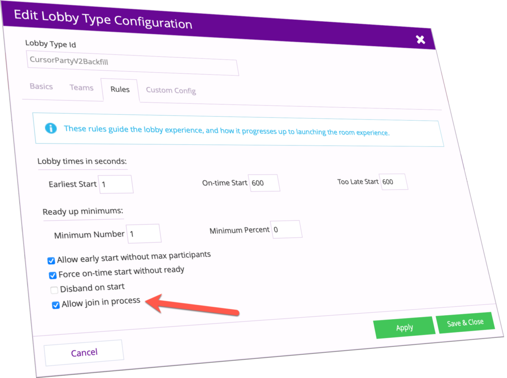

brainCloud 4.9 is a massive update with a hat-trick of new **Multiplayer / Hosting Features** - plus _Unity Compression_ and some highly requested _Marketplace and Management APIs_. We hope you like it!

Warning

This release features an update to path handling for the `bridge.callScript()` method to ensure that _called script paths_ are treated as relative to the _calling scripts paths_. This aligns with the path handling of the `bridge.include()` import mechanism - and makes for more maintainable and portal script modules. See _Updated Script Path Handling_ for more information.

## Release Highlights

### Amazon GameLift Support!

We are pleased to announce that brainCloud now supports [Amazon GameLift](https://aws.amazon.com/gamelift/).

This means that you can enjoy all the benefits of brainCloud multiplayer - with our _online matchmaking_ and _lobby services_ - but with the flexibility of running and hosting your own server fleets in GameLift.

This is especially helpful in scenarios where:

- You already have game servers running in GameLift
- Your game needs the performance boost provided by GameLift’s non-containerized architecture 
- You want to lower costs with GameLift’s ability to utilize AWS Spot Instances

The best part is that once you configure it - there are almost no changes to your client code. The only difference is that the `connectData` information returned to the client will specify a protocol type of `gamelift`.

Information

Note that GameLift hosting is priced differently than standard brainCloud hosting. brainCloud will charge the equivalent of _5 API Calls per player_ added to your GameLift servers.  
  
_This is independent of the costs that Amazon will charge you directly, of course._

### Join in progress!

Speaking of brainCloud lobbies and matchmaking - brainCloud 4.9 adds support for _backfilling_ of matches - which means that new/replacement players can finally be added to matches in progress!

Note that the room server should use the `SysGetLobbyMember()` call to validate the legitimacy of any players attempting to join the Room Server after the match starts.

### Retrieve List of Lobbies

To complete our multiplayer hat-trick, developers can now query the list of active lobbies in a game. This is useful for games providing a more classic multiplayer experience.

Simply pair the new `GetLobbyInstances()` and `GetLobbyInstancesWithPingData()` calls with the existing `GetLobbyData()` and `JoinLobby()` calls to implement your own old-school lobby system!

### AppStore Item Purchases

At long last, Marketplace Products can now include Inventory Items. This means users will be able to acquire your game’s “Magic Wand of Silly Walks” directly through an in-app purchase!

### Unity Client Compression

The Unity Client now officially supports compressing of client ↔︎ server messages.

Sending large API requests/responses takes time - especially under mobile conditions. With a pair of flags, you can enable compression for faster processing of brainCloud requests. _This can also reduce the occurrence of network timeouts that can happen when sending/receiving larger requests_.

brainCloud’s compression support is intelligent - and only kicks in if the message bundle to be transmitted is greater than a size threshold - which defaults to 50Kb. Any messages sent/received above that threshold will be compressed (and uncompressed) automatically and transparently to your app.

Note that compression is _disabled_ in the 4.9 Unity Client by default.

To enable compression of both requests and responses, call:

### Updated Script Path Handling

We have updated brainCloud’s handling of paths for the `bridge.callScript()` method to make it more consistent with industry standards (and our own `bridge.include()` method).

Before this change, if brainCloud were running script `/subFolder/myScript.ccjs` - the following two calls would look for their files in different directories:

- `bridge.include("myImportFile.ccjs")` ← would look for `myImportFile.ccsj` in the current directory of the calling script - i.e. “/subFolder” ✅
- `bridge.callScript("myUtilityScript.ccjs", {})` <- would look for `myUtilityScript.ccjs` in the _root_! ❌

With this change, the two calls use the same algorithm to determine the referenced script.

As you would expect, we have introduced a new compatibility flag that controls this improved behavior. The new **[x]** _**Use legacy script path handling**_ flag, if enabled, preserves the old functionality. _This flag is enabled by default for all existing apps, and disabled by default for newly created apps._

Information

**Important** - this change does _not_ affect the functioning of `ScriptServiceProxy.runScript()`. As that method mimics the Client API call - it always assumes that it is running from the root. We highly recommend that devs use `bridge.callScript()` instead of `ScriptServiceProxy.runScript()` from within scripts.

### Tournament Management APIs

We have expanded our Sys APIs to support Tournament Management.

This includes new cloud-code only APIs for:

- Managing Tournament Templates
- Enabling Tournaments for a Leaderboard Config
- Editing Tournament details for current and future periods

In addition, we have added new methods for more efficiently retrieving the list of leaderboards, and retrieving leaderboard details. See the _API Changes_ section for more details.

### Additional Improvements

This release also includes the following:

- **$text** query support
    - the query syntax for Custom Entities has been extended to support MongoDB $text queries.
- Improved **RTT connection id** handling
    - The **Relay Server Protocol** protocol (and the _Relay Server_ and _Client Libraries_ that implement it) have been enhanced for more consistent usage of RTT connection IDs - basically, the protocol now uses `profileIdCx` ids instead of just `profileId`
    - There is a new compatibility flag, **[x] Include legacy lobby owner field in API output**, that when enabled ensures that this new behavior still works with old clients. _This flag is enabled by default for all existing apps, and disabled for newly created apps._
- Additions / Improvements to the **Builder API**
    - Support for **API Hook** management
    - Support for basic **Team Member** management
- Improvements to **Async Match** APIs
    - We are now returning handy `summaryFriendData` for players in more of the AsyncMatch calls - including `FindMatches()`, `FindCompleteMatches()` and `ReadMatch()`
- Additional **HTTP Client** methods
    - Support for HTTP **PATCH**, **DELETE**, and **HEAD** commands
- **External Authentication** enhancements
    - Ability to return additional information with authentication results
    - For more info - see the new `authPayload` and `extraErrorJson` fields documents in the [API Docs](/learn/key-concepts/authentication/external-authentication/).

* * *

## Portal Changes

### Design

- **Core App Info | Advanced Settings**
    - Added new compatibility flag: _**[x] Include legacy lobby owner field in API output**_. Enabled for existing apps by default. See _Improved RTT Connection ID_ handling for more information.
    - Added new compatibility flag: **[x] Use legacy script path handling**. Enabled for existing apps by default. See _Updated Script Path Handling_ for more information.
- **Cloud Code | My Servers**
    - The new **GameLift Room Server** option has been added.
- **Cloud Code | Scripts**
    - When dealing with _live_ apps, the Script Editor will no longer allow portal users to start editing a script before unlocking the app -- instead of just refusing to _save_ the changes! A small but useful improvement!
- **Custom Config | Legacy Files**
    - The old **Files** page has been fittingly renamed to **Legacy Files**.
- **Integrations | Manage Integrations**
    - A new **AWS GameLift Integration** section has been added.
- **Leaderboards | Leaderboard Configs**
    - We have added a search box for filtering the list of leaderboards. Super useful for those apps with tons of leaderboards!
- **Marketplace | Products**
    - Added the ability to add Items as reward items for in-app purchase products.
- **Multiplayer | Lobbies**
    - Added new options to the Rules page for lobbies:
        - _**Disband on start (default)**_ - lobbies will be terminated when the game starts. This flag is enabled by default for existing apps.
        - _**Allow join in progress**_ - allows players to join games that are already in progress (i.e. backfilling)

### Team

- **Manage | Apps**
    - We’ve added an app’s `appId` (in parenthesis) to the list for easy reference
    - We’ve also added a new **Last Updated** field - so it is easier to see which apps have been edited recently. Note that we have also updated how some of our nightly processes work with the `updatedAt` field of the game record - so that going forward, apps are not considered to be “updated” when our back-end billing processes run.

* * *

## API Changes

The following changes/additions have affected the brainCloud API:

- **AsyncMatch Service**
    - We have added user summary data to the results returned by `CreateMatch()`, `SubmitTurn()`, `FindMatches()`, `FindCompleteMatches()`, `ReadMatch()` and `UpdateMatchSummaryData()`.
- **Client Service (Unity Only)**
    - Call the new `EnableCompressedRequests()`and `EnableCompressedResponses()` methods to enable compression.
- **Global App Service**
    - New `ReadSelectedProperties()` and `ReadPropertiesInCategories()` methods allow the app to retrieve a subset of the app’s global properties instead of all of them.
    - We have also added new S2S and cloud-code only methods for creating properties: `SysCreatePropertyString()` and `SysCreatePropertyJson()`
- **Group Service**
    - New cloud-code only `SysIsGroupMember()` call for testing group membership.
- **HTTPClient**
    - Added support for HTTP PATCH: `PatchJsonResponseJson()` and `PatchTextResponseText()`
    - Added support for HTTP DELETE: `DeleteJsonResponseJson()` and `Delete()`
    - Added support for HTTP HEAD: `HeadRequest()`
- **Leaderboard Service**
    - New `PostScoreToDynamicGroupLeaderboardDaysUTC()` call allows for the dynamic creation of group leaderboards with a `DAYS` rotation.
    - New `SysCreateLeaderboardConfig()` and `SysEditLeaderboardConfig()` methods are updated versions of the older `SysCreateLeaderboard()` and `SysEditLeaderboard()` methods - with the ability to edit tournament settings. The old methods continue to be available (they are not deprecated).
    - New `SysListLeaderboardConfigs()` and `SysGetLeaderboardConfig()` methods for more efficient retrieval of summary information vs. leaderboard details, respectively.
    - New APIs for editing tournament period settings on leaderboards: `SysEditTournamentSettingsForFuturePeriodsOnly()` and `SysEditTournamentSettingsIncludingCurrentPeriod()`. Note that you would usually only edit future periods - because you don’t want to change the rules of a tournament that is already underway - that seems unfair! 
    - New APIs for editing adhoc tournament periods - `SysCreateAdhocTournamentPeriod()`, `SysEditAdhocTournamentPeriod()`, and `SysDeleteAdhocTournamentPeriod()`
- **Lobby Service**
    - Added new `GetLobbyInstances()` and `GetLobbyInstancesWithPingData()` calls to return the list of available lobbies. Pair with the existing `GetLobbyData()` and `JoinLobby()` calls to implement your own old-school lobby system!
- **Tournament Service**
    - New management calls - `SysListTournamentTemplates()`, `SysCreateTournamentTemplate()`, `SysEditTournamentTemplate()`, `SysReadTournamentTemplate()` and `SysDeleteTournamentTemplate()`.
- **User Service**
    - A number of Sys methods that were missing from the S2S proxy have been added

* * *

## Miscellaneous Changes / Fixes

- Updated libraries
    - All libraries have been updated with the latest API changes. Go get 'em!
- Documentation updates
    - All of the new API calls have been added to the API Reference
- Important Fixes
    - BCLOUD-792 - JS S2S Heartbeat doesn't work - fixed.
    - BCLOUD-799 - User Batch Script processing issue with PlayerSession API version causing Leaderboard API errors
    - BCLOUD-945 - REDIS lag causes issues when scripts are moved between folders
    - BCLOUD-980 - Scripts in the root folder are not being cleared when restored to checkpoint
    - BCLOUD-981 - Add protection for PlayerStatistics experience points from going negative
    - BCLOUD-982 - Add more input validation for Tournament rewards input for GlobalGameStatistics and/or PlayerStatistics stat names
    - BCLOUD-998 - Add support for $text operator text query document fields
    - BCLOUD-1057 - Locks with no player session context not unlocking properly
- Plus miscellaneous fixes and performance enhancements...
