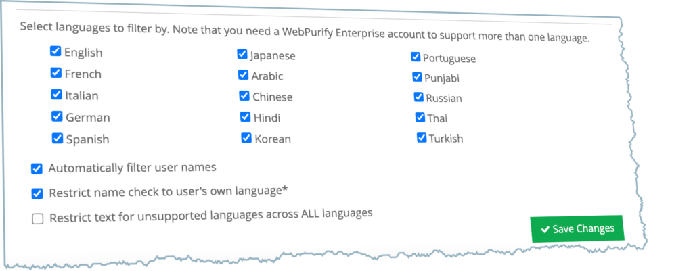

brainCloud 4.9.5 is the last release of 2021, and targets a few key customer requests and performance and reliability improvements.

## Release Highlights

### Profanity Check Improvements

We have improved the built-in filtering of our **WebPurify** integration - so that devs can now choose to filter a user’s **chat messages**, and updates to their **name**, by their own language only (instead of against all configured languages).

You will find the new options:

- on the **Design | Integration | Manage Integrations** screen for the player name settings

- on the **Design | Messaging | Chat** screen for the chat message settings

### Additional improvements

- _**Async Match improvements**_ - Deleting a player will now automatically _**abandon**_ any asynchronous matches that they have in progress
- _**Entity call improvements**_ - added a new `_serverTime` field to the JSON responses of most get entity calls – as a convenience to client devs
- _**Friend service improvements**_ - more reliable retrieval of friend data across multiple social platforms ← a failure to retrieve friends from one service will no longer abort retrieving from the remaining services.
- _**Leaderboard rotation improvements**_ - Improvements to concurrency handling during Leaderboard rotations and Tournament processing
- _**Lobby matchmaking**_ - improved matchmaking performance under heavy loads
- _**User batch processing**_ - improved handling of larger data bundles during batch processing

* * *

## Portal Changes

We've made the following portal improvements:

### Design Section

- **Integrations | Manage Integrations**
    - WebPurify - Added new options for improved targeting of languages for name profanity checks
- **Multiplayer | Chat**
    - Added new options for improved targeting of languages during chat profanity checks
- **General**
    - Adjusted the line-height of several components used in some log screens to address issue with low-hanging font characters being cut off

* * *

## API Changes

The following changes/additions have affected the brainCloud API:

- **CustomEntity service**
    - Added a `_serverTime` field to the `ReadEntity()`, `ReadSingleton()`, `SysReadEntity()`, `GetEntityPage()`, `GetEntityPageOffset()`, and `GetRandomEntitiesMatching()` responses
- **\[User\] Entity service**
    - Added a `_serverTime` field to the `GetEntitiesByType()`, `GetEntity()`, `GetList()`, `GetPage()`, `GetPageOffset()`, `GetSharedEntitiesForProfileId()`, `GetSharedEntitiesListForProfileId()`, `GetSharedEntityForProfileId()`, `GetSingleton()` responses
- **GlobalEntity service**
    - Added a `_serverTime` field to the `GetList()`, `GetListByIndexedId()`, `GetPage()`, `GetPageOffset()`, `GetRandomEntitiesMatching()`, `GetSystemEntityList()`, `GetSystemEntityPage()`, `GetSystemEntityPageOffset()`, `ReadEntity()`, `ReadSystemEntity()` responses
- **Group service**
    - Added a `_serverTime` field to the `ReadGroupEntitiesPage()`, `ReadGroupEntitiesPageByOffset()`, `ReadGroupEntity()`, `SysReadGroupEntitiesPage()`, `SysReadGroupEntitiesPageByOffset()`, `SysReadGroupEntity()` responses

* * *

## Miscellaneous Changes / Fixes

- Updated libraries
    - There are no new client APIs in this release.
    - There have been several client lib patches over the past month though - so be sure that you are using the latest!
- Plus miscellaneous fixes and performance enhancements...
