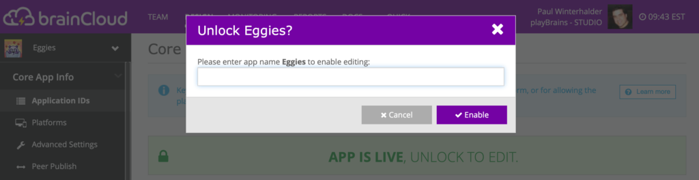

brainCloud 4.10 adds new _**Security Options**_, an upgraded _**Cloud Code Engine**_, new _**Advanced Authentication**_ calls, and more.

:::caution Compatibility

As always, brainCloud 4.10 aims to be 100% backwards compatible with previous releases. There are some changes/fixes that could affect existing apps:  
  
**Plus Plan Exclusive Feature Enforcement** - We have discovered that in some scenarios, **Plus Plan Features** (i.e. RTT, Chat, Messaging, Custom Entities, etc.), can be accessed by live apps that are not on an appropriate plan. Release 4.10 addresses this issue. We will be enabling _proper enforcement of Plus Plan restrictions_ starting **Tuesday, April 5th**. Please double-check that your app is on the correct plan before then!  
  
**Rhino 1.7.14** - there is a known breaking change in the new engine. It involves using the _java_\-based (i.e. not _javascript_\-based) `java.util.HashMap()`class from within a cloud code script. Our production searches indicate that no developers are using this class in production - and thus we are disabling support for that feature. But _just_ in case - we are still noting it here.  
  
**Group and Group Entity ACL changes** - there are fixes to how Groups and Group Entities handle ACL permissions, which may affect existing applications. To be safe, we have added a compatibility flag, “\[x\] Preserve legacy GroupEntity / Group ACL defect behaviour”, that preserves the old behaviour for existing apps by default.
:::
## Release Highlights

### TLS Security Enforcement

We are hardening the security of our Public BaaS environment to enforce **TLS 1.2** for all APIs.

:::note Background

Up until now, we have accepted TLS 1.0 and 1.1 for API calls to ensure maximum compatibility for older apps. TLS 1.2 is well established now though, and we risk more by allowing 1.0 and 1.1 than we gain in backwards compatibility keeping them. Apologies to those devs that may be affected - but we must all march forward!
:::
To facilitate a manageable transition - we have added an additional API endpoint to our public BaaS. So our public BaaS now supports:

- `api.braincloudservers.com` - our new API endpoint that supports TLS 1.2 only… (we will further upgrade it to support TLS 1.3 as well when AWS supports it)
- `sharedprod.braincloudservers.com` - this is our legacy endpoint that currently supports TLS 1.0, 1.1 and 1.2. This URL will be re-targeted to the same endpoint as `api.braincloudservers.com` starting **June 7, 2022** ← approximately 90 days from now.

Note that other than the version of TLS enforced, these two endpoints function exactly the same. Your apps and players will not see any difference!

Our 4.10 client libraries have all been updated to use `api.braincloudservers.com` as the new default `serverUrl` for API calls. If you are using an older library, you can simply specify `"https://api.braincloudservers.com/dispatcherv2"` for the `serverUrl` parameter of the wrapper `Initialize()` call - see [API Reference](http://getbraincloud.com/apidocs/apiref/?csharp#wrapper-initialize).

Once your app is calling the new endpoint, you can then go to the new **Design | Core App Info | Security** page, and set the minimum API TLS to 1.2. Careful though - this will mean that any calls to the older API endpoint (`sharedprod.braincloudservers.com`) will be rejected! ← because brainCloud cannot otherwise ensure that they were at least TLS 1.2.

Note that our RTT websocket endpoint is already enforcing a minimum TLS of 1.2. The raw TCP version of RTT however, which is used only for clients that cannot support WebSockets, is not encrypted. Setting _Minimum RTT TLS Version_ to 1.2 thus disables the raw TCP connection option for your app. Note that both Unity and Unreal clients use the encrypted websocket implementation by default - so removing this option does not affect 99% of apps.

:::info

Note - S2S and Builder APIs are also available via the new `api.braincloudservers.com` endpoint. It is recommended that all devs move to these endpoints at their earliest convenience.
:::
:::warning

Older libraries - Our tests indicate that our older libraries should support TLS 1.2 - but we haven’t been able to exhaustively test across all client platforms. As always, it is recommended that developers keep pace with the latest brainCloud libraries for maximum performance and reliability.
:::
#### Migration options

In summary, brainCloud 4.10 allows developers to bump up the minimum level of TLS for client APIs. Developers have two options on how they would like to migrate:

1. **Do nothing** \- If you do nothing, your app will automatically be upgraded to TLS 1.2 starting on **June 7, 2022** when `sharedprod.braincloudservers.com` merges with `api.braincloudservers.com` and begins enforcing a minimum TLS of 1.2.
2. **Migrate early** - For developers wanting to improve their app security now, the new API and security settings provide the means to de-risk and accelerate the migration – which is definitely convenient for devs maybe going through Facebook’s Privacy Checklists for example. The recommended approach is:
    1. Reconfigure your app to talk to `api.braincloudservers.com` - either by updating to the 4.10 libs - or overriding the `serverUrl` parameter in wrapper `Initialize()`.
    2. Confirm that your app works just fine
    3. Release the updated build of your app - so that you can get the majority of your player base migrated over
    4. Set the minimum client version of your app to force upgrades for any stragglers.
    5. Adjust the TLS settings of your app to require TLS 1.2. You are done!

:::tip

One final note - the `api.braincloudservers.com` endpoint is actually ready now - _before_ the official 4.10 release. So you don’t have to wait to start migrating your apps to the more secure endpoint. _Start today!_
:::
### Cloud Code Engine Upgrade

We have upgraded the Mozilla Rhino Engine from 1.7.13 → [1.7.14](https://github.com/mozilla/rhino/releases/tag/Rhino1_7_14_Release).

This brings with it support for the following Javascript features:

- Template Literals!
- Promise Support (Requires app to be set to ES6)
- Error stack traces!

And more!

For the full details, see the [Rhino 1.7.14 Release Notes](https://github.com/mozilla/rhino/releases/tag/Rhino1_7_14_Release).

### Advanced Authentication

Developers of certain categories of apps have long asked for the ability to register a new user, and set default attributes, etc. for that user during the initial Authentication call. This is not possible with the existing Authentication calls – so we have added a new set of calls to satisfy this use case. 

The new `AuthenticateAdvanced()` call allows the developer to include an extraJson payload with the authentication call, which can then be picked up by pre- or post- API hooks for additional processing as the account is created.

Note that for simplicity, all authentication types are handled by the single `AuthenticateAdvanced()` call - similar to how the API Explorer works… Corresponding `Merge()` and `Detach()` calls have been added to the `Identity` service as well.

### Group and Group Entity Enhancements

We have done a full review of our Group and Group Entity code, and found some areas that warranted improvements. The following changes/fixes have been made:

- **Improved handling of ACL permissions** - In particular, some `GroupEntity` operations were being gated via the Group ACL instead of the Group Entity ACL! Note that there is a _compatibility flag_ to preserve the old behaviour.
- **Improved concurrency handling** \- we have improved the locking of several key methods - including managing group membership.
- **Added missing Group “Sys” API call** - Added Sys implementation for `SysRemoveGroupMember()`
- **New** `SysGetRandomGroupsMatching()` **call** - this is a more useful implementation of the `GetRandomGroupsMatching()` call - which is hampered by ACL permissions not allowing the API to return full details of groups that the user is not a member of. We would recommend that in most use cases, it is more correct to use `SysGetRandomGroupsMatching()` than `GetRandomGroupsMatching()` - though like all Sys calls, `SysGetRandomGroupsMatching()` is not available directly via the client API - so you’ll need to call it via a cloud code script.
- **Updated** `ReadGroupMembers()` and `SysReadGroupMembers()` calls to return a user’s `summaryFriendData`

### Additional Features

- _**Unreal Relay communications**_ - we have completely re-written Unreal relay communications for this release. In addition, we have created an Unreal-based Relay Tester app to demonstrate the usage of the relay server APIs.
- _**Improved credential checks**_ - we have added improved versions of `getProfileInfoForCredential()` and `getProfileInfoForExternalAuth()` that don’t unnecessarily log an error if the credential isn’t found. This is handy for use cases where a credential not being found is normal - and isn’t worth flagging as an error in the logs. The new methods are:  `getProfileInfoForCredentialIfExists()` and `getProfileInfoForExternalAuthIfExists()`
- **Faster file deployments** - brainCloud will now copy multiple files in parallel during app deployments. This should have a noticeable reduction in deployment times for some apps.
- **Ultra authentication** - brainCloud APIs now support user authentication for apps on the [Ultra.io](http://ultra.io/) platform. 
- **Unity Chat** - a new Unity Chat example app has been created. You can find the source for it here:  
    [https://github.com/getbraincloud/examples-unity/tree/develop/BC-Chat](https://github.com/getbraincloud/examples-unity/tree/develop/BC-Chat)
- **Unreal Relay Test** - a new Unreal Relay Test example app has been created. You can find the source for it here:  
    [https://github.com/getbraincloud/examples-unreal/tree/master/RelayTestApp](https://github.com/getbraincloud/examples-unreal/tree/master/RelayTestApp)

### Plus 4.9.5 Patch items

The following additions were technically included in 4.9.5 patches - but are described here for completeness:

- _**Illegal file types**_ - Developers are no longer allowed to upload certain file types. Currently disallowed extensions are: html,htm,jsp,php,bat,cmd,exe,js,pif,ps1,scr,vb,vbe,vbs
- `SysUpdateEntityFieldSharded()` **call** - added new `SysUpdateEntityFieldSharded()` call for use with sharded Custom Entity Collections. This is because the existing `SysUpdateEntityField()` will not work for owned custom entities once sharded.
- _**Improved Room and Relay Servers**_ - improved handling for long-lived lobbies with join-in-progress servers.
- _**Improved RTT connection handling**_ - improved handling of RTT connection disconnects. 

* * *

## Portal Changes

We have made the following portal changes:

### Design 

- **Core App Info | Advanced Settings**
    - Added a new compatibility flag to preserve the old (and incorrect) GroupEntity / Group ACL behaviour. By default this flag is enabled for existing apps - but it is recommended that devs review their apps and clear this flag when possible.
- **Core App Info | Security**
    - This new screen allows devs to customize the security settings of their apps. For more information, see the _TLS Security Enhancements_ section above.

### Monitoring

- **Global Monitoring | Custom Entities**
    - Improved performance when showing all entities for a custom entity collection with tons of entities.
- **Global Monitoring | Recent Errors**
    - Fixed an issue that would cause logs to show the wrong relative date in certain timezone situations.

### Reports

- **Reporting | Analytics**
    - The _Dormant Users_ statistics table has been updated.
- **Reporting | API Usage**
    - Fixed an issue displaying usage stats for games with > 2.1 Billion game sessions.

### **General**

- _**Unlocking apps**_ - Unlocking a live app (via the _Live Lock Banner_) now requires the developer to type the **name** of the app, not the developer's **password**. This is more in tune with the original design intent for the banner (which was to ensure the developer is aware of which particular version of their app (production, development, etc.) is being changed) - and interacts better with the PortalSSO integrations of private licensee’s brainCloud instances.

* * *

## API Changes

The following changes/additions have affected the brainCloud API:

- **Authentication**
    - New `AuthenticateAdvanced()` call that allows `extraJson` payload to be included with player authentication / registration
    - New `AuthenticateUltra()` call allows apps to authenticate with the [Ultra.io](http://ultra.io/) platform
- **Custom Entity**
    - New methods `UpdateEntityFieldsSharded()` and `SysUpdateEntityFieldsSharded()` are sharding-safe implementations of the older `UpdateEntityFields()` and `SysUpdateEntityFields()` methods. The non-sharded versions of these methods are now recommended only for custom entity collections that you know you will never want to shard in the future (i.e. small, probably static collections).
- **Friend**
    - The new `getProfileInfoForCredentialIfExists()` and `getProfileInfoForExternalAuthIfExists()` methods behave just like `getProfileInfoForCredential()` and `getProfileInfoForExternalAuth()` respectively - except that they don’t log errors if the credentials don’t exist. Handy and cleaner for many use cases.
- **Group**
    - New `SysGetRandomGroupsMatching()` call is a more convenient version of `GetRandomGroupsMatching()` - which eliminates the need to give read-only access to “other” users.
    - Added new S2S + cloud code only method: `SysRemoveGroupMember()`
    - Updated `ReadGroupMembers()` and `SysReadGroupMembers()` to return a user’s `summaryFriendData`
    - Improved concurrency handling
    - Improved handling of ACL permissions; behaviour changes are gated by a new compatibility flag.
- **Group Entity**
    - Improved concurrency handling
    - Improved handling of ACL permissions; behaviour changes are gated by a new compatibility flag..
- **Identity**
    - New _cloud code only_ `GetIdentityData()` call allows apps to retrieve additional information regarding a specific player identity. Currently only supported for the new Ultra authentication.
    - New _Advanced_ identity methods: `AttachAdvancedIdentity()`, `DetachAdvancedIdentity()`, `MergeAdvancedIdentity()`
    - New Ultra identity methods: `AttachUltraIdentity()`, `DetachUltraIdentity()`, `MergeUltraIdentity()`
- **RTT**
    - `EnableRTT()` now fails if the app’s plan does not support RTT. Note that this is a server-side check, and is not limited to the 4.10 client library.

We have attached warnings in the API docs to the following methods:

- **Custom Entity**
    - `UpdateEntityFields()` and `SysUpdateEntityFields()` - These methods are not sharding safe - and thus are not recommended for custom entities that you may want to shard for greater performance and scalability in the future. Consider using `UpdateEntityFieldsSharded()` and `SysUpdateEntityFieldsSharded()` instead.

* * *

## Miscellaneous Changes / Fixes

- Updated libraries
    - All libraries have been updated with the new `serverUrl` and the latest APIs. Go get 'em!
- Documentation updates
    - API reference has been updated with the latest API changes.
- Important Fixes
    - \[BCLOUD-1508\] Fix for broken RTT disconnects
    - \[BCLOUD-1508\] Fix for broken RTT disconnects
    - \[BCLOUD-1565\] Dormant User Analytics changes: Users now only considered dormant if inactive > 365 days
    - \[BCLOUD-1534\] \[Fixed\] Can't turn off Facebook Limited Login Friends once turned on
    - \[BCLOUD-1530\] \[Fixed\] Design Portal Error log entry displayed date is not accurate
    - \[BCLOUD-1378\] Add missing API Hooks for RedemptionCode service
    - \[BCLOUD-266\] \[Fixed\] RTT DISCONNECT message not passed to the user
    - \[BCLOUD-35\] \[Fixed\] Relay C++ UDP ping sent before CONNECT
    - \[BCLOUD-1535\] Add missing Sys Group API (SysRemoveGroupMember)
    - \[BCLOUD-1525\] ItemCatalog service missing some cloud code SYS calls
    - \[BCLOUD-1298\] \[BuilderAPI\] Fixed NPE when request does not contain a content-type
    - \[BCLOUD-1531\] Improved error message (and logic) for launching hosted servers when a region is not supported
    - \[BCLOUD-1515\] \[Fixed\] Apps with billing plans with RTT disabled should not be able to send chat messages or make rtt connections
    - \[BCLOUD-1587\] \[Fixed\] Group has two members having role of OWNER
    - \[BCLOUD-1387\] \[Fixed\] User Monitoring - Login as User should set user’s languageCode and countryCode on created PlayerSession
    - \[BCLOUD-1394\] Return Catalog Item Definition name and/or description in app's default language if none for user's language for User Item with metadata flagged true
    - \[BCLOUD-1393\] Added missing support for getRunningOrQueuedCloudScripts Sys API on ScriptS2SServiceProxy
    - \[BCLOUD-1331\] Group APIs for Group Entity should enforce Group Entity ACL, not Group ACL
    - \[BCLOUD-1331\] Speed up SysIncrementGroupEntityData and SysUpdateGroupEntityData calls by avoiding Group lookup (only required for the equivalent non-Sys calls)
    - \[BCLOUD-1402\] \[Fixed\] Messaging Sys APIs not allowing version -1 for any version

- Plus miscellaneous fixes and performance enhancements...
