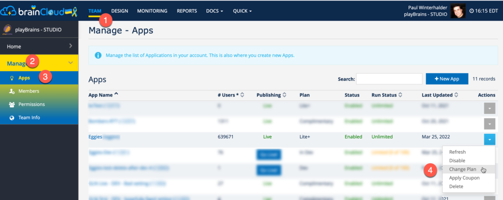
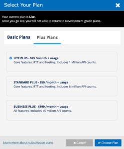

:::caution

Note that basic RTT features are still available in the free Development plan. As before, Dev+ is only required for _hosting_ and _deep data_ features during development.  
  
These changes apply to apps using _Plus Plan_ features from the non-plus paid plans (i.e. **Standard** / **Lite** / **Business**).
:::
A quick reminder that usage of the following features have always required activation of a **Plus Plan** for live apps:

- _RTT_ - used for Chat, Lobbies, Presence, etc
- _Hosting_ - spinning up custom Room and Relay Servers
- _Deep Data_ - used for Custom Entities and Messaging

In 4.9.5 (and earlier) there were scenarios where these restrictions were not being enforced.

We have addressed those scenarios in 4.10 - and as noted in the 4.10 release notes - we will enable the feature flag to begin properly enforcing these restrictions tomorrow - **_April 5th, 2022_** - at approximately 9am Eastern.

Starting tomorrow, developers can expect that attempting to access these features (like enabling RTT, creating a custom entity, connecting to a chat channel, sending a message, etc.) without an active Plus Plan, will result in a run-time licensing error.

To quickly update your app to a plus plan, simply:

- Navigate to **Team | Manage | Apps**
- Select **Change Plan** from the action menu associated with the app
- Click on the **Plus Plans** tab
- **Choose** the plan to switch to
- And click **\[Choose Plan\]**

brainCloud will then swap your app to the new plan.

Note that your charges will be adjusted automatically, with the first few days of April charged to the old plan, and the rest of the month charged to the new plan - with the live fees pro-rated accordingly.

If you have questions or issues, feel free to reach out via the support widget.
