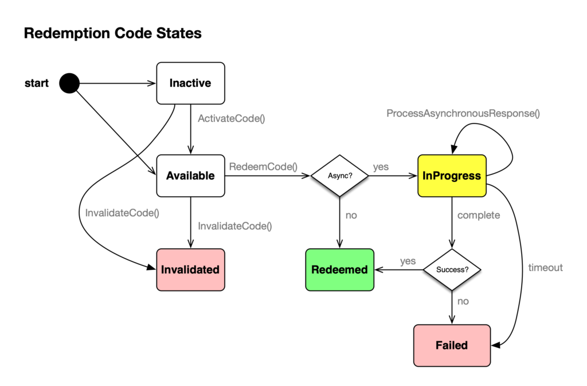

brainCloud 4.11 has dropped. Here is what it contains.

## Release Highlights

### Redemption Code Enhancements

brainCloud 4.11 adds significant customization abilities to the Redemption Code service.

Developers can now write and configure scripts to programmatically handle the processing of redemption codes. These scripts can even incorporate _asynchronous_ processing so that redemption processing can work with off-board fulfillment systems (i.e. delivery of virtual or physical goods via a 3rd party system).

brainCloud 4.11 also adds the ability to generate groups of redemption codes - in two code formats\*:

- `StructuredGuid` - which is a standard GUID-format (i.e. “be0cc83f-024b-4dce-b50c-035ca51e99ae”)
- `FiveByFive` - which is a 5x5 alphanumeric code (i.e. "a1c2b-a82k3-d82h3-48sw7-8a82d")

_Note - Additional code types may be added in the future._

Simply choose the format of codes that you want - and the quantity - and an email will be sent to you with the generated set of codes.

With this - the following API calls have been added:

- `GenerateCodes()` - generates a set of codes, and emails them to the specified user
- `GenerateCodesInline()` - generates a set of codes, and returns them directly in the API call... (limited to max of 100 codes generated at a time)
- `ProcessAsynchronousResponse()` - used in asynchronous custom processing scripts to tell the Redemption Code service the updated status of the specified code.

### Division Management API

brainCloud adds a new API for the creation and management of Divisions – accessible via S2S and cloud code.

The following new methods are available:

- `SysCreateDivisionSetConfig()`
- `SysDeleteDivisionSetConfig()`
- `SysEditDivisionSetConfig()`
- `SysListDivisionSetConfigs()`
- `SysReadDivisionSetConfig()`

Note that the `JoinDivision()` and `SysGetLeaderboardConfig()` calls have also been enhanced to return a new `createdAt` field (for division leaderboard instances only) that indicates the date+time that that particular division set instance was created. 

### Relay Server Fixes / Improvements

We have improved the robustness of the relay server and added support for customizable timeouts.

The following timeout values are now supported:

- `MEMBER_TIMEOUT` - Number of _seconds_ within which a member needs to initially join the game. They will be automatically dropped if they don’t join within this time. Default is 30 seconds.
- `CONNECTION_TIMEOUT` - Number of seconds a connection can be idle (i.e. no activity from the client) before the server drops it. Default is 10 seconds.
- `RESEND_TIMEOUT` - Number of seconds of resending the same packet before the player is dropped for "too many packet drops". Default is 10 seconds.

Note - these improvements are only available for the v2 Relay Protocol servers.

### Unity Client Improvements

We have made significant improvements to how the Unity Client processes timeouts and connection errors - especially in times of high server load. These improvements will be applied to the other client libraries in the coming months.

In addition, our latest libs address a WebSocket change in the 2021+ versions of Unity.

As always, for best performance, we encourage all developers to upgrade to the latest client libraries. So be sure to grab the 4.11 libs!

### Unity Plug-in Changes

The Unity Plug-in has been enhanced to accept Builder API keys in the password field during login. This is to assist our private licensees who are transitioning to Single-Sign-On usage.

### New Unity Authentication Example

We have totally re-written the Unity Authentication example - from OnGUI to Unity UI - to better illustrate how authentication works - including our recently added `AuthenticateAdvanced()` call.

We even have new docs and a video to go with it. Check it out! 

### Additional Features

- Added new **Ultra Blockchain Service** for our [Ultra.io](http://ultra.io/) partner
- **Auto-Delete Users** \- we are finally introducing the Auto Deletion service that we teased way back in brainCloud 4.5.5! (Hey - we’ve been busy! 🙂 ) Anyway, this service allows your app to automatically delete users who haven’t logged in for a given period of time (e.g. 1 year) - with useful exceptions, like folks who have monetized, reached a certain level, etc. You can even choose to save a backup of a deleted user for X days. Deleting dormant users saves data and speeds up your app - and saves you $$$ as well!
- **Backup Deleted Users for X days.** If you enable the Auto-Delete feature (above), you also get the benefit of backing up deleted users for X days when they are deleted via the `playerState.Delete()` method as well.
- Improved **caching** of **AppStore** product items
- Updated **Facebook Graph API** to version **10** (technically introduced earlier in a 4.10 patch)
- Added missing **DELETE** (with query parm) APIs to **HTTPClient**…
- Added the missing _**SmartSwitch**_ calls to the **Java library**.
- Added the missing _**SaveDataHelper**_ calls to the **Android C++** library.
- The format of individual **User Exports** have been updated:
    - new appId, profileId and time fields added to the top-level of the export for easy searching
    - gameId / appId and playerId / ownerId fields removed from sub-data components (redundant)
    - now excluding the following data: playerActivty, groups (we still export the list of groups the player was a member of, just not the data of the groups themselves), sentEvent, matchedOwned, matchHistory, playbackStreams and playbackStreamsTargetUser

### Features for Private Licensees

The following features are of particular interest to customers who are licensing private instances of brainCloud:

- SSO status of Team Members now shown in the **Super | Manage | Users** and **Team | Manage | Members** pages.
- To better support private licensees moving to SSO, both the **Unity Plug-in** and our **TeamAdmin APIs** now support **Builder API Keys** as passwords. This behaviour is controlled by the new portalSSOTeamAdminAPI brainCloud property.

* * *

## Portal Changes

We have made a few tweaks for 4.11... (though admittedly most of our web efforts are directed at Portal-X, the next-generation portal for brainCloud 5…)

### Design

- **Cloud Data | Custom Entities**
    - Custom index Keys JSON is now properly pretty-printed
- **Integrations | Blockchain**
    - Added support for the Ultra Blockchain Service (for customers on our [Ultra.io](http://ultra.io/) licensee’s platform)
- **Marketplace | Redemption Codes**
    - Redemption Code type screen updated to support linking in a _custom Redemption Script_ for automating the redemption process.
    - Added a Generate Codes function to allow for easy generation of codes in several formats.

### Monitoring

- **Global Monitoring | Recent Errors**
    - Added a Host Name field to error logs - convenient for tracking down certain errors
- **Global Monitoring | Redemption Codes**
    - Updated the Redemption Code monitoring screen to support the new asynchronous processing states.
- **User Monitoring | User Summary**
    - Updated the Select User search screen to support Ultra ID lookup

### Reporting

- **Reporting | API Errors**
    - Fixed the error percentage calculations 
- **Reporting | API Usage**
    - Hosting Hours now only shows two digits after the decimal place

### Team

- **Manage | Members**
    - A Team Members SSO status will be shown in private licensee deployments that support SSO.

### Super (private licensees only)

- **Manage | Users**
    - A Team Member’s SSO status will be shown in private licensee deployments that support SSO.

* * *

## API Changes

The following changes/additions have affected the brainCloud API:

- **AppStore**
    - `VerifyPurchase()` - we are now bubbling up more errors from the transactionResultCode up to the overall resultCode. (Basically, everything except for `RESULT_FAILED_ALREADY_PROCESSED` should bubble up). You still want to check the individual transaction details for receipts with multiple transactions, including ensuring that `processedCount` > 0. 
- **BlockChain**
    - Added methods to support minting NFTs (from Redemption Codes) on a Blockchain service. These methods are `MintNFTFromRedemptionCode()` , which of course starts the minting process, and `GetTransaction()` - which checks the status of a minting operation.
- **CustomEntity**
    - Reminder that we added `UpdateEntityFieldsSharded()` and `SysUpdateEntityFieldsSharded()` as a patch in 4.10. It is important to use these variants of the `UpdateEntityFields()` call if you plan to shard your Custom Entity collections <- which is recommended for large collections for best performance. (Ask a support tech to shard the collections for you!)
    - Also a reminder that `GetEntityPage()` and `GetEntityPageOffset()` have been enhanced to allow devs to specify whether they want the queries to accommodate entities not owned by the current player. There is a related compatibility flag that all apps should have set to `disabled` - unless you have a specific reason to enable it. More info here: [https://getbraincloud.com/apidocs/custom-entity-getentitypage-improvement/](/release/2022/04/26/custom-entity-getentitypage-improvement/)
- **HTTPClient**
    - Added query string support to all relevant HTTP methods that were missing it - including `PostMultipartResponseJson()`, `PostJsonOffboard()`, `PatchJsonResponseJson()`, `PatchTextResponseText()`, `Delete()` and `DeleteJsonResponseJson()`
- **Leaderboard**
    - `SysGetLeaderboardConfig()` response now includes, for division set leaderboards only, a new `createdAt` field, which is the date+time in millis when the instance leaderboard was created.
- **PlayerState**
    - `DeleteUser()` call will save a backup copy of the deleted user - if player backups are configured on the **Design | Core App Info | Auto-Delete Users** screen
- **RedemptionCode**
    - Added the following new methods: `GenerateCodes()`, `GenerateCodeInline()` and `ProcessAsynchronousResponse()`
- **Tournaments**
    - Added new Division Management API calls - `SysCreateDivisionSetConfig()`, `SysDeleteDivisionSetConfig()`, `SysEditDivisionSetConfig()`, `SysListDivisionSetConfigs()`, `SysReadDivisionSetConfigs()`
    - `JoinDivision()` response now includes a `createdAt` field, which is the date+time in millis when the division set instance leaderboard was created
- **User**
    - The `optionsJson` parameter for `SysGetUserExport()` API now supports the ability to exclude specific custom entity collections

* * *

## Miscellaneous Changes / Fixes

- Updated libraries
    - All libraries have been updated with the latest API enhancements. Go get 'em!
- Documentation updates
    - All new APIs have been added to the API Reference.
    - There’s a new document and video for the Unity Authentication Example.
- Important Fixes
    - BCLOUD-2091 - Unity Error re: Runtime of websocket-native.jslib not being defined
    - BCLOUD-1461 - Swart Switch calls are missing for Java
    - BCLOUD-1718 - Reset Univeral ID API sholdn’t throw a no session error
    - BCLOUD-1562 - Treat a blank queue guard setting as “any” rather than “stop”
    - BCLOUD-1631 - Return `TLS_VERSION_INVALID` for RTT connection attempts that don’t meet TLS version requirements
    - BCLOUD-1876 - Long-lived lobby instances are getting “stuck”
    - BCLOUD-2077 - Gamification - XP Levels: Min Points validation is broken/unenforced when editing and existing XP level
    - BCLOUD-1806 - Swapping between child/parent profiles in the Unlock dialog displays incorrect app name

- Plus miscellaneous fixes and performance enhancements...
