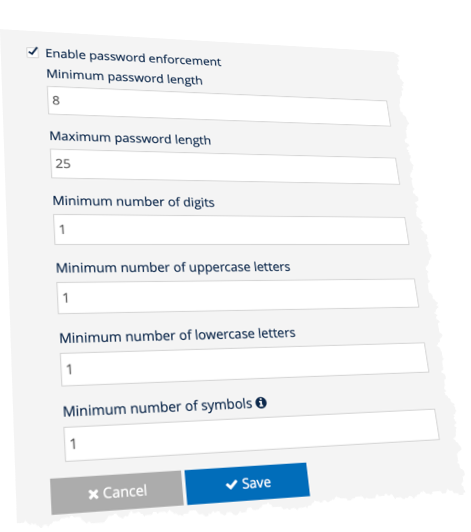

brainCloud 4.13 has just dropped. Here’s what it contains…

:::caution

Note - the implementation of `GlobalEntity.IncrementGlobalEntityData()` and `Entity.IncrementUserEntityData()` have changed - to properly enforce `acl.other` permissions. Be sure that your app isn’t improperly using those methods against entities with `acl.other` set to `0` or `1` - because those calls will now fail under 4.13!  
  
Also creating unowned Group Entities via `Group.CreateGroupEntity()` or `Group.SysCreateGroupEntity()` with `acl.member` of `0` or `1` will no longer be overridden to `2` permission.  
  
_Contact support if you would like our team to reset any previously created entities for you._
:::

### App Minimum Password Standards

This feature allows developers to set minimum password requirements for the users of their apps.

The following requirements can be set:

- minLength - <x\> chars. Default 8
- maxLength - <y\> chars. Default is 25 (max is 128).
- minDigits - <n\>. Default 1
- minUppercase - <n\>. Default 1
- minLowercase - <n\>. Default 1
- minSymbols - <n\>. Default 1

Feature notes:

- This feature affects users when setting _new_ passwords. _Existing_ passwords already associated with an account are _not_ affected by this feature.
- For symbol enforcement, the following characters are treated as symbols: ``~!@#$%^&*_-+=`|(){}[]:;'<>,.?/``

If enabled, these standards are automatically enforced by brainCloud when:

- **creating** new accounts
    - using Email or Universal authentication
    - using following User service APIs (if a password is provided – generated passwords will not be verified):
        - SysCreateUserEmailPassword
        - SysCreateUserUniversalId
- **attaching** new Email or Universal identities
- **updating** passwords (via **reset** password and other mechanisms)

Attempting to create an account (or attach an identity) whose password does not meet the requirements will return the new `INVALID_PASSWORD_CONTENT` ( `550022`) reason code.

```
{
  "status_message": "Processing exception (message): Password should have minimum 1 uppercase character/s",
  "reason_code": 550022
}
```

### **Temporary Leaderboards**

Apps can now more easily create temporary leaderboards using the `SysCreateLeaderboardConfig()` call. A new field, `expireInMins`, has been added to the configuration object to control the lifetime of the leaderboard. Leaderboards set to expire will show an epoch timestamp the expiry field returned from `SysGetLeaderboardConfig()` and other methods. The system will automatically remove the leaderboard after the specified time has expired.

_Technically the clean-up is done nightly, but those are just implementation details._

This provides a convenient method for creating temporary leaderboards, without having to implement a separate process to clean them up.

_Note that this functionality is limited to ADHOC and NEVER rotation leaderboards (i.e. leaderboards that don’t rotate)._

### Resend Verification Emails

For apps with **Reject Unverified Email Logins** enabled (via the **Design | Authentication | Email** screen) -- the system will now **automatically resend** the verification email to users when they re-attempt to login.

### GameLift-based Relay Servers

We have extended our AWS GameLift integration to include support for Relay Servers.

For instructions on how to configure them, see this [article](https://help.getbraincloud.com/en/articles/5606739-using-braincloud-lobbies-with-your-gamelift-servers).

### Non-consumable IAP Product History

Non-consumable In-App-Purchases can be processed multiple times (unless the “_Do not reprocess currencies for non-consumable IAP products in receipts_” compatibility flag is enabled).

This can be triggered when an iOS user clicks \[Restore Purchases\] on an app. Doing so may cause the transaction to be moved from one brainCloud account to another… (for example - if the iOS user is using a different brainCloud account than when they originally made the purchase).

_Note that this sort of activity could also theoretically happen if your app has been cracked and users are sending stolen (but valid) receipts into brainCloud._

We have enhanced the system to keep track of all users that have processed a non-consumable IAP item. The processing history can be viewed by clicking on the new **View History** menu option on the **Monitoring | User Monitoring | Transactions** screen.

### Library Improvements

All client libraries have been updated to include the 4.13 API additions.

_Note that some of the listed improvements were included in 4.12 patches previously._

- **C++**
    - Upgraded WebSockets for RTT with embedded SSL certification
    - Reconnect() method returns a failure if previous connection information is not available
    - Improved build time in Objective-C
    - Improvements for Android Studio builds
    - Added response codes and API calls
- **Java**
    - Added 502 & 504 response code conditions to retry requests.
    - `Reconnect()` method returns a failure if previous connection information is not available
- **Javascript**
    - `Reconnect()` method returns a failure if previous connection information is not available
- **Unity**
    - Compressed Responses and Requests are now turned on by default. This should be transparent to your app - but can be disabled by setting `EnabledCompressedRequests(false)` and `EnableCompressedResponses(false)`.
    - `Reconnect()` method returns a failure if previous connection information is not available
    - Adding Mac OS support for getting country code while initializing the client
    - Now supports Unity up to 2021.3 LTS
- **Unreal lib**
    - Plugin supports and ready to use in **Unreal Engine 5**
    - Fixes to engine heartbeat not working as intended (also in 4.12.2 patch)
    - Reconnect() method returns a failure if previous connection information is not available
    - Moved plugin to standalone release in GitHub for use as git submodule (Improved setup in GitHub?)
    - Fixed MacOS build error
    - Added check for failed connection callback

### Miscellaneous Improvements

- **ACL Permissions** **fixes**
    - Fixes have been applied to several methods in Global, User and Group Entities.
    - Be sure to double-check the ACL permissions of you entity objects if you see issues with your app(s)
- **Custom Entity** **improvements**
    - New `IncrementSingletonData()` API call
    - Improved locking for **Custom Entity Singletons**
- **Deployment** **improvements**
    - Improvements to the web and server components to prevent parallel deployment / import / restore processes
    - Optimizations to cache notifications to reduce the traffic across the api servers
    - Added a fail-safe refresh after deployment to ensure that all caches are updated properly
- **Dormant User** **processing**
    - Refactored dormant user deletion to add parallel processing (across datastream servers)
- **Global Files**
    - Fixes to file versioning during deploys and imports (was also patched late in 4.12)
    - New portal function to manually edit a File’s version on the **Design | Custom Config | Global Files** page
- **Groups**
    - The _custom data_ section of **Group** objects are now indexed on an `indexedId` field (if it exists). Feel free to set that field, and do searches using it for quick lookups of groups via an alternate id.
- **Legacy Flagged Users API**
    - We’ve added an API for controlling the users that that appear in the Portal’s flagged users list.
    - This is legacy system, and not super-scaleable - and thus we have named the methods as such.
    - Important: Apps are limited to 1000 flagged users max.
    - The API methods can be found in the **GlobalApp** service. ← due to the legacy of it’s implementation
    - _Do NOT use these APIs for anything other than tagging users to make them easier to look-up in the portal._
- **Push Notifications**
    - Improvements to performance of **Push Notifications** sent to **all** users of an app
- **S2S API**
    - Significant improvements to **S2S** locking - prevents lock timeouts in certain situations
- **Steam** **integration improvements**
    - Steam purchase transaction ids are now prefixed by the appId of the brainCloud app processing them. This reduces situations where the ids may clash if the same Steam information is being used across both dev and production apps in brainCloud.
    - System now returns more useful information for failed SteamClient validations

### Features for Private Licensees

- **Portal SSO**
    - Improvements to handling of mixed-case email addresses for SSO-connected private deployments
- **Azure**
    - Improvements to handling of long-lived Azure ServiceBus requests

* * *

## Portal Changes

We've made the following portal changes:

### Design Section

- **Authentication | Passwords**
    - New Passwords screen allows apps to enforce minimum password standards



- **Cloud Code | API Hooks**
    - Hooks are properly ordered by **Service**, then **Operation** in the main screen
    - Also, when selecting a script for a hook, the scrips are now sorted alphabetically by path
- **Cloud Code | Scripts**
    - Quick Authenticate now ensures it chooses a platform that is enabled
    - Optimizations to the script editor - no longer retrieves _all_ scripts when attempting to run the current script!
- **Custom Config | Global Files**
    - You can now manually adjust the “version” of a file using by choosing **Adjust Version** from the Action menu.
- I**ntegrations | Blockchain**
    - Added new Ultra App blockchain integration to be used by Ultra licensee apps to enable integration with Ultra’s blockchain services - including Uniqs.

### Monitoring

- **Global Monitoring | Custom Entities**
    - Custom Entity collections now displayed in alphabetical order
- **User Monitoring | Transactions**
    - The processing history of a non-consumable transaction can now be viewed by choosing the **View History** option from the action menu. Note that the **View History** menu option will only be available for transactions that have history to view.

* * *

## API Changes

The following changes/additions have affected the brainCloud API:

- **Blockchain**
    - New `GetUniqs()` call added for retrieving Uniqs from the **Ultra** blockchain
    - Also new `GetBlockchainItems()` for other blockchain flavors
- **Bridge**
    - New `VerifySignedJwt()` method added to the cloud code bridge to aid in implementing OpenId via External Authentication
    - Added `GetSessionForValidatedCredential()` method to the client bridge... (was only in the server bridge before)
- **Custom Entity Service**
    - New `IncrementSingletonData()` API call
- **GlobalApp**
    - New methods for controlling the users that appear in the Portal’s flagged users list. This is legacy system, and not super-scaleable - and thus we have named the methods as such. _Do NOT use these APIs for anything other than tagging users to make them easier to look-up in the portal._
    - Important: Apps are limited to 1000 flagged users max.
    - The new methods are: `SysAddLegacyFlaggedUser()`, `SysGetLegacyFlaggedUserData()`, `SysGetLegacyFlaggedUserDataList()`, `SysRemoveFromLegacyFlaggedUsers()`, `SysUpdateLegacyFlaggedUser()`
- **Group Service**
    - New cloud code only `SysAddGroupMember()` call adds the specified member to the group immediately (irregardless of the permissions of the current user)
- **Leaderboard Service**
    - `SysCreateLeaderboardConfig()` and `SysEditLeaderboardConfig()` methods updated to access the new `expireInMins` field. Select methods like `SysGetLeaderboardConfig()` now return an `expiry` field with the calculated epoch expiry.
- **RTT**
    - New `RegisterBlockchainCallback()` and `DeregisterBlockchainCallback()` methods enable registering for real-time blockchain changes
- **Script Service**
    - Added new cloud code only `SysCancelScheduledScriptIfExists()` call which as the name implies, cancels a script if it exists - but more importantly, does not return an error if it does not!
    - Added new cloud code only `SysCancelUserScriptBatchIfExists()` to do the same for batch script processing

* * *

## Miscellaneous Changes / Fixes

The following issues have been addressed in this release:

- BCLOUD-1257 - Getting NPE When Paginating in the Server logs Page
- BCLOUD-1728 - \[Internal\] The “Localize in” field stuck when user made a changes and click on Cancel button
- BCLOUD-2050 - \[Internal\] Cloud Code – Scripts page, when user “Export All Scripts” and single "Export Script" in the TEAM | Audit Log shows duplicate entries for the exported
- BCLOUD-2084 - JoinDivision and SysGetLeaderboardConfig responses to include timestamp division set instance leaderboard was created at
- BCLOUD-2113 - Missing translation "Details for" on Monitoring | Global Monitoring | Redemption Codes page
- BCLOUD-2114 - Missing translation "Error! Invalid search criteria. Please enter a minimum of 3 characters." on User Monitoring | User Summary - Select User
- BCLOUD-2115 - Missing translation "Code Info" on Monitoring | Global Monitoring | Redemption Codes page
- BCLOUD-2191 - Cache ItemDef collection in app cache
- BCLOUD-2260 - Support locking of singleton custom entities by ownerId
- BCLOUD-2336 - Avoid SendGrid enabled checking (and logging warnings) for User service "create" APIs when notificationTemplateId input is empty string
- BCLOUD-2347 - Issue handling Portal User Emails with mixed cases
- BCLOUD-2349 - Return a 503 response status in the event of Memcached timeouts
- BCLOUD-2351 - Reset password for email and universalId not trimming or lowercasing "externalId" input
- BCLOUD-2352 - Custom Entity SysIncrementData and IncrementData APIs require Sharded versions for sharded custom collections
- BCLOUD-2353 - \[Internal\] Nintendo is not in alphabetical order in Select User Identity list
- BCLOUD-2375 - \[Internal \] Unlock App dialog ignores changes to the application name
- BCLOUD-2376 - Errors in prod-baas for IdentityService ATTACH with Google OpenID
- BCLOUD-2396 - Super / Manage / Apps - Search filter is performing the query against the server on EVERY character that is typed.
- BCLOUD-2433 - Audit logs missing for a number of update and delete Push Notification settings requests from Portal
- BCLOUD-2488 - \[Internal\] Generate error/warning message when user saves a User Statistics Event without proper Actions
- BCLOUD-2499 - Modify Steam IAP order id generation to incorporate app id
- BCLOUD-2512 - We should have a way of re-sending end-user email verification emails?
- BCLOUD-2525 - PATCH! Need IdentityService.getIdentityData() to be accessible from cloud code scripts!
- BCLOUD-2526 - PATCH - missing CLIENT cloud code proxy for getSessionForValidatedCredential()
- BCLOUD-2528 - \[Internal\] Design | Cloud Data | Custom Entities, HTTP Status 500 error message pops up when user create “Migrate:true” entity type collection in portal
- BCLOUD-2550 - \[Internal \] While IOS platform disabled, the script Quick Authenticate throw exception error message "Processing exception (message): Platform IOS has not been enabled for this app"
- BCLOUD-2558 - Legacy Portal - Cloud Code Scripts (remove usage of the "scripts-read" call).
- BCLOUD-2601 - When Updating Existing Owned Entity(Custom Collection is Sharded) Incorrect Version is Getting Updated in API Response and Global Monitoring - Custom Entities Page
- BCLOUD-2647 - API counts posted for scripts using relative reference to other scripts are failing
- BCLOUD-2652 - Refactor purgeSoon User Purge processing to use Consumers
- BCLOUD-2771 - Email Auth - Resend Verification
- BCLOUD-2781 - Cloud code audit log improvements
- BCLOUD-2785 - Add support for CustomEntity IncrementSingletonData API and locking on all "increment" APIs
- BCLOUD-2786 - Change audit logs to differentiate "App user-enabled" activity for import/deploy versus "Updated app" (generic)
- BCLOUD-2788 - Add new Group service SysAddGroupMember API
- BCLOUD-2790 - Clicking a folder-based script execution entry from the API Usage page (under API Errors) is not redirecting to the correct location in the portal (API Errors).
- BCLOUD-2791 - After a deployment, the system should set a timer for X seconds, and when it expires, trigger a refresh of the app
- BCLOUD-2792 - \[Internal\] Not able to see newly created app in Admin Tools-Deployment drop-down menu of other app
- BCLOUD-2815 - Change Deploys, Import Configuration and Restore to Checkpoint processing to clear new appCache via prefix rather than looping
- BCLOUD-2821 - New special "indexedId" field in Group Data
- BCLOUD-2861 - Cloud Code - API Explorer - Service script list should be sorted by path+scriptname
- BCLOUD-2865 - \[Internal \] Super | Manage | Teams page, previous Team Name is saving in delete dialog text field while attempting to delete different team
- BCLOUD-2866 - \[Internal\] Design | Cloud Code | Scripts, when user export single script doesn’t logged in the Audit Log
- BCLOUD-2873 - \[Internal\] Monitoring | User Monitoring | Groups, the ID links don’t use a hand cursor when user hover over to click on the ID links
- BCLOUD-2877 - Legacy Portal: Item Management - Make select virtual currency mandatory before the user enters the $ amount
- BCLOUD-2880 - User batch script with passed in profileIds list to skip null profileId
- BCLOUD-2881 - Enable setting of expiry date to applicable Leaderboard APIs to create or edit leaderboard configs
- BCLOUD-2885 - Nightly purge of leaderboard scores for old versions is including gameId in query (slow)
- BCLOUD-2891 - Legacy Portal - Monitoring / Global Monitoring / Custom Entities - Apply alphabetical order to entity type list.
- BCLOUD-2901 - Total Users value displayed for Super | Manage | Apps isn't accurate
- BCLOUD-2902 - \[Internal\] When user entering iTunes IAP Product ID no limitation and after 53 characters cutting off
- BCLOUD-2904 - \[Internal\] When user entering Configure Platforms fields no limitation and after 56 characters cutting off
- BCLOUD-2908 - Deployment / Import Configuration / Restore to Checkpoint safety measures required to prevent overlap
- BCLOUD-2909 - Core App Info - Admin Tools - Deploy configuration button should be disabled when deployment is in progress
- BCLOUD-2918 - Legacy Portal - API Key Name is Restricted to Numbers, letters and underscore (\_) When Adding a New Key in Edit Profile | Permissions | API Keys Tab
- BCLOUD-2921 - Internal - Unlock dialog will display APP ID twice after user selects Cancel on the unlock dialog
- BCLOUD-2923 - \[Internal \] Deploying to an app with incorrect app name does not show error, instead upon hovering over Deploy button ( active) shows red icon
- BCLOUD-2948 - Unreal Engine Heartbeat Not Working As Intended
- BCLOUD-2956 - \[Internal\] French Version - Selecting Group id and Group Name from drop-down menu cut off
- BCLOUD-2958 - Modify Non-Consumable purchase behavior
- BCLOUD-2996 - Legacy Portal - Scripts - API Usage should use new fields returned from the server instead of calculating the values itself.
- BCLOUD-2998 - Legacy Portal - If passwords feature not enabled those password rules should not be displayed on the Reset Password page
- BCLOUD-3000 - Legacy Portal – User Monitoring | Transactions, adjust the View Transaction to show both dataJson and history
- BCLOUD-3002 - Set proper version on target files for deploy
- BCLOUD-3029 - JSON Error App not found error generates when deploying to the same app multiple times
- BCLOUD-3037 - New app-overridable brainCloud property to control audit logging of leaderboard configuration (create, edit) via Sys or post to dynamic APIs
- BCLOUD-3040 - \[Legacy\] Desing | Gamification - Statistics Event 'Add User Statistics Event' pops up dialog has 'Currencies', 'User Statistics' and 'Global Statistics' options are enabled compared to XP Levels page
- BCLOUD-3044 - Add some additional logging around 3rd party authentication
- BCLOUD-3045 - Legacy Portal - Player Selector - Applicable options in search drop-down not working correctly when language is French.
- BCLOUD-3051 - Do some pre-processing on Nintendo externalId
- BCLOUD-3054 - \[Legacy\] Icon of Platforms 'Oculus' and 'Apple watchOS' are not shown in User Monitoring >User Summary Logged In From section
- BCLOUD-3067 - GlobalEntity IncrementGlobalEntityData is not enforcing read-only for other users
- BCLOUD-3081 - Entity service Increment User Entity Data APIs are not enforcing read-only for other users
