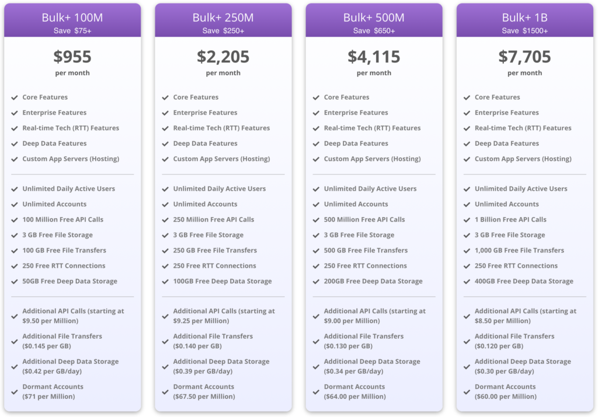

Hi folks,

The new Bulk+ Pre-paid plans are now live!

These plans offer additional discounts for high-volume (i.e. 100M+ API / month) brainCloud apps.

The savings come primarily from pre-paying for a bulk quantity of _API Counts_ - but there are also additional savings in the pricing for _File Transfers_, _Deep Data Storage_, and _Dormant Accounts_.

Note - you can see the fine details of these plans on our shiny new [getbraincloud.com](https://getbraincloud.com) site! Just go to the Pricing tab, then choose [\[Bulk+ Plans\]](https://getbraincloud.com/pricing).

:::tip

Note - if you aren't sure which plan to choose, feel free to reach out to our support team and we'll review your app usage and advise you!
:::
To switch your app(s) to one of the new plans:

- Go to **Teams | Manage | Apps**
- Find the app you want to change, and choose **Change Plan** from the action menu
- Switch to the **Bulk Plans** tab to view the new plans
- Select the plan that works for your app - and click **\[Choose Plan\]** to make the change!

:::caution

Important - These are **pre-paid** plans, the base cost of the plan will be charged to your credit card **immediately**. If you swap plans part-way through the month, the cost is pro-rated according to how many days are left in the current month.
:::
As always, if you have any further questions reach out to our support team and we will help you out!
