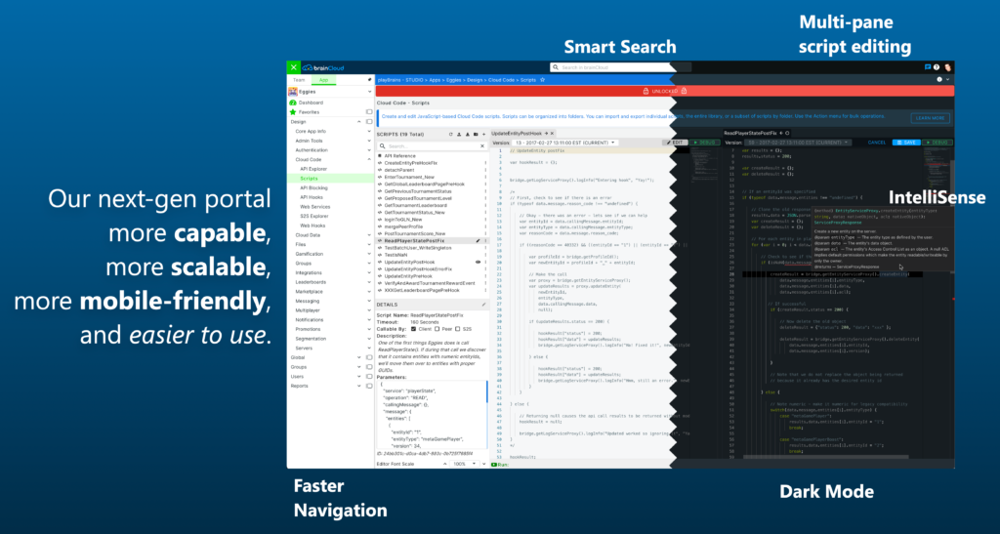

We know, we know - you really want brainCloud 5 -- not 4.14! It will be here soon -- we promise!

In the meantime, this is the last in our 4.X series of releases - and it features a bunch of important updates.

Plus, as a bonus, in a few weeks we will be granting preview access to the new brainCloud 5 Portal!

* * *

## Important Changes

Note: there are a few important (and potentially disruptive) changes in this release - specifically:

- For un-owned Group Entity Creates (i.e. `CreateGroupEntity()` (with `isOwnedByGroupMember == false`) and `SysCreateGroupEntity()` ) - the following two changes apply:
    - if `acl` is specified, it must include both the `other` and `member` fields… Also, `member` cannot be more restrictive than `other`
    - Also - if `acl` is _not_ specified, it now defaults to `{ "member": 2, "other": 0 }` . It did this before when acl was **empty** map, but when acl was null, it defaulted to `{ "member": null, "other": 1 }` - which was both less secure and problematic.
- Also regarding Group Entity creates - the entityType must no longer be null or empty string ← it was never supposed to be allowed in the first place!
- When using _Shared Accounts_ (i.e. apps with parent and child profiles) - the following change applies:
    - calling `Identity.GetChildProfiles()` will no longer return the child profiles for apps that have been soft-deleted
- Apps by default are now initially limited to max of 15 custom entity collections. See _Custom Entity Improvements_ section for more information.

* * *

## Release Highlights

### Portal-X! (available shortly after 4.14 release)

Our next-gen Design Portal (codenamed Portal-X), will be available as part of brainCloud 4.14.

The new Portal has been completely re-designed and re-written from the ground up to give us a strong foundation for new features moving forward.

Portal-X is more **capable**, more **scalable**, more **mobile-friendly**, and **easier to use**. It is also a work-in-progress - and will definitely improve over time as we polish it. We look forward to your feedback!



### Group Files API \[Beta\]

brainCloud 4.14 adds support for group-managed files.

Group Files are similar to Group Entities - in that they are associated with, and potentially private to, a specific group.

Group Files features include:

- folder structure within a group
- ACL permissions at folder and file levels
- operations for creating, moving and deleting folders
- operations for moving, copying and deleting files
- ability to copy/move user files to group files

Note that Portal support for Group Files will be added to our Next-gen Portal in coming releases. For now, support is API only.

Also note, that like user files, group files do not migrate to downstream apps during deployment.

### Relay Server Improvements

We have made several changes and improvements to our Relay Servers:

- Added a new “END\_MATCH” call to better support ending a game session while players remain attached to the lobby that spawned it.
- Fixes for websocket packet handling that span frames.
- Added missing passcode validation for match join-in-progress.
- Lots of logging cleanup.
- Updated documentation accordingly.

:::info

Relay Servers will be updated a few days after the initial 4.14 deployment.
:::

### Client Library Improvements

In addition to incorporating the 4.14 API changes, the following additional improvements have been made to the client libraries: 

- **Objective-C / Swift Library (C++)**
    - Fixed errors for Xcode 14 update (multiple definitions of http\_status\_codes)
    - Fixed Cocoapod compiler warnings
    - Builds for WatchOS
    - Improved compile time
- **Unity Library**
    - At long last, **Unity Package Manager** support!
    - Added support for new RelayServer EndMatch() call
    - Relay Communication: TCP and UDP bug fixes
- **Unreal Engine**
    - Code fix for UE 5.1 no longer accepts deprecated IOnlineStorePtr type
    - Facilitates proper/complete disconnect from relay server (send disconnect to server then handle cleanup in client closed callback)
    - More detailed connection status in RTT comms to include CONNECTING, more precise DISCONNECT
    - Improved compile time
    - IMPORTANT: IWYU paradigm is promoted for UE5 and has been implemented in our brainCloud plugin. Monolithic include **Engine.h** replaced with **CoreMinimal.h**. Client projects may incur build errors and if so will need to include required headers directly (Json reader, Platform file manager, etc).
    - There is a known Clang compiler issue when using Xcode 14 with UE 4. There will be errors of redefintions of HTTP\_STATUS codes in thirdparty libraries used by Unreal and brainCloud. This issue is resolved in UE 5. In order to continue development in previous versions of Unreal, the file Engine/Source/ThirdParty/libWebSockets/libwebsockets/include/Mac/libwebsockets.h can be overwritten by the updated one downloaded from [Epic Games' developer github](https://github.com/EpicGames/UnrealEngine/blob/2cd6352a6928d0ba38138a72d1aa8d1fdd882a68/Engine/Source/ThirdParty/libWebSockets/libwebsockets/include/Mac/libwebsockets.h). 
- **Java**
    - Updated documentation for client setup
- **Javascript**
    - Eliminated redundant callbacks in Relay service

### Custom Entity Changes and Improvements

- Portal now uses a paged API for retrieving Custom Entity types
- Max # of custom entities now enforced (see note below)
- New **Raw Lines** import / export format. This is a more efficient format for larger imports.
- API - Recount now skipped on subsequent page requests

:::info An Important note regarding Custom Entities…

Custom Entity collections were designed for high-capacity, high-usage data situations - and they are great for that. We are, however, seeing some apps use them for lists of reference data (like months of the year, active promotions, avatar types, etc.) - resulting in dozens of read-only collections with just dozens of records each.  
  
This is somewhat problematic because each custom entity collection consumes a MongoDB “namespace” - and there are performance implications to piling up tons of essentially empty namespaces.  
  
Remember - entity collections are very flexible. If you have a dozen collections that you are using for various types of reference data, you could probably create a single “reference” collection, and have each object have a “referenceType” field and it’s own custom JSON. Thus - the contents of the 12 collections could efficiently be stored within a single custom entity `reference` collection. ← and returned to the client in a single set of calls as well!  
  
To address the inefficiency, in the _future_ we plan to add a “minimum storage cost” for each Custom Entity collection. That would mean that even though your collection only has a dozen records and is consuming only 50Kb of space – our system would calculate its cost at the minimum size - which will likely be somewhere between 10MB - 1GB ← we have not decided (we don’t want to gouge, but it needs to large enough to dissuade wasteful use of the collections).  
  
In the meantime, brainCloud 4.14 will start to enforce a maximum # of custom entities collections per app. We’re setting the initial value at **15** - and if you already have more than that you are fine - brainCloud will just block your app from creating more. The limit is controllable on an app-by-app basis by us - so reach out to support if you validly need more. We aren’t going to be especially stingy with it - but we want to at least force the discussion.  
  
To help meet the design needs of our apps, we plan to add some key improvements to Global Entities - namely adding the ability to migrate specified _System Entity_ collections during deployment – so that Global Entities are maybe more appropriate for these sorts of small, read-only reference collections.  
  
Anyway - stay tuned - and please think twice before creating your next custom entity collection - when you could maybe use the `reference` pattern instead!
:::

### Deployment and Import/Export Changes

We have been working to improve the performance and scalability of our app deployment and import/export mechanism.

Some of these changes are effective right-away - and others will be enabled in the coming weeks after more production testing.

#### Import / Export

There is a new file format for App Configuration Data imports / exports, which separates each migrateable custom entity collection into its own file. \[feature is backwards-compatible and will be initially disabled\]

#### Deployments

- The target app’s game record is no longer temporarily deleted during the deployment process. The old record is updated directly instead.
- Migrateable Custom Entity collections are now copied directly **collection-to-collection** - instead of being exported to and imported from intermediate files. This lowers the memory footprint of deployments considerably. \[feature is backwards-compatible and initially disabled\]

### Example App Improvements

The following improvements have been made to the example apps:

- All Unity Examples will be updated to 4.14 shortly after release
- All Unreal Examples will be updated to UE 5 before next release
- **Authentication Demo** (Unity)
    - We have completely re-worked the Unity Authentication demo
    - Version 1.0 includes clear examples of how to handle user authentication and the various services within the brainCloud API when using Unity (including Entity, Custom Entity, Global Statistics, Identity, Player Statistics, Script, and Virtual Currency)
        - More methods of authentication and examples of other services to come
    - You can find the new release, alongside all other Unity examples, here: [GitHub - getbraincloud/examples-unity: Example projects using the Unity brainCloud client](https://github.com/getbraincloud/examples-unity)
- **brainCloud Clashers** (Unity)
    - a One-Way Multiplayer Example
    - We have a new Clash-style game implemented to demonstrate use of our one-way multiplayer APIs – complete with playback streams
- **Java Demo**
    - A new Android demo based on the Unity Authentication example that demonstrates how to use various services within the brainCloud API
    - You can find the new release here: [GitHub - getbraincloud/examples-java: Example projects using the Java brainCloud library](https://github.com/getbraincloud/examples-java)
- **Relay Test App** (Unity Version)
    - Takes advantage of new Relay Server “END\_MATCH” feature to properly support long-lived lobbies.
- **Unreal Functional Test Suite and Device Demo**
    - Added scripts to switch between UE 4.27 , 5.0 and 5.1 with documentation
    - Improved logging in editor
    - Include required headers for project in replacing Engine.h with CoreMinimal.h
    - Changes made to build in Xcode 14 (the new options added do not exist in previous versions so compiler errors will occur with UE 4/Xcode 13 setup - see project Readme regarding fix)
    - Added scripts to up-convert to UE 5 and to ensure asset compatibility for UE 4
- **Relay Test App** (Unreal Version)
    - Changes made to build in Xcode 14 (the new options added do not exist in previous versions so compiler errors will occur with UE 4/Xcode 13 setup - see project Readme regarding fix)
    - Added build scripts for continuous integration
- **Android C++ Demo App**
    - Improvements to Java layout and test output
- **Relay Test App** (C++ Version)
    - Added gradle project to existing source code for deployment to Android devices
- **Swift UI and Basic Example**
    - Updated for Xcode 14 and improved command-line builds

### Additional Features / Changes

- **Auto-Delete Users**
    - We have made a change so that Auto-Delete settings are **no longer propagated** during deploys. This allows developers to have separate settings for Development vs. Production app instances.
- **Group Entities**
    - Increased enforcement of parameters when creating new Group Entities. See API section for details.
- **External Web Services**
    - We have improved the caching of the external service endpoints - so calls to these services should be a bit faster… (especially at higher volumes)
- **Logging**
    - The system will no longer record “user session has expired” warnings. The system already provides an appropriate response to the client. There is no value to retaining them on the server (and they just waste log storage).
- **MongoDB 4.4**
    - This release has been fully tested on MongoDB 4.4. All brainCloud deployments will migrate to MongoDB 4.4 in the coming months.
- **Offline Matchmaking**
    - Database Index Optimizations for faster performance
- **Playstation**
    - Added new option to ensure that the user’s Profile Pic url is updated at each login
- **Portuguese (Brazilian)**
    - We have updated our global list of supported locales to include Portuguese (Brazillian)
- **Ultra Blockchain**
    - The Ultra Blockchain components have been updated to support NFT v1
- **WebPurify Integration**
    - Improvements to WebPurify error logging

### From Previous Patches

_Additional changes that were added in 4.13 patches:_

- Increased Max Leaderboard “Days” value from 7 → 28 days
- Added the ability to extend the Max Server Session time from 6 hours → 24 hours

* * *

### Features for **licensees**

_These features are of special interest for customers who have their own private instance of brainCloud:_

- **Auto Hard-Deletion**
    - New settings to automatically trigger hard-deletion of soft-deleted apps - after a period of days, and only if the app’s users are lower than a specified threshold
    - This helps to keep to keep the database slim and trim
- **Auto-Delete Users**
    - The deployment changes will allow private licensees to enable deletion of Dormant Accounts in development apps - without having those settings necessarily migrate to their production apps.
- **Portal Password Standards**
    - brainCloud can now enforce minimum password standards for portal users
    - The settings are controlled via the new `portalPasswordEnforcement` brainCloud property

```
{
  "isEnabled": true,
  "minLength": 8,
  "maxLength": 25,
  "minDigits": 1,
  "minUppercase": 1,
  "minLowercase": 1,
  "minSymbols": 1
}
```

* * *

## Portal Changes

:::tip Multi-factor Authentication Changes

The **Authy Service** that brainCloud's Portal uses for Multi-factor authentication is being terminated by Twilio as of **May 1, 2023**. (Note - the Authy App lives on. Twilio will continue to support it as a consumer application, and you can continue to use it for brainCloud MFA if you would like.)  
  
In it's place, the brainCloud Portal (both legacy and Portal-X) now integrates with the **Twilio Verify** service. Portal MFA users are encouraged to activate the new MFA implementation before May 1, 2023. There will be a blog post in the next couple of days with information on how to do so.
:::
We have also made the following changes to the legacy portal:

### Design

- **Core App info | Application IDs**
    - New **\[x\] Always update profile pic url** option added to the **Playstation** settings. Ensures that the PlayStation avatar picture will be refreshed each time a user logs in - even if the pic had been previously set before.
- **Cloud Code | My Servers**
    - Can now specify **Custom Environment** settings for GameLift servers
- **Cloud Data | Custom Entities**
    - Retrieving the list of custom entity types is now paged properly (under the hood) for better performance
- **Integrations | Blockchain**
    - Updated the Ultra System plugin to support optional CloudFlare service tokens

### Team

- **Manage | Team Info**
    - The Billing Information section will now display the team’s **Credit Balance** (if it has one).

* * *

## API Changes

The following changes/additions have affected the brainCloud API:

- **Event**
    - New `SysSendEventRTTOnly()` method can be used to send events to users via RTT-only -- i.e. without persisting them to disk. This eliminates the need to delete the event once received. RTT-only events have an `eventId` of `""` (i.e. _empty string_).
- **Group**
    - For un-owned Group Entity Creates (i.e. `CreateGroupEntity()` (with isOwnedByGroupMember == false) and `SysCreateGroupEntity()` ) - the following two changes apply:
        - if acl is specified, it must include both the other and member fields… Also, member cannot be more restrictive than other
        - Also - if acl is not specified, it now defaults to `{ "member": 2, "other": 0 }` . It did this before when acl was empty map, but when acl was null, it defaulted to `{ "member": null, "other": 1 }` - which was both less secure and problematic.
    - Group Entity creation calls now enforce that groupEntities must specify an entityType - can’t be null or empty string
- **GroupFile \[NEW!\]**
    - File Info - `CheckFilenameExists()`, `CheckFullpathFilenameExists()`, `GetFileInfo()`, `GetFileInfoSimple()`, `GetCDNUrl()`, `GetFileList()`, `UpdateFileInfo()`
    - File Operations - `CopyFile()`, `MoveFile()`, `DeleteFile()`, `MoveUserToGroupFile()`
    - Sys File Info Operations (Cloud Code Only; ignore permissions) - `SysCheckFilenameExists()`, `SysCheckFullpathFilenameExists()`, `SysGetFileInfo()`, `SysGetFileInfoSimple()`, `SysGetCDNUrl()`, `SysGetFileList()`, `SysUpdateFileInfo()`
    - Sys File Operations (Cloud Code only) - `SysCopyFile()`, `SysMoveFile()`, `SysDeleteFile()`, `SysMoveUserToGroupFile()`
    - Folder Operations (Cloud Code only) - `SysCreateFolder()`, `SysMoveFolder()`, `SysUpdateFolder()`, `SysLookupFolder()`, `SysDeleteFolder()`
- **Identity**
    - calling `Identity.GetChildProfiles()` will no longer return the child profiles for apps that have been soft-deleted 
- **Messaging**
    - New `SysDeleteMessages()` call allows multiple messages to be deleted in a single call.
- **RelayServer**
    - New `EndMatch()` call allows the owner of a game session to tell the RelayServer to shut down the match – without having each player disconnect from the client (which also causes them to leave the lobby). This is a better flow for long-lived lobbies.

* * *

## Miscellaneous Changes / Fixes

- Updated libraries
    - All libraries have been updated with the latest API enhancements. Go get 'em!
- Documentation updates
    - The latest APIs have been incorporated into the docs
- Important Fixes
    - TBC
- Fixes included from 3.14.1 patches
    - BCLOUD-1518 - Fix to lobby screen - disband on start no longer automatically selected
    - BCLOUD-3060 - Blockchain Integration - Enforce a minimum value of 1 for the "Timeout (minutes)" fields.
    - BCLOUD-3109 - Improvements to json response exception reporting from scripts
    - BCLOUD-3115 - Added header and bundle appId to s2s dispatcher
    - BCLOUD-3119 - Fixed issues with the reset password screen.
    - BCLOUD-3123 - Monitoring Group Entities - Fixed displayed member ACL in the table
    - BCLOUD-3179 - Support search on name of definition id for Item catalog
    - BCLOUD-3184 - Detach identity confirm anon fix
    - BCLOUD-3295 - Corrected permissions check on app passwords feature
    - BCLOUD-3362 – Fix to serialization issue for cloud code version of LobbyService.GetLobbyInstances()
    - BCLOUD-3371 - Made hosting cost billing adjustment values super properties
    - BCLOUD-3411 and 3412 - Extended max Room Server Session time past 6 hours (new property - roomServerMaxSessionTimeMins)
    - BCLOUD-3581 - Custom Entities skip recount on user page requests
    - BCLOUD-3555 - PS5 Profile and Friends Support
    - BCLOUD-3687 - Passing through custom fields in fusebill get plan details
    - BCLOUD-3652 - Fixed issue with monthly aggregates for ccx overages
    - BCLOUD-3805: Fixed encoding of URL parameters when a player confirms their email address ← important for email addresses with “+” in them
    - BCLOUD-3836 - Fix for collecting RTT cx usage stats
    - BCLOUD-3844 - Improvements to WebPurify error handling
- Plus miscellaneous fixes and performance enhancements...
