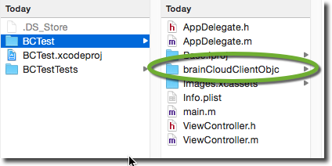
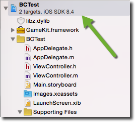
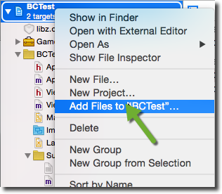
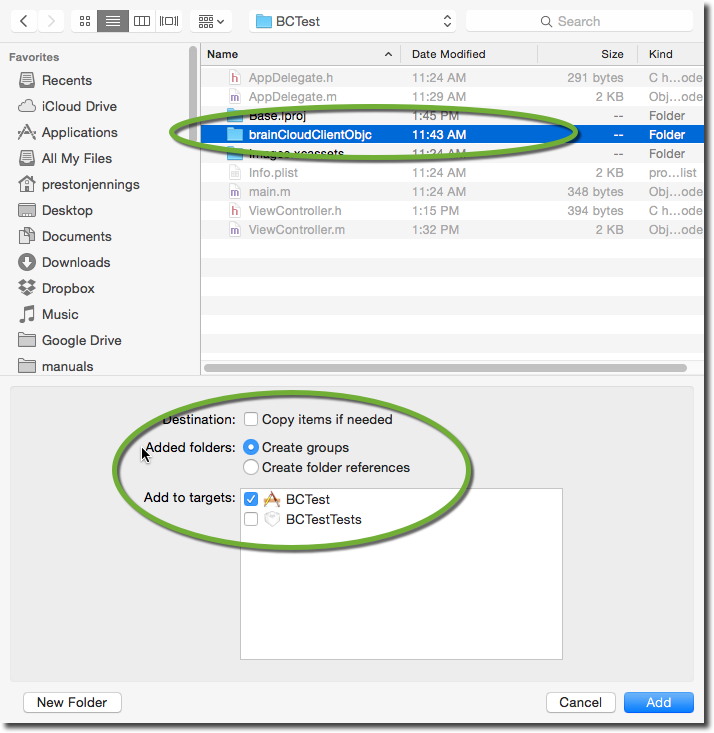
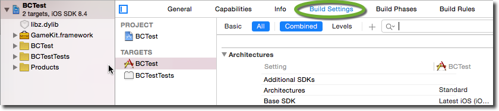
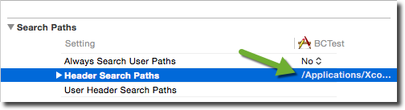
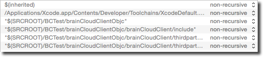
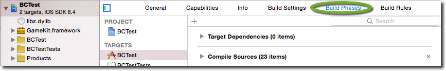
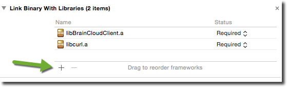

This tutorial will walk you through the basic steps of getting your Objective-C project running with brainCloud.

## Assumptions

- You've created a basic Objective-C project
- You've downloaded the brainCloud Objective-C library
- You have a brainCloud app created with OSX/iOS platforms enabled

## Setting Up Xcode

The first step to using the Objective-C brainCloud library is adding it to your Xcode project.

### Add brainCloud Library To Project

- Unzip the brainCloud library within your Xcode project. You should end up with a similar path  
    
    [](images/2015-08-10_13-52-38.png)
    
- Right click on your project in Xcode  
    
    [](images/2015-08-10_13-55-05.png)
    
- Select "Add Files To Project..."  
    
    [](images/2015-08-10_13-55-59.png)
    
- Select the unzipped brainCloudClientObjc folder
    
    [](images/2015-08-10_13-57-55.png)
    
- Ensure that CreateGroups is selected and your project in the "Add to targets" section is selected
- Click Add

### Add include paths to project

- Select your project in Xcode and select "Build Settings"  
    
    [](images/2015-08-10_14-03-22.png)
    
- Look for the "header search paths" parameter
- Double click on the value of the "header search paths" parameter  
    
    [](images/2015-08-10_14-14-17.png)
    
- Add the following lines being careful to replace "BCTest" with the folder name of your project.
    - "$(SRCROOT)/BCTest/brainCloudClientObjc"
    - "$(SRCROOT)/BCTest/brainCloudClientObjc/brainCloudClient/include"
    - "$(SRCROOT)/BCTest/brainCloudClientObjc/brainCloudClient/thirdparty/iOScURL-7.39.0"
    - "$(SRCROOT)/BCTest/brainCloudClientObjc/brainCloudClient/thirdparty/jsoncpp-1.0.0"
- You should now have Header Search Paths that look similar to this:  
    
    [](images/2015-08-10_14-15-29.png)
    

### Add link libraries to project

- Select your project in Xcode and select "Build Phases"  
    
    [](images/2015-08-10_14-21-471.png)
    
- Under "Link Binary With Libraries", click the + icon  
    
    [](images/2015-08-10_14-25-41.png)
    
- Add the following libraries:
    - GameKit.framework
    - libz.dylib

You should now be able to build your project.

## Integrating brainCloud

Now that you have the brainCloud client library setup, it's time to start integrating! The first step you need to do is initialize the library itself.

### Initializing brainCloud

Before you make any API calls to brainCloud you need to initialize the library. The best place to put this code is right before you go to Authenticate your user.
```js
BrainCloudClient * client = [BrainCloudClient defaultClient];

[client
	initialize:@"https://sharedprod.braincloudservers.com/dispatcherv2"
	secretKey:@"your_secret" // replace me!
	gameId:@"your_gameid" // replace me!
	gameVersion:@"1.0"
	appId:@""
	region:@""];
```
You will need to replace the secretKey and gameId with the information appropriate for your game. You can find this information in the brainCloud portal "Core App Info | Application IDs" section.

### Authentication

Here is an example of authenticating a user with brainCloud:
```js
BrainCloudAuthentication * auth = [client authenticationService];

[auth authenticateUniversal:user 
	password:pwd 
	forceCreate:true
	completionBlock:^(NSString *serviceName, NSString *serviceOperation, NSString *jsonData, BCCallbackObject cbObject)
	{
		// do something on success
	}
	errorCompletionBlock:^(NSString *serviceName, NSString *serviceOperation, NSInteger statusCode, NSInteger returnCode, NSString *statusMessage, BCCallbackObject cbObject)
	{
		// do something on failure
	}
	cbObject:nil]
```
Note that you will want to fill out the "completionBlock" and "errorCompletionBlock" blocks of code with something more appropriate.
