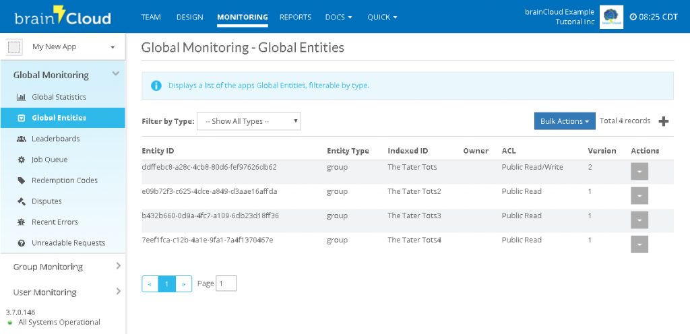

This tutorial uses brainCloud's **Global** and **User Entity** features.

_Global Entities_ are json objects that are available globally to _all users_ of a system (subject to the specified ACL of the object). _User Entities_ are local to a single user, and thus largely private (though there are mechanisms in place to share them). _For more information on brainCloud data features, see the [Cloud Data](/learn/key-concepts/data/) section of the brainCloud documentation._

The combination of Cloud Code working together with Global and User Entities is very powerful in brainCloud.

## Background

This example uses a combination of _Cloud Code_, _Global Entities_ and _User Entities_ to build a **Group (or Clan)** feature that represents a collection of end-users. The operations that we will support include:

- CreateGroup()
- DeleteGroup()
- ListGroups()
- JoinGroup()
- LeaveGroup()

## Step 1 - Create, Delete and List Groups

We'll start with the overall group management methods - Tut3_CreateGroup(), Tut3_DeleteGroup() and Tut3_ListGroups(). Create methods using the listings below.

### CreateGroup() Script

Parameters for Tut3_CreateGroup()
```js
{
     "groupName": "The Tater Tots"
}
```
Tut3_CreateGroup script
```js
// Tut3_CreateGroup() - creates a new group

// Retrieve the parameter
var groupName = data.groupName;
var results = {};
// Grab the Global Entity service proxy from the bridge
var globalEntityService = bridge.getGlobalEntityServiceProxy();
// First check to see if a group of this name already exists
var searchResults = globalEntityService.getListByIndexedId(groupName, 1);
// If we find one, abort, cause the name is already taken
if (searchResults.data.entityList.length > 0)
{
    results.message = "Failure - group already exists.";
    results.group = null;
}
else
{
// Create the groupData to store in the entities
    var groupData = {};
    groupData.groupName = groupName;
    groupData.members = {};
    var aclPermissions = {};
    aclPermissions.other = 2; // public read-write permission
    var createResults = globalEntityService.createEntityWithIndexedId("group", groupName, 0, aclPermissions, groupData);
    if (createResults.data.entityId !== null)
    {
      results.message = "Success - created new group.";
      results.group = createResults.data;
    }
    else
    {
      results.message = "Unknown error occurred creating group";
      results.group = createResults.data;
    }
}
results;
```
### DeleteGroup() Script

Parameters for Tut3_DeleteGroup()
```js
{
  "groupId": "aGroupGUID"
}
```
Tut3_DeleteGroup script
```js
// Tut3_DeleteGroup() - deletes the specified group
// Retrieve the parameter
var groupId = data.groupId;
var results = {};
// Grab the Global Entity service proxy from the bridge
var globalEntityService = bridge.getGlobalEntityServiceProxy();
// Find the specified group
var searchResults = globalEntityService.readEntity(groupId);
if (searchResults.status == "200") {
    // Did we find it?
    if (searchResults.data.entityType == "group") {
      // Grab the identifying info
      var version = searchResults.data.version;
      // Delete the group
      var deleteResults = globalEntityService.deleteEntity(groupId, version);
      if (deleteResults.status == "200") {
        results.message = "Successfully deleted group.";
        results.numDeleted = 1;
      } else {
        results.message = "unknown error";
      }
    } else {
      results.message = "Entity is not a group.";
    }
} else {
    results.message = "Entity does not exist.";
}
results;
```
### ListGroups() code

Tut3_ListGroups() script
```js
// Tut3_ListGroups() - lists all the groups
// No parameters to retrieve
var results = {};
// Grab the Global Entity service proxy from the bridge
var globalEntityService = bridge.getGlobalEntityServiceProxy();
// Get all groups of type group
var searchResults = globalEntityService.getList({entityType: "group"}, {"data.groupName": 1}, 100);
// Declare the groups array
results.groups = [];
// Did we find it?
if (searchResults.data.entityList.length > 0)
{
    results.message = "Listing all groups";
    for (var i = 0; i < searchResults.data.entityList.length; i++) {
      var groupData = {};
      groupData.name = searchResults.data.entityList[i].data.groupName;
      groupData.groupId = searchResults.data.entityList[i].entityId;
      results.groups.push(groupData);
    }
} else {
    results.message = "No groups found";
}
results;
```
## Step 2 - Test the Group Management scripts

Once you've got the routines written, test them using the API Explorer. Remember, if you don't see any of the scripts, you probably don't have _Client Callable_ set to **TRU**E.

Once you've created a few entities with the scripts, take a moment to check out the data via our _Global Entities Viewer_.

To use the viewer:

- Click on the **Monitoring** tab
- Choose **Global Monitoring | Global Entities**
- You can filter the list using the _Filter by Type_ drop-down box
- You can _View/Edit_ an entity by clicking on the "eyeball"

[](images/Tut3_GlobalEntities-1024x496.png)

## Step 3 - Manage Members

Now that we've got the groups being created, lets put the code in place to manage the members.

We'll start by adding a JoinGroup() method.

### JoinGroup()

Parameters for Tut3_JoinGroup()
```js
{
  "groupId": "aGlobalEntityId",
  "memberId": "aProfileId"
}
```
Tut3_JoinGroup() script"
```js
// Tut3_JoinGroup() - add myself to the specified group

// Retrieve the parameter
var groupId = data.groupId;
var memberId = data.memberId;

var results = {};

var apiStatus;

// Grab the Global Entity and User Entity service proxies
var globalEntityService = bridge.getGlobalEntityServiceProxy();
var userEntityService = bridge.getEntityServiceProxy();

// Retrieve the Group
var group = globalEntityService.readEntity(groupId).data;

// Confirm that we found it and that it's a group
if ( (group !== null) && (group.entityType == "group") ) {
    
    // Add a new member to the group
    var memberRecord = {};
    memberRecord["profileId"] = memberId;
    
    // Storing the members in a map is a bit more flexible than an array
    group.data.members[memberId] = memberRecord;
    
    // Write the updated group
    apiStatus = globalEntityService.updateEntity(groupId, group.version, group.data);
    if (apiStatus.status == 200) {
        
         // Store a reference from the user to the group in a user entity
        var userRefToGroup = {};
        userRefToGroup["groupId"] = groupId;
        
        // Update via the singleton API - the entity will be created if it 
        // doesn't already exist
        apiStatus = userEntityService.updateSingleton(
            "myGroup",          // Entity type name (all you need for singletons)
            userRefToGroup,     // Entity data to store
            { "other": 0 });    // Keep the object private
        if (apiStatus.status == 200) {
            results.success = true;
            results.message = "Group updated!";
            results.members = group.data.members;
        } else {
            results.success = false;
            results.message = 'Error writing User Entity!';
            results.apiStatus = apiStatus;
        }
    } else {
        results.success = false;
        results.message = 'Error writing Global Entity!';
        results.apiStatus = apiStatus;
    }
} else {
    results.success = false;
    results.message = "Group not found!";
    results.apiStatus = null;
}

results;
```
And we'll round things off with the ability to leave a group.

### LeaveGroup()

Parameters for Tut3_LeaveGroup()
```js
{
  "groupId": "aGlobalEntityId",
  "memberId": "aProfileId"
}
```
Tut3_LeaveGroup() code
```js
// Tut3_LeaveGroup() - remove myself to the specified group

// Retrieve the parameter
var groupId = data.groupId;
var memberId = data.memberId;

var results = {};

var apiStatus;

// Grab the Global Entity and User Entity service proxies
var globalEntityService = bridge.getGlobalEntityServiceProxy();
var userEntityService = bridge.getEntityServiceProxy();

// Retrieve the Group
var group = globalEntityService.readEntity(groupId).data;

// Confirm that we found it and that it's a group
if ( (group !== null) && (group.entityType == "group") ) {
    
    // Delete the entry from the members map
    delete group.data.members[memberId];
    
    // Write the updated group
    apiStatus = globalEntityService.updateEntity(groupId, group.version, group.data);
    if (apiStatus.status == 200) {
        
         // Remove the group reference from the user entity
        var userRefToGroup = {};
        userRefToGroup["groupId"] = null;
        
        // Update via the singleton API - the entity will be created if it 
        // doesn't already exist
        apiStatus = userEntityService.updateSingleton(
            "myGroup",          // Entity type name (all you need for singletons)
            userRefToGroup,     // Entity data to store
            { "other": 0 });    // Keep the object private
        if (apiStatus.status == 200) {
            results.success = true;
            results.message = "Group updated!";
            results.members = group.data.members;
        } else {
            results.success = false;
            results.message = 'Error writing User Entity!';
            results.apiStatus = apiStatus;
        }
    } else {
        results.success = false;
        results.message = 'Error writing Global Entity!';
        results.apiStatus = apiStatus;
    }
} else {
    results.success = false;
    results.message = "Group not found!";
    results.apiStatus = null;
}
```
results;

## Step 4 - Test some more

Once again, utilize the **API Explorer** to test out these new methods.

And confirm that the Global Entities are being written properly using the **Global Monitoring | Global Entities** viewer.

Finally, we're utilizing User Entities now too - so go to **User Monitoring** and go to the **User Entities** page to confirm the user's reference to the group that they belong to.

## Step 5 - Explore

There is a lot more functionality that can be built upon the base that we've provided here. Happy Coding!
