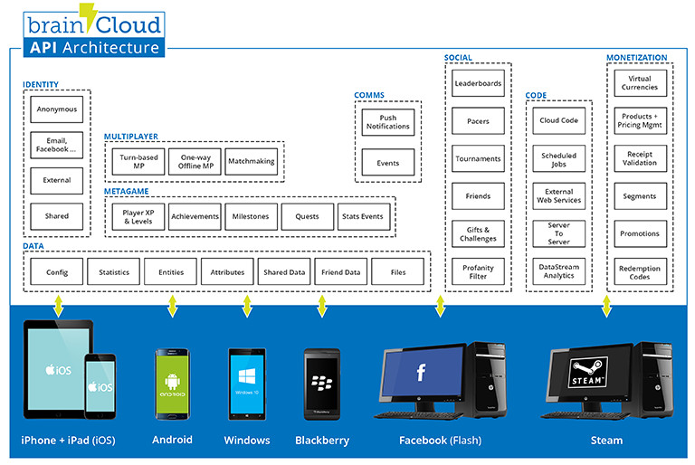

[](images/BrainCloud-architecture-boxes.jpg)

The brainCloud API is implemented as a REST-based protocol for communicating with the brainCloud servers.

brainCloud provides libraries, written in a number of languages, that hide the details of the REST mechanism as well as organize the API into separate functional modules. The libraries can be [downloaded](https://portal.braincloudservers.com/admin/dashboard#/support/libs) from the brainCloud Portal.

While the client libraries provide a standard API in the form of classes and methods to make the server requests, the server responses are served up to callback objects passed into the methods as JSON formatted strings. These strings must be parsed by the client application code.

Here is an example of a successful response:
```js
{
  "status": 200,
  "data": {
    "vcPurchased": 0,
    "playerSessionExpiry": 600,
    "sessionId": "vaa5qv2gt1tqvpp22av1dme5ni",
    "profileId": "8e8edaeb-08f5-4acc-834d-a815fcc58225",
    "rewards": {
      "rewardDetails": {},
      "rewards": {},
      "currency": {
        "coin": {
          "purchased": 0,
          "balance": 0,
          "consumed": 0,
          "awarded": 0
        },
        "coinMultiplier": {
          "purchased": 0,
          "balance": 0,
          "consumed": 0,
          "awarded": 0
        },
        "bar": {
          "purchased": 0,
          "balance": 0,
          "consumed": 0,
          "awarded": 0
        }
      }
    },
    "abTestingId": 58,
    "newUser": "false"

  }
}
```
Success and failures:

- The Status field indicates the overall success or failure of the operation - 200 is success
- Non-success (!= 200) return values will include a [reason code](/api/appendix/reasoncodes "Processing Exception Reason Codes") and message
