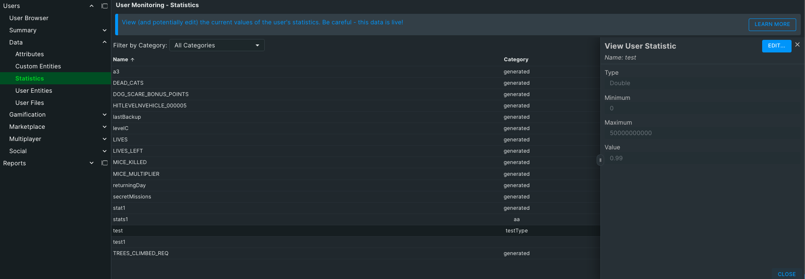
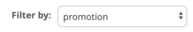

The statistics tab allows you to view the User's custom stat (created in Statistics Rules) values and edit them.

Stats can be sorted by Name, Category, and Value.  Each stat can be edited by clicking the pencil icon to the right of the stat.  To see the raw JSON for all the stats listed click the **{...}** icon beside the total record count at the top right of the Stats section.

Above the Stats section is the **Filter by Category** dropdown.  This allows you to filter the stats displayed in the list.
