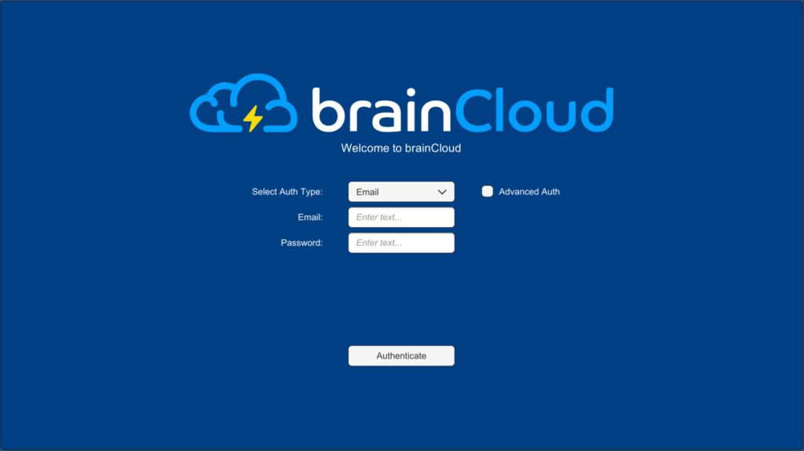
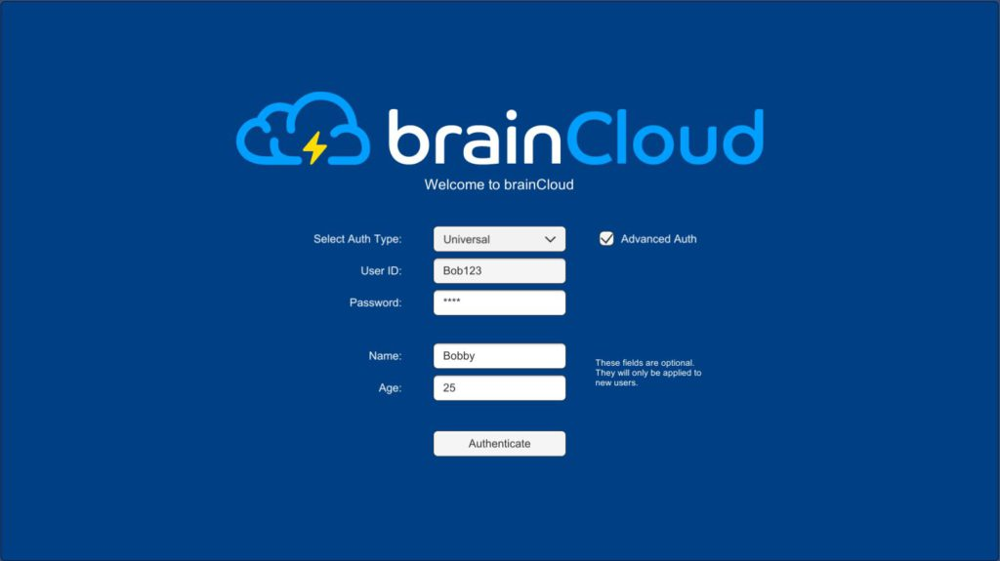
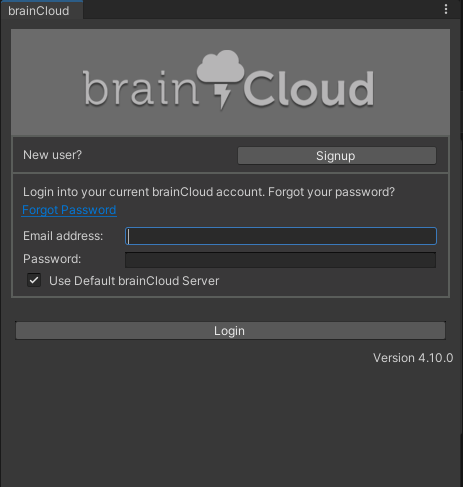
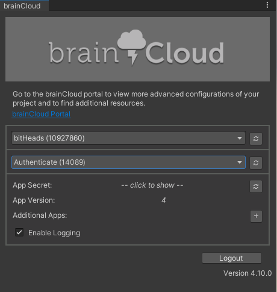
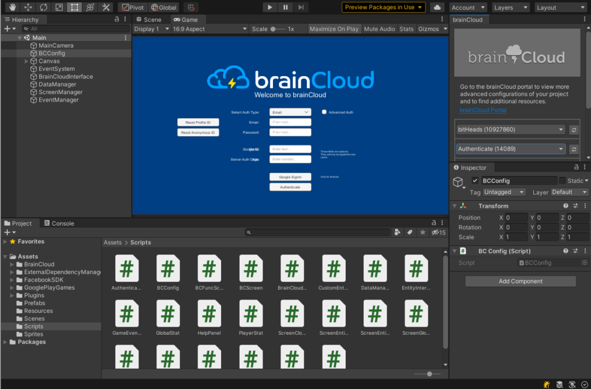

This example shows how to use several of the authentication types in brainCloud. Specifically, we illustrate how to authenticate using the following authentication types: 

- Email and Password
- Universal
- Anonymous
- Advanced 
- Google (Android Devices only)

## **Prerequisites**

In order to get started, you will need Unity installed. Please download the example project by following the link below: 

[Unity Authentication Example Download](https://github.com/getbraincloud/UnityExamples)

You can also download the stand-alone brainCloud Unity library here:

[brainCloud Unity Client](https://github.com/getbraincloud/Unity-Csharp)

## **Running the Project**

To try out the example project you must:

- Download the examples-unity repo. 
- Unzip the examples-unity folder.
- Open the “Authentication” project in unity.
- Open the “Main” scene in the “Scenes” folder.
- Follow the steps under “Pointing to your own game” to point to your brainCloud app.
- Click Unity’s play button.

You should see the following screen.



Feel free to test out the various authentication types. Authentication types can be changed by clicking the dropdown menu next to “Select Auth Type”. You can also toggle “Advanced Auth” which allows you to send extra JSON data along with your authentication. This extra JSON data can be used for things like account validation. In this example, we use the extra data to create a user entity of type “player” for new users. 



### **Pointing to your own game**

Follow these steps in order to test different authentication methods against your own brainCloud game:

1. Open the brainCloud settings menu option.


2. Login to brainCloud and select your game.

- 
    
- 
    

Ensure that the correct platforms have been enabled in the brainCloud Portal, under **Design | Core App Info | Platforms**

4. Import the app data from the “ImportData” folder. 

See [Import/Export Game Data](/learn/portal-tutorials/importexport-game-data/) in the portal tutorial section for more information. 

The Authentication app also features the following brainCloud functionality:

- [User Entities](/api/capi/entity)
- [Custom Entities](/api/capi/customentity)
- [Player XP and Player Leveling](/api/capi/playerstats)
- [Virtual Currencies](/api/capi/virtualcurrency)
- [Player Stats](/api/capi/playerstats)
- [Global Stats](/api/capi/globalstats)
- [Cloud Code scripting](/api/capi/script) 
- [Identity Attaching / Merging](/api/capi/identity)

Enjoy interacting with this example project and getting an idea for some of the features brainCloud has to offer. 

### **Code Overview**

First, we initialize the brainCloud Wrapper in a script called BCConfig.cs
```js
using System.Collections;
using System.Collections.Generic;
using UnityEngine;
 
public class BCConfig : MonoBehaviour {
 
    private BrainCloudWrapper _bc;
 
    public BrainCloudWrapper GetBrainCloud()
    {
        return _bc;
    }
    
    // Use this for initialization
    void Awake ()
    {
        DontDestroyOnLoad(gameObject);
        _bc = gameObject.AddComponent<BrainCloudWrapper>();
        
        _bc.WrapperName = gameObject.name;    // Optional: Set a wrapper name
        _bc.Init();      // Init data is taken from the brainCloud Unity Plugin
    }
}
```
Next, we create a BCConfig GameObject and attach the BCConfig script as a component.



We have a script called BrainCloudInterface.cs which is used to interface between the brainCloud Wrapper and our game-related classes. This script handles all of our brainCloud Authentication methods and all of our calls and callbacks from our brainCloud wrapper. 

Email Authentication:
```js
public void AuthenticateEmail()
{
    m_emailId = DataManager.instance.EmailID;
    m_emailPwd = DataManager.instance.EmailPass; 
 
    _bc.ResetStoredProfileId();
    _bc.ResetStoredAnonymousId();
    _bc.AuthenticateEmailPassword(m_emailId, m_emailPwd, true, OnSuccess_Authenticate, 
                                  OnError_Authenticate);
}
```
Universal Authentication:
```js
public void AuthenticateUniversal()
{
    m_universalUserId = DataManager.instance.UniversalUserID;
    m_universalPwd = DataManager.instance.UniversalPass;
 
    _bc.ResetStoredProfileId();
    _bc.ResetStoredAnonymousId();
    _bc.AuthenticateUniversal(m_universalUserId, m_universalPwd, true, OnSuccess_Authenticate, 
                              OnError_Authenticate);
}
```
Anonymous Authentication:
```js
public void AuthenticateAnonymous()
{
    _bc.AuthenticateAnonymous(OnSuccess_Authenticate, OnError_Authenticate);
}
```
Google Authentication
```js
public void AuthenticateGoogle()
{
    _bc.AuthenticateGoogle(m_googleId, m_serverAuthCode, true, OnSuccess_Authenticate, OnError_Authenticate);
}
```
Authentication Success and Failure Callbacks
```js
public void OnSuccess_Authenticate(string responseData, object cbObject)
{
    m_authStatus = "Authenticate successful!";
    Debug.Log(m_authStatus);
 
    ScreenManager.instance.ActivateMainScreen();
}
public void OnError_Authenticate(int statusCode, int reasonCode, string statusMessage, object cbObject)
{
    Debug.Log(string.Format("Failed | {0}  {1}  {2}", statusCode, reasonCode, statusMessage));
}
```
This example also features advanced authentication. We are able to send extra Json data in the form of a <string, object> dictionary. 
```js
public void AuthenticateAdvanced(AuthenticationType authType, BrainCloud.AuthenticationIds ids, Dictionary<string, object> extraJson)
{
    SuccessCallback successCallback = (response, cbObject) => 
    { ScreenManager.instance.ActivateMainScreen(); };
 
    FailureCallback failureCallback = (status, code, error, cbObject) => 
    { Debug.Log(string.Format("Failed | {0}  {1}  {2}", status, code, error)); };
 
    _bc.AuthenticateAdvanced(authType, ids, true, extraJson, successCallback, failureCallback);
}
```
## **Further Reading**

You can find more information on the Authentication methods by visiting this section of the API reference: 

[Authentication APIs](/api/capi/authentication)

The code in the example project that deals with authentication is located in “Scripts/BrainCloudInterface.cs”.
