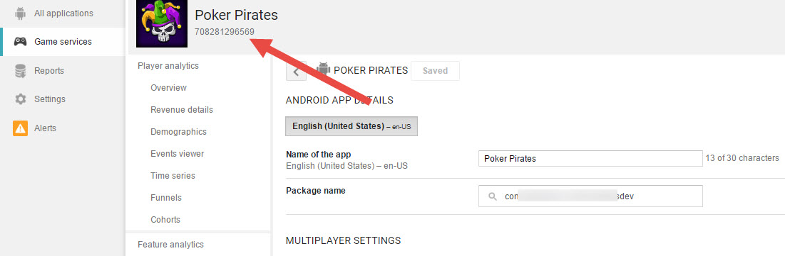
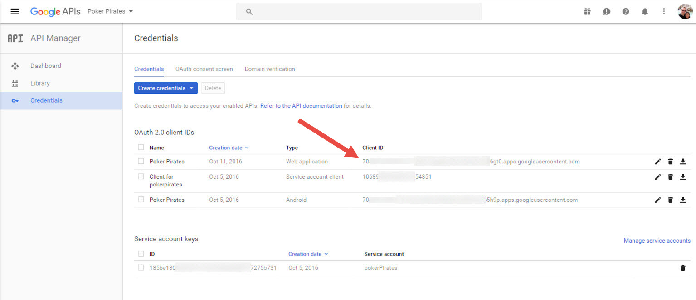
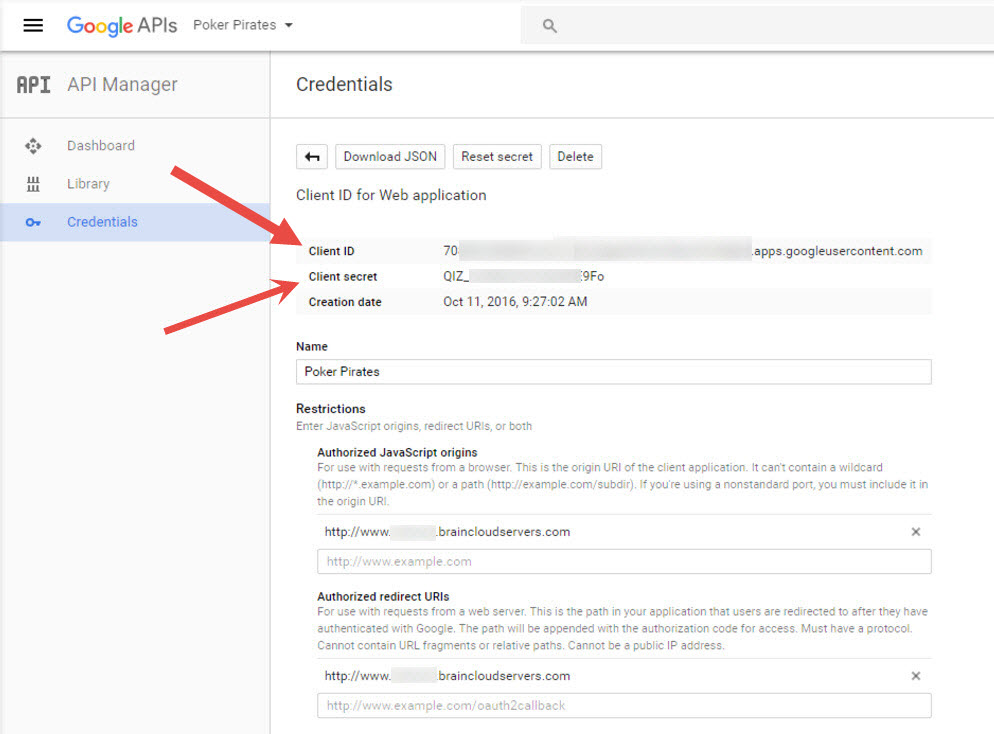

This tutorial outlines how to set up Google authentication with the new Google Play API (v4) using the new server auth token.

### Configure Google IDs

Navigate to the [Application IDs page](https://api.braincloudservers.com/admin/dashboard#/development/core-settings-information) for your app in the brainCloud portal. Under Configure Platforms select Google.  There are four new application IDs required to handle Google’s updated authentication paradigm.  

To retrieve them go to Google Play Developer Portal.  Navigate to Games Services.  Select Linked Apps.  At the bottom under Authorization are two values for the new application IDs.  

**Google App ID**  
Google Play Developer Portal -> “Application ID“

Next go to Google APIs portal, https://console.developers.google.com/apis/credentials?project=<your project\>.  Navigate to Credentials, **ENSURE A WEB APPLICATION** is setup for the project you wish to authenticate with brainCloud with. Select the Web Application under OAuth 2.0 client IDs.  The remaining information to fill this out is located on this screen.

**Google Client ID**  
Google API Portal| OAuth 2.0 Client IDs | Web Application | "Client ID"

**Google Client Secret**  
Google API Portal| OAuth 2.0 Client IDs | Web Application | "Client secret"

### Unity - Using GooglePlayServices

- A step by step tutorial on brainCloud with GooglePlayServices and Unity can be found [here](/learn/portal-tutorials/authentication-google-openid/).
