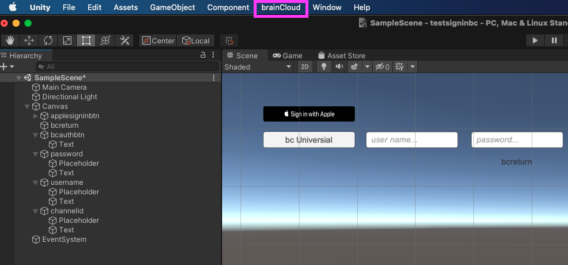
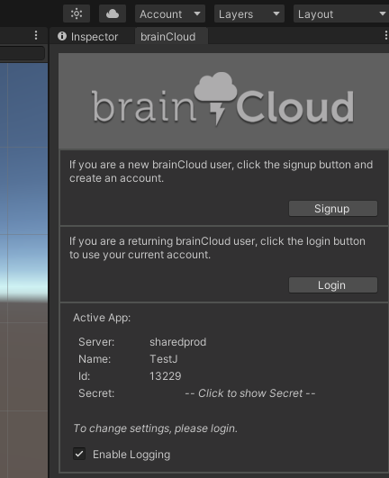
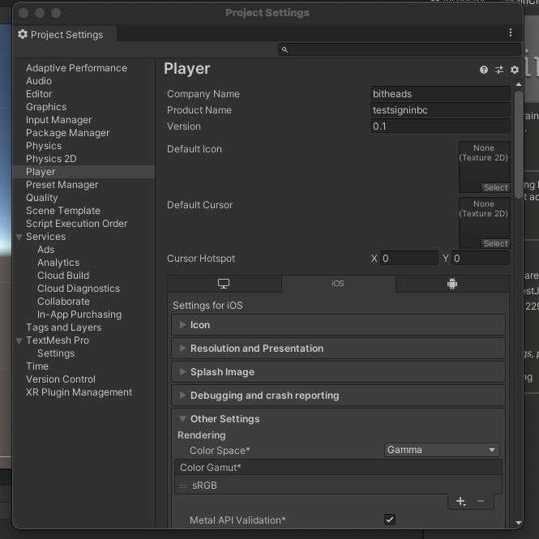
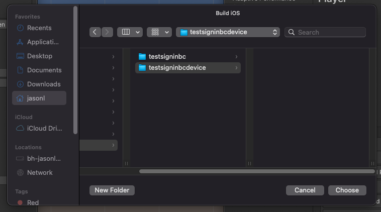
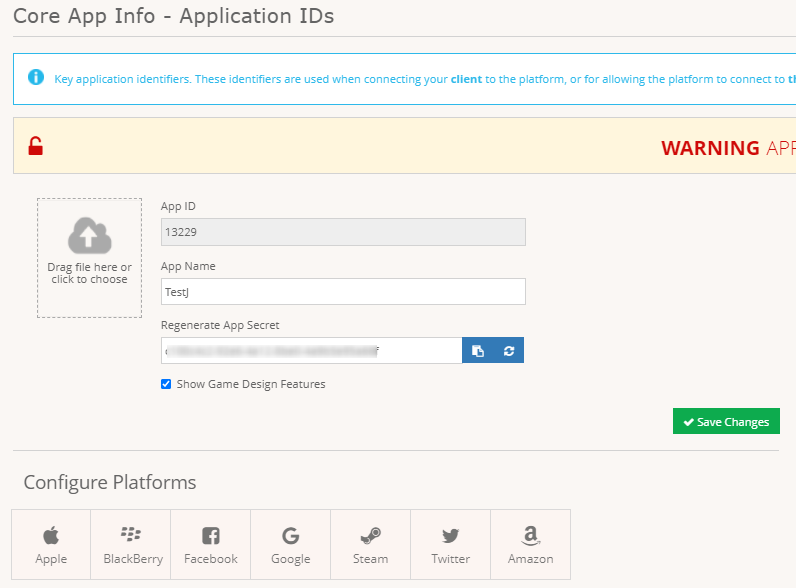
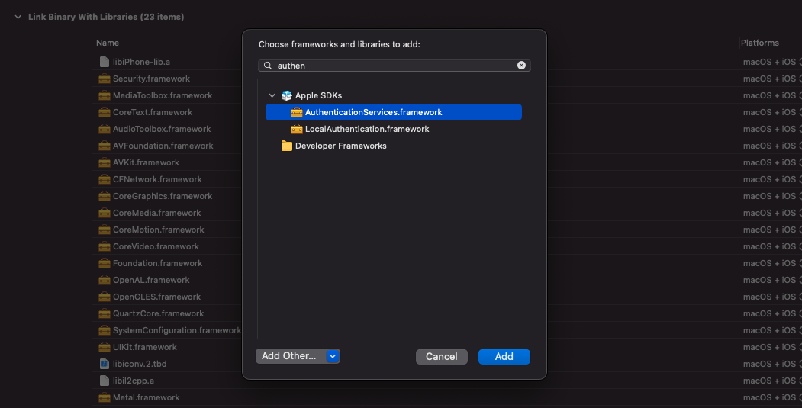
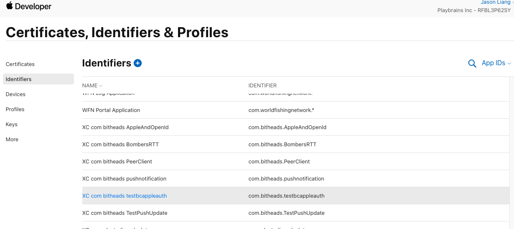
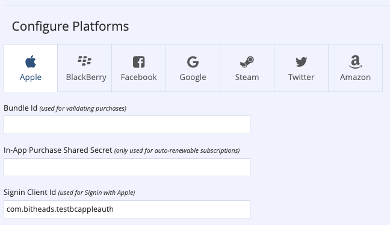
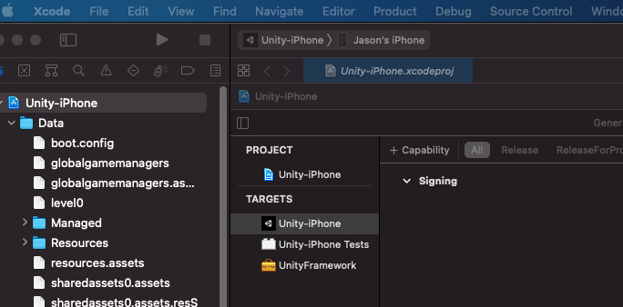

This article elaborates on the basic steps of how to authenticate end-users with their Apple credentials in a unity example.

**Prerequisites**

- You have an Apple developer account
- Your testing device with iOS 13 and above

**Step 1: Create an application on Unity editor**

- Open Unity hub and create a new project.
- Download and import the latest [brainCloud client Unity package](https://github.com/getbraincloud/braincloud-csharp/releases) to this project. Once imported the plugin correctly, you will find the brainCloud tab appears on the editor menu.



- Download and import the latest `Sign in with Apple` plugin (the left one on the picture below) to this project via the Asset store.


- You should find the Unity Technologies folder under the asset after `SignInWithApple` plugin imported.


- Open brainCloud setting from the tab, select or create a brainCloud back-end app linked to your project.



- Create some UI elements and initialize brainCloud and Apple SignIn from your script. You can compare the differences between brainCloud universal authentication and Apple authentication by setting both of them to UI.


- Functions and its code that linked behind the button [Sign in with Apple] are similar to below. Once end-user login into their Apple account, from the success callback, retrieve the userId and id token and pass them to brainCloud Apple authentication method -- `AuthenticateApple`
```js
    void Start()

    {

        bcreturn = GameObject.Find("bcreturn").GetComponent<Text>();

        username = GameObject.Find("username").GetComponent<InputField>();

        password = GameObject.Find("password").GetComponent<InputField>();

        _bc.SetAlwaysAllowProfileSwitch(true);

        gameObject.AddComponent<SignInWithApple>();

    }
    //click authentication apple button

    public void AuthenticateApple()

    {
        var siwa = gameObject.GetComponent<SignInWithApple>();

        siwa.Login(OnLogin);

    }
    private void OnLogin(SignInWithApple.CallbackArgs args)
    {
        if (args.error != null)
        {
            Debug.Log("Errors occurred: " + args.error);
            return;
        }
        UserInfo userInfo = args.userInfo;
        // Save the userId so we can use it later for other operations.
        userId = userInfo.userId;
        idToken = userInfo.idToken;
        // Print out information about the user who logged in.
        Debug.Log(
            string.Format("Display Name: {0}\nEmail: {1}\nUser ID: {2}\nID Token: {3}", userInfo.displayName ?? "",
                userInfo.email ?? "", userInfo.userId ?? "", userInfo.idToken ?? ""));
        //authenticate user to bc
        _bc.AuthenticateApple(userId, idToken, true, authSuccess_BCcall, authError_BCcall);
    }
```
- Finish the rest callbacks code in your script.
- Click `Build Settings` from Unity `File` tab, switch platform to iOS.


- Set up project `Bundle Identifier` via `Player Settings` .



- Click `Build and Run`, then create a folder to save this Xcode project on your local storage.



**Step 2: Configure bundle identifier on brainCloud**

- Open your app from brainCloud development portal, navigate to **Design | Core App Info** page.



- Click **Apple** under Configure Platforms and paste your `Bundle Identifier` to `Signin Client Id` field.



- Make sure the `Apple iOS` platform is selected from the **Design | Core App Info | Platforms** page.

**Step 3: Configure authentication service on Xcode**

- Open the build Xcode project via Xcode editor, make sure `AuthenticationServices.framework` is added to `UnityFramework`


- Add `Sign in with Apple` capability to Unity-iPhone from `Signing & Capabilities` tab.
- Select `Automatically manage signing` checkbox, then login to your Apple developer team.



- Once the above step is done, check the `Identifiers` is added to your Apple developer account under `Certificates, Identifiers & Profiles` section.



- Connect your testing device to Xcode, then run this project on your testing device.



:::info
For the example of using **AuthenticateApple** with Swift, refer to our Swift example repository [here](https://github.com/getbraincloud/examples-swift#bcchat-example)
:::
