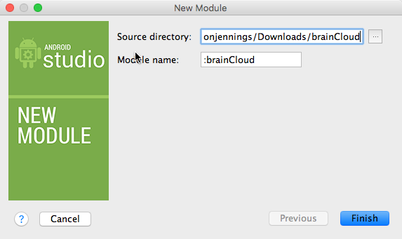
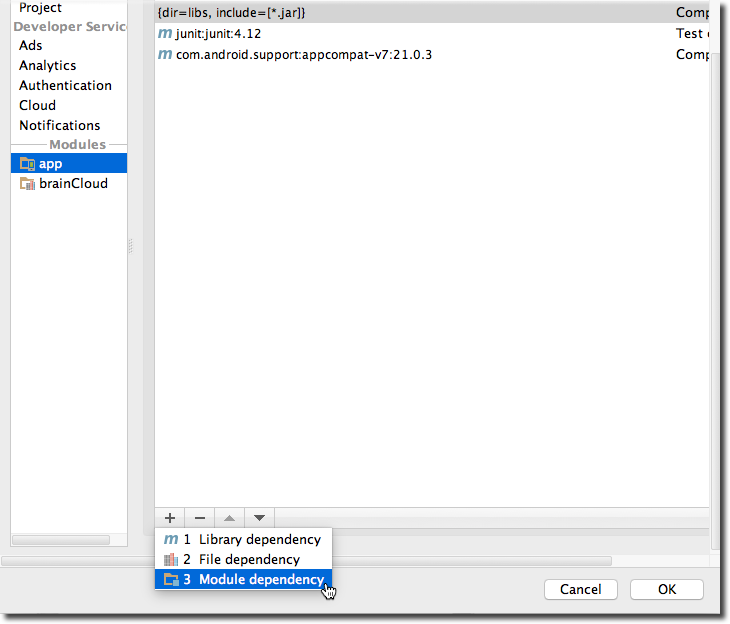
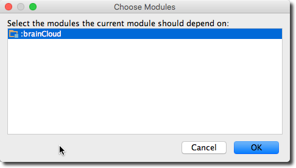

For this tutorial, we will assume that you are using Android Studio to develop a Java application for the Android platform. You should have a project created that can run on the device or emulator before proceeding.

## Integrate brainCloud module

- Download the brainCloud Android Java client library from the [brainCloud portal](https://portal.braincloudservers.com/) client libs section
- Unzip the client library somewhere on your computer but *not* in your project folder
- Open Android Studio if not open already
- Select File | New... | Import Module...
- Choose the unzipped "brainCloud" folder
- You should see this dialog pop up. Hit Finish  
    
- You should now see a "brainCloud" module in your project
- Right-click your "app" module and select "Open Module Settings"
- Navigate to the Dependencies tab and click the + icon at the bottom to add a "Module dependency"  
    
    [](images/2016-01-27_15-23-23.png)
    
- Select the "brainCloud" module and hit OK  
    
    [](images/2016-01-27_15-23-35.png)
    

## Initializing brainCloud and callbacks

In order to use brainCloud you will need to initialize the client with your game id and secret (both found on the [brainCloud portal](https://portal.braincloudservers.com/) on the Core App Info | Application Ids page). In this example, we will add all of our code to the MainActivity.java file in our app module.

### First set up the imports
```java
import com.bitheads.braincloud.client.*;  
import com.bitheads.braincloud.services.*;
```
### Initialize the BrainCloudClient

In the onCreate method of our MainActivity java file, we initialize the client. We also enable logging so we can see the JSON going to/from the server. The logs will show up in Android Studio under "logcat".
```java
protected void onCreate(Bundle savedInstanceState)
{
    super.onCreate(savedInstanceState);
    setContentView(R.layout.activity_main);

    // initialize brainCloud with your gameId, secret, and game version
    BrainCloudClient.getInstance().initialize("your-game-id", "your-secret", "1.0.0");
// also enable logging
BrainCloudClient.getInstance().enableLogging(true);
```
### Run the callback update regularly

The next step is to ensure we run the BrainCloudClient's update() method regularly. The brainCloud update method will check for any received messages from brainCloud, and fire user-defined callbacks in response to those messages. Every API call takes in an "IServerCallback" parameter which allows you to define a callback handler.

There are two ways to call the BrainCloudClient update method regularly: either by running the callbacks on the main UI thread or by running them on a separate thread.

#### Running update on the main thread

In our method below, a timer is created to tick regularly from the main thread of the application. This means that the UI can directly be manipulated within the user callback. Care must be taken not to block the callback however as the UI will lock up.
```java
// update brainCloud every second after initialize
new CountDownTimer(10000, 1000) {
    public void onTick(long millisUntilFinished) {
        BrainCloudClient.getInstance().update();
    }

    public void onFinish() {
        start(); // just restart the timer
    }
}.start();
```
#### Running update on a separate thread

An alternative method is to call the update method on a separate thread. This has the advantage that the  UI will never hang if a callback takes a long time. The downside is that interactions with the UI of your app will need to be marshaled to the main application thread.
```java
// Set up the brainCloud callback handler.
// Callbacks will execute on this thread.
Thread t = new Thread(new Runnable () {
    public void run()
    {
        while (true)
        {
            BrainCloudClient.getInstance().update();
            try
            {
                Thread.sleep(300);
            } catch (InterruptedException ie)
            {
                ie.printStackTrace();
            }
        }
    }
});
```

Whichever method suits your application best is up to you. For simplicity, running the update on the main thread is the quickest way to get started. Also important to note is that the BrainCloud update method is very lightweight and should not cause any issues with blocking the UI.

## Authenticating

To get started, you will need to authenticate with brainCloud. In our example, we will run an email authentication with hardcoded data from an onClick of a button in the app.

### Set up server callback

First, you'll need to implement the callback handler. In our case, we implement the IServerCallback interface in our MainActivity java file.

Add the "implements IServerCallback" to the MainActivity class

Then add the two callback functions to the class:
```java
public void serverCallback(ServiceName serviceName, ServiceOperation serviceOperation, JSONObject jsonData)
{
    if (serviceName.equals(ServiceName.authenticationV2)
        && serviceOperation.equals(ServiceOperation.AUTHENTICATE))
    {
        // success callback from authenticate - we're now authenticated!
    }
}
    
public void serverError(ServiceName serviceName, ServiceOperation serviceOperation, int statusCode, int reasonCode, String jsonError)
{
    if (serviceName.equals(ServiceName.authenticationV2)
        && serviceOperation.equals(ServiceOperation.AUTHENTICATE))
    {
        // error callback from authenticate
    }
}
```
### Email authentication

Lastly, we'll set up a function which will get called on a login button click (you'll have to set this up in your Android project accordingly). This function will authenticate with brainCloud passing in the user's email and password. In the example below, we hardcode these values.
```java
public void onLoginClick(View v)
{
    BrainCloudClient.getInstance().getAuthenticationService()
            .authenticateEmailPassword("me@somewhere.com", "pwd", true, this);
}
```
See the [BrainCloudAuthentication.AuthenticateEmailPassword](/api/capi/authentication/authenticateemailpassword) API docs for more info.

If you enabled logging (see initialize brainCloud step above) you should be able to see JSON being sent to the server, and JSON being returned from the server as follows:
```java
#BCC OUTGOING: {
  "messages": [
    {
      "service": "authenticationV2",
      "operation": "AUTHENTICATE",
      "data": {
        "externalId": "me@somewhere.com",
        "authenticationToken": "pwd",
        "authenticationType": "Email",
        "forceCreate": true,
        "profileId": "",
        "gameId": "9999",
        "releasePlatform": "ANG",
        "upgradeAppId": "1.0.0",
        "version": "2.20.0",
        "countryCode": "US",
        "languageCode": "en",
        "timeZoneOffset": -5
      }
    }
  ],
  "gameId": "9999",
  "sessionId": "q3ddmrers7504rhrv4t4d9bt6g",
  "packetId": 1
}
#BCC INCOMING (200): {
  "packetId": 1,
  "responses": [
    {
      "status": 200,
      "data": {
        "vcPurchased": 0,
        "experiencePoints": 0,
        "refundCount": 0,
        "playerSessionExpiry": 1200,
        "server_time": 1453990136292,
        "experienceLevel": 0,
        "abTestingId": 19,
        "statistics": {},
        "currency": {},
        "id": "579c983f-e97b-4474-9cf4-441ec557db1e",
        "createdAt": 1453990116153,
        "profileId": "579c983f-e355-4474-9cf4-4926c557db1e",
        "newUser": "false",
        "xpCapped": false,
        "sent_events": [],
        "timeZoneOffset": -5,
        "playerName": "",
        "vcClaimed": 0,
        "parentProfileId": null,
        "rewards": {
          "rewardDetails": {},
          "rewards": {},
          "currency": {}
        },
        "countryCode": "US",
        "loginCount": 2,
        "emailAddress": "email",
        "previousLogin": 1453990116294,
        "incoming_events": [],
        "lastLogin": 1453990136277,
        "languageCode": "en",
        "sessionId": "f828opj5p7huqe482e28ec75i7",
        "amountSpent": 0
      }
    }
  ]
}
```