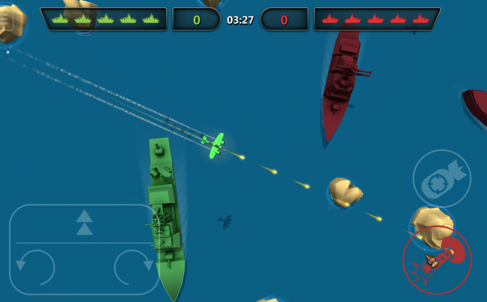

_Trying to use UNET or Photon? Find our legacy Bombers Tutorial [here](/learn/sdk-tutorials/unity-tutorials/braincloud-bombers-example-game/)._

* * *

The latest version of the Bombers project can always be found [here](https://github.com/getbraincloud/examples-unity/tree/master/BombersRTT) on GitHub

brainCloud Bombers RTT is a fun little game, written in **Unity**, that demonstrates how brainCloud can work with our RTT technology for real-time multiplayer.  

Bombers is a fun multiplayer game with the following features:

- Game objective: Destroy the other team's fleet to win
- Two-stage gameplay: Dogfight to collect bombs, then drop the bombs to destroy enemy ships
- Controls: Touch controls
- Players: Max 8 players per match
- Leaderboards: Global leaderboards
- Achievements: 3 achievements to earn
- Cloud saves: Player progression is saved as they level up

## **Play Now!**

- [Web Demo](http://apps.braincloudservers.com/bombersrtt-live/index.html) - bombers Unity/WebGL example
- **[MacOS Demo](https://sharedprod.braincloudservers.com/s3/brainCloudExamples/unity/bombersUnet/brainCloudBombersUNET_OSX_1.0.0.zip)** - bombers MacOS example (not yet Catalina-ready).

## Full Source Available

The full source of brainCloud bombers has been made available for our developers. Feel free to use and extend it - but please replace all art for commercial efforts and be sure to use brainCloud! Good luck!

- [Read](/learn/sdk-tutorials/unity-tutorials/about-bombers-rtt/) about how brainCloud Bombers RTT was written
- [View](https://github.com/getbraincloud/UnityExamples) the source (Github)
