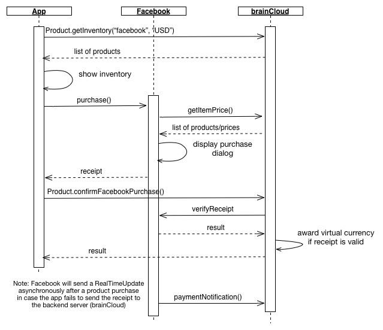

In this tutorial, we will look at setting up store integration between Facebook and your brainCloud app.

## Purchase Flow

-   The App requests the “facebook” product inventory from brainCloud, optionally passing in the user's currency. This returns a list of products, their reference prices (as configured in the brainCloud portal) and their configured Facebook currency/price pairs.
-   The App presents a list of products with the most appropriate price/currency.
-   The user selects an item to purchase
-   The App sends a request to Facebook to purchase an item.
-   Facebook communicates with brainCloud to determine the catalog of products and their prices.
-   Facebook presents a purchase confirmation dialog to the user.
-   A receipt is returned from Facebook assuming the user goes through with the purchase.
-   The App asks brainCloud to verify the Facebook receipt. Assuming this is a valid receipt, brainCloud will award any virtual currencies attached to this product.
-   Note that Facebook will send an asynchronous real-time update event to brainCloud when a product is purchased. This is a failsafe mechanism to ensure that the appropriate item is awarded to the user (regardless of whether the app sent the receipt to the server). BrainCloud will only award currency once regardless of which notification is received first (the receipt from the app or the real-time update payment notification from Facebook). The behavior and return JSON of the API call to confirm a receipt is identical regardless of the order in which these two events occur.

## Portal Setup

### Prerequisites

-   You have a Facebook game created in the [Facebook developer portal](https://developers.facebook.com)
-   You have configured brainCloud with the Facebook app id and secret
-   You have configured a [Marketplace in brainCloud](/learn/portal-tutorials/marketplace-configuration/)

### Configure Facebook Price Data

Once your products have been configured in the brainCloud marketplace, you will need to populate a list of currencies and prices for each product.

-   Log into the [brainCloud Portal](https://portal.braincloudservers.com/)
-   Go to the “Marketplace | Products” page in the Design tab
-   Select the product you would like to configure
-   Click the “+ Edit Product” button
-   Find your Price (or create one) and click the edit icon
-   In the Edit Price dialog, click the + icon to add an entry for Facebook
-   Click the "+ Add" button and configure the price/currency information. You can enter separate prices for multiple currencies if you'd like to maintain the price of the product for that currency. Note that Facebook will automatically convert prices to the user's currency if necessary.
-   At this point, you may want to select your price to be the default if it isn’t already selected. You can do this back in the Edit Product page.
-   You can now verify that your Product is coming back with the correct Facebook price information. Here is the output from the API Explorer “Product.GetInventory” call for "Facebook"

## Facebook Developer Portal

In order to process real-time payment updates, you will need to do the following configuration steps in the Facebook Developer portal.

-   Log into the [Facebook developer portal](https://developers.facebook.com/apps)
-   Select your app and go to the "Canvas Payments" section
-   Enter your dynamic URL (and any Facebook testers you'd like to test purchases with). Note the format of the Dynamic Pricing Callback URL must be: "https://api.braincloudservers.com/fbcreditservice?app_id=YOUR_FB_APP_ID" where "YOUR_FB_APP_ID" should be replaced with a number such as 1234567890.
-   Enter the callback URLs for Realtime subscriptions. Note both URLs should have this format: "https://api.braincloudservers.com/fbupdateservice?gameId=YOUR_BRAINCLOUD_GAME_ID" where "YOUR_BRAINCLOUD_GAME_ID" should be replaced with the brainCloud game/app id found in the "Core App Info | Application IDs" section of the brainCloud portal.
-   If you'd like to test the callback URL, configure a verification token on both the Facebook developer portal as well as the brainCloud "Core App Info | Application IDs" Facebook section. You can use any string you'd like as long as they're the same. Once configured, the "Test Callback URL" button should show a success dialog similar to this one

You should now be configured to make Facebook purchases. Next steps that you will need to complete are to implement the API calls to Facebook + brainCloud. For further information in regard to implementing Facebook IAP integration, refer to [this linked article](http://help.getbraincloud.com/en/articles/4676736-facebook-iap-integration) in our knowledge base help center.
