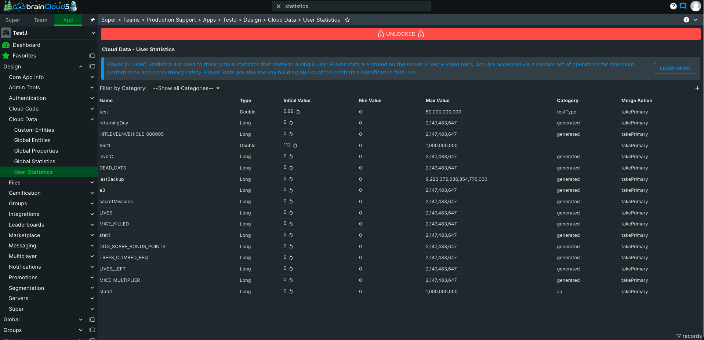

brainCloud provides very robust and specialized APIs for dealing with cloud data.

In regard to User (Player) data, brainCloud provides the following mechanisms:

- **User [Player] Statistics** - advanced API for managing numeric stats on the server.  Statistics are defined ahead-of-time on the server and are concurrency-safe.  User statistics are a key building block for brainCloud's Gamification features, and therefore developers are encouraged to take advantage of the facility where appropriate
- **User Entities** - entities are used to store more complex (i.e. json) objects on the server. The brainCloud API has been optimized to allow retrieval of all entities via a single read operation, with support for a continuous stream of incremental updates.
- **Owned Custom Entities** - an alternative to **User Entities** for applications with more advanced user data needs. Allows for the creation of custom indexes for greater performance and scalabitiy.
- **User Attributes** - brainCloud also provides support for free-form attributes (key+value pairs).  Attributes are useful for simple, less rigid data - and can be used to simplify the creation of complex user segments (for promotions targeting)

_Note - brainCloud's Gamification features provide direct support for player XP, player XP level, achievements, etc - so you do not need to model these concepts directly in your cloud data._

brainCloud also provides support for **Global** data elements:

- **Global Statistics** - similar to user statistics, but with global scope - global statistics are useful for managing key metrics across your player population
- **Global Entities** - like User Entities, except global in scope.  Global Entities support ACL for permissions.  Global Entities can also be written with a TTL (time to live) attribute so that they automatically delete themselves after a given time period.
- **Un-owned Custom Entities** - an alternative to **Global Entities** for applications with more advanced user data needs. Allows for the creation of custom indexes for greater performance and scalabitiy.
- **Global Properties** - finally, brainCloud supports Global Properties (key+value pairs) which are very handy as global tuning parameters for your app or game (especially since they're directly editable via the design portal).

brainCloud event supports **Group** data entities (i.e. **Group Entities**) as well!

_Note that brainCloud's Design Portal provides support for viewing (and in some cases editing) all User and Global data._

For a more detailed overview of brainCloud's Cloud Data features, see the introductory section of the [Cloud Data APIs](/learn/key-concepts/data/).
